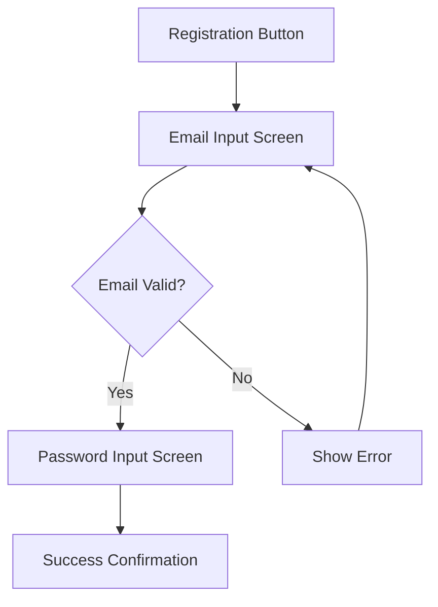

# Wireframes, Visual Design & Component Specs (template sections 4–6)

The bulk of a UI Design. Drive these from the FDD (what the feature does) and the Design Guidelines
(PD-UIX-001, the visual source of truth). Contents:

- [Section 4 — Wireframes & User Flows](#section-4--wireframes--user-flows)
- [Section 5 — Visual Design Specifications](#section-5--visual-design-specifications)
- [Section 6 — Component Specifications](#section-6--component-specifications)

## Section 4 — Wireframes & User Flows

**User flow** — one Mermaid flowchart per primary journey: entry point, happy path, 1–2 critical
alternatives, exit. Keep it focused; don't diagram every edge case.



**Screen wireframes** — one per screen in the flow. For each: a layout sketch, the interactive
elements with their purpose/behavior, and layout notes (spacing, alignment, hierarchy). ASCII is
fine for simple screens; use Mermaid or an external mockup (linked in the Appendix) for complex
layouts.

```
┌─────────────────────────────────────┐
│  [Header: "Create Account"]         │
├─────────────────────────────────────┤
│  [Text: "Welcome! Enter your email"]│
│  [Input Field: Email]               │
│  [Helper Text: "We'll send a code"] │
│  [Primary Button: "Continue"]       │
│  [Link: "Already have account?"]    │
└─────────────────────────────────────┘
```

## Section 5 — Visual Design Specifications

**Source every visual token from the Design Guidelines (PD-UIX-001); do not invent.** List only the
tokens this feature actually uses, by name + value, so implementation is unambiguous.

- **Colors** (PD-UIX-001 palette) — primary action, success, error, etc., each as `Name #RRGGBB`.
  Introduce a new color only with justification, and log it as a deviation (see SKILL.md finalization).
- **Typography** (PD-UIX-001 type scale) — the styles used: e.g. page title `H1 32px Bold`, input
  labels `Caption 12px Regular`, button text `Button 14px Medium`.
- **Spacing** (PD-UIX-001 spacing scale, typically an 8px grid) — concrete values for key gaps:
  field spacing `16px`, button padding `12px × 16px`, screen margins `16px` mobile / `24px` tablet.
- **Icons** (PD-UIX-001 icon set) — each icon by name + size + (where relevant) color, e.g.
  `email_outlined 24px`, `error 16px red`, `check_circle 24px green`.

## Section 6 — Component Specifications

For each **major interactive component**, specify: type, variants, states, dimensions, behavior,
accessibility. Reuse Design-Guidelines component specs where they exist; group variants of the same
component together; specify all major components but don't over-document trivial ones.

```markdown
### Component: Primary Button

**Type**: Primary Button (standard component)
**Variants**: Primary (brand color background, on-color text)
**States**:
- Default: `#6200EE`, white text, 8px radius
- Hover: `#7F39FB` · Pressed: `#3700B3`, scale 0.95
- Focused: 2px focus outline · Disabled: `#BDBDBD`, reduced opacity
- Loading: inline circular progress
**Dimensions**: height 48dp (Android) / 44pt (iOS); padding 16px × 12px; min-width 88px
**Behavior**: ripple (Android) / opacity (iOS) on tap; light haptic on press (iOS)
**Accessibility**: label = button text; role = Button; contrast ≥ 4.5:1 (AA)
```

The state list (Default / Hover / Pressed / Focused / Disabled / Loading / Error) is the checklist of
states to consider per interactive component — include the ones that apply, and note explicitly when
a state doesn't (e.g. no hover on touch-only).
