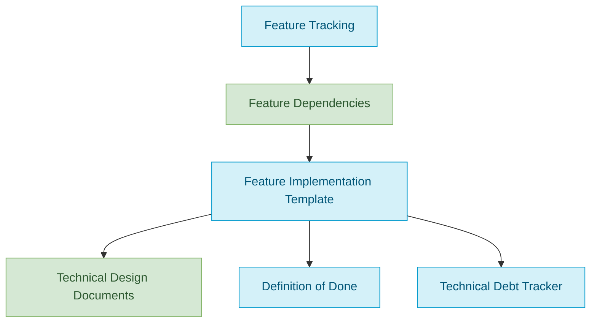

# Project Documentation Map

This document serves as a central index for all documentation in the project. It provides links to both process framework documents and product documentation to help you find the information you need.

## Process Framework Documents

These documents describe how we work and our development processes:

### Task Definitions

Our tasks are organized into four categories and follow a unified structure:

> **📋 Recent Enhancement (2025-08-01)**: All task definitions now include **AI Agent Role** sections that specify the professional role, mindset, focus areas, and communication style for optimal AI agent behavior during task execution.

#### Onboarding Tasks

- [Task: Codebase Feature Discovery](tasks/00-onboarding/codebase-feature-discovery.md) - Discover all features in existing codebase and assign every source file
- [Task: Codebase Feature Analysis](tasks/00-onboarding/codebase-feature-analysis.md) - Analyze implementation patterns, dependencies, and design decisions
- [Task: Retrospective Documentation Creation](tasks/00-onboarding/retrospective-documentation-creation.md) - Create tier assessments and required design documentation

#### Discrete Tasks

- [Task: Feature Request Evaluation](tasks/01-planning/feature-request-evaluation.md) - Classify change requests as new features or enhancements, scope enhancements, and create Enhancement State Tracking Files
- [Task: Feature Tier Assessment](tasks/01-planning/feature-tier-assessment-task.md) - Assess complexity of new features
- [Task: FDD Creation](tasks/02-design/fdd-creation-task.md) - Create Functional Design Documents for Tier 2+ features
- [Task: TDD Creation](tasks/02-design/tdd-creation-task.md) - Create Technical Design Documents
- [Task: Test Specification Creation](tasks/03-testing/test-specification-creation-task.md) - Create comprehensive test specifications from TDDs
- [Task: E2E Acceptance Test Case Creation](tasks/03-testing/e2e-acceptance-test-case-creation-task.md) - Create concrete, reproducible E2E acceptance test cases from test specifications with exact steps, file contents, and expected outcomes
- [Task: E2E Acceptance Test Execution](tasks/03-testing/e2e-acceptance-test-execution-task.md) - Execute E2E acceptance test cases systematically, record results, and report issues through human interaction with the running system
- [Task: Test Audit](tasks/03-testing/test-audit-task.md) - Systematic quality assessment of test implementations using six evaluation criteria
- [Task: Feature Implementation Planning](tasks/04-implementation/feature-implementation-planning-task.md) - Analyze design documentation and create detailed implementation plan with task sequencing and dependency mapping
- [Task: Data Layer Implementation](tasks/04-implementation/data-layer-implementation.md) - Implement data models, repositories, and database integration for feature
- [Task: Feature Enhancement](tasks/04-implementation/feature-enhancement.md) - Execute enhancement steps from Enhancement State Tracking File, adapting existing task guidance to amendment context
- [Task: Foundation Feature Implementation](tasks/04-implementation/foundation-feature-implementation-task.md) - Implement foundation features (0.x.x) that provide architectural foundations for the application
- [Task: Validation Preparation](tasks/05-validation/validation-preparation.md) - Plan validation rounds by selecting features and applicable dimensions, create tracking state file
- [Task: Architectural Consistency Validation](tasks/05-validation/architectural-consistency-validation.md) - Validate selected features for architectural pattern adherence, ADR compliance, and interface consistency
- [Task: Code Quality Standards Validation](tasks/05-validation/code-quality-standards-validation.md) - Validate selected features for code quality standards, SOLID principles, and best practices adherence
- [Task: Integration Dependencies Validation](tasks/05-validation/integration-dependencies-validation.md) - Validate selected features for dependency health, interface contracts, and data flow integrity
- [Task: Documentation Alignment Validation](tasks/05-validation/documentation-alignment-validation.md) - Validate selected features for TDD alignment, ADR compliance, and API documentation accuracy
- [Task: Extensibility Maintainability Validation](tasks/05-validation/extensibility-maintainability-validation.md) - Validate selected features for extension points, configuration flexibility, and testing support
- [Task: AI Agent Continuity Validation](tasks/05-validation/ai-agent-continuity-validation.md) - Validate selected features for context clarity, modular structure, and documentation quality to support AI agent workflow continuity
- [Task: Security & Data Protection Validation](tasks/05-validation/security-data-protection-validation.md) - Validate selected features for security best practices, data protection, input validation, and secrets management
- [Task: Performance & Scalability Validation](tasks/05-validation/performance-scalability-validation.md) - Validate selected features for performance characteristics, resource efficiency, and scalability patterns
- [Task: Observability Validation](tasks/05-validation/observability-validation.md) - Validate selected features for logging coverage, monitoring instrumentation, alerting readiness, and diagnostic traceability
- [Task: Accessibility / UX Compliance Validation](tasks/05-validation/accessibility-ux-compliance-validation.md) - Validate selected features for accessibility standards, UX compliance, keyboard navigation, and inclusive design patterns
- [Task: Data Integrity Validation](tasks/05-validation/data-integrity-validation.md) - Validate selected features for data consistency, constraint enforcement, migration safety, and backup/recovery patterns
- [Task: Code Review](tasks/06-maintenance/code-review-task.md) - Review code for quality and correctness
- [Task: Bug Triage](tasks/06-maintenance/bug-triage-task.md) - Systematically evaluate, prioritize, and assign reported bugs
- [Task: Bug Fixing](tasks/06-maintenance/bug-fixing-task.md) - Diagnose and fix bugs
- [Task: Release Deployment](tasks/07-deployment/release-deployment-task.md) - Manage releases and deployments
- [Task: System Architecture Review](tasks/01-planning/system-architecture-review.md) - Evaluate how new features fit into existing system architecture before implementation
- [Task: API Design](tasks/02-design/api-design-task.md) - Design comprehensive API contracts and specifications before implementation begins
- [Task: Database Schema Design](tasks/02-design/database-schema-design-task.md) - Plan data model changes before coding to prevent data integrity issues
- [Task: Code Refactoring](tasks/06-maintenance/code-refactoring-task.md) - Systematic code improvement and technical debt reduction without changing external behavior
  - [Code Refactoring — Lightweight Path](tasks/06-maintenance/code-refactoring-lightweight-path.md) - Process steps and checklist for low-effort refactorings (≤ 15 min, single file)
  - [Code Refactoring — Standard Path](tasks/06-maintenance/code-refactoring-standard-path.md) - Process steps and checklist for medium/complex refactorings (multi-file, architectural)
- [Task: Feature Discovery](tasks/01-planning/feature-discovery-task.md) - Identify and document potential new features

#### Support Tasks

- [Task: Project Initiation](tasks/support/project-initiation-task.md) - Initial project setup including project-config.json creation
- [Task: New Task Creation Process](tasks/support/new-task-creation-process.md) - Complete process for creating new tasks from concept to implementation-ready definition
- [Task: Process Improvement](tasks/support/process-improvement-task.md) - Improve development processes
- [Task: Structure Change](tasks/support/structure-change-task.md) - Manage structural changes to documentation
- [Task: Framework Extension Task](tasks/support/framework-extension-task.md) - Support task for fundamentally extending the framework with new functionalities and capabilities
- [Task: Tools Review](tasks/support/tools-review-task.md) - Review and improve project tools and templates

#### Cyclical Tasks

- [Task: Documentation Tier Adjustment](tasks/cyclical/documentation-tier-adjustment-task.md) - Adjust documentation requirements
- [Task: Technical Debt Assessment](tasks/cyclical/technical-debt-assessment-task.md) - Systematic approach to identifying, categorizing, and prioritizing technical debt across the codebase

### Core Process Documents

- [Process: Feature Tracking](../product-docs/state-tracking/permanent/feature-tracking.md) - Comprehensive list of all features with implementation status
- [Process: Test Tracking](../../test/state-tracking/permanent/test-tracking.md) - Tracks implementation status of test cases derived from test specifications
- [Process: Test Registry](/test/test-registry.yaml) - Registry of all test files with feature mappings, cross-cutting support, and PD-TST IDs
- [Process: Definition of Done](guides/04-implementation/definition-of-done.md) - Clear criteria for when a feature is considered complete
- [Process: Technical Debt Tracking](../product-docs/state-tracking/permanent/technical-debt-tracking.md) - System for tracking and managing technical debt
- [Process: Validation Tracking](../product-docs/state-tracking/temporary/validation-tracking.md) - Master tracking for codebase validation across all validation types
- [Process: Feature Implementation Template](templates/04-implementation/feature-implementation-template.md) - Template for planning and implementing features
- [Process: Implementation Plan Template](templates/04-implementation/implementation-plan-template-template.md) - Template for creating implementation plan documents that define sequenced execution strategies for feature implementation
- [Process: Foundation Feature Template](templates/04-implementation/foundation-feature-template.md) - Template for foundation feature structure and architectural documentation
- [Process: FDD Template](templates/02-design/fdd-template.md) - Template for creating Functional Design Documents
- [Process: UI Design Template](templates/02-design/ui-design-template.md) - Comprehensive template for creating UI/UX Design Documents with wireframes, visual specifications, accessibility requirements, and platform adaptations
- [Process: Architecture Impact Assessment Template](templates/02-design/architecture-impact-assessment-template.md) - Template for creating architecture impact assessments
- [Process: API Specification Template](templates/02-design/api-specification-template.md) - Template for creating comprehensive API contract definitions
- [Process: Schema Design Template](templates/02-design/schema-design-template.md) - Template for database schema design documents
- [Process: Test Audit Report Template](templates/03-testing/test-audit-report-template.md) - Template for systematic test quality assessment reports
- [Process: Feedback Form Template](templates/support/feedback-form-template.md) - Template for creating tool and process feedback forms
- [Process: Feedback DB Input Template](templates/support/feedback-db-input-template.json) - JSON reference template for `feedback_db.py record --json` input format
- [Process: Language Config Template](templates/support/language-config-template.json) - JSON template for adding new language configurations to languages-config/
- [Process: Tools Review Summary Template](templates/support/tools-review-summary-template.md) - Standardized template for Tools Review task (PF-TSK-010) summary output documents
- [Process: Technical Debt Assessment Template](templates/cyclical/technical-debt-assessment-template.md) - Template for technical debt assessment reports
- [Process: Debt Item Template](templates/cyclical/debt-item-template.md) - Template for individual debt item records
- [Process: Prioritization Matrix Template](templates/cyclical/prioritization-matrix-template.md) - Template for debt prioritization matrices
- [Process: Temporary Task Creation State Template](templates/support/temp-task-creation-state-template.md) - Template for tracking multi-session task creation implementation
- [Process: Temporary Process Improvement State Template](templates/support/temp-process-improvement-state-template.md) - Template for tracking multi-session process improvement implementation (via `New-TempTaskState.ps1 -Variant ProcessImprovement`)
- [Process: Structure Change State Template](templates/support/structure-change-state-template.md) - Template for tracking multi-session structure change implementation
- [Process: Enhancement State Tracking Template](templates/04-implementation/enhancement-state-tracking-template-template.md) - Template for tracking enhancement work on existing features, used by New-EnhancementState.ps1
- [Process: Bug Fix State Tracking Template](templates/06-maintenance/bug-fix-state-tracking-template.md) - Template for tracking multi-session complex bug fix work, used by New-BugFixState.ps1
- [Process: Framework Extension Concept Template](templates/support/framework-extension-concept-template.md) - Template for creating framework extension concept documents
- [Process: Validation Report Template](templates/05-validation/validation-report-template.md) - Template for creating feature validation reports
- [Process: Cross-Cutting Test Specification Template](templates/03-testing/cross-cutting-test-specification-template.md) - Template for test specifications spanning multiple features
- [Process: E2E Acceptance Master Test Template](templates/03-testing/e2e-acceptance-master-test-template.md) - Template for group-level master test files with quick validation sequences
- [Process: E2E Acceptance Test Case Template](templates/03-testing/e2e-acceptance-test-case-template.md) - Template for individual E2E acceptance test case files with exact steps, preconditions, and expected outcomes
- [Process: Documentation-Only Refactoring Plan Template](templates/06-maintenance/documentation-refactoring-plan-template.md) - Template for documentation-only refactoring plans (no code metrics/test sections), used by New-RefactoringPlan.ps1 -DocumentationOnly
- [Process: Enhancement Workflow Concept](proposals/proposals/enhancement-workflow-concept.md) - Framework extension concept for feature enhancement classification and execution workflow
- [Process: Code Quality Standards Validation Concept](proposals/code-quality-standards-validation-concept.md) - Concept document for code quality validation task creation
- [Process: Foundation Feature Implementation Usage Guide](guides/04-implementation/foundation-feature-implementation-usage-guide.md) - Comprehensive guide for using the Foundation Feature Implementation task effectively
- [Process: Test Audit Usage Guide](guides/03-testing/test-audit-usage-guide.md) - Comprehensive guide for conducting systematic test quality assessments
- [Process: Test Infrastructure Guide](guides/test-infrastructure-guide.md) - How the test/ directory connects to the process framework — directory conventions, automation scripts, and tracking relationships
- [Process: Testing Setup Guide](guides/03-testing/testing-setup-guide.md) - Language-specific guide for scaffolding test infrastructure in new or existing projects
- [Process: CI/CD Setup Guide](guides/07-deployment/ci-cd-setup-guide.md) - Guide for scaffolding CI/CD infrastructure (pipelines, pre-commit hooks, dev scripts)
- [Process: Feedback Form Guide](guides/framework/feedback-form-guide.md) - Comprehensive guide for completing feedback forms effectively
- [Process: Feedback Form Completion Instructions](guides/framework/feedback-form-completion-instructions.md) - Standardized instructions for completing feedback forms (referenced by all tasks)
- [Process: Task Transition Guide](guides/framework/task-transition-guide.md) - Guidance on when and how to transition between related tasks

### Automation Scripts

- [Process: New E2E Acceptance Test Case Script](scripts/file-creation/03-testing/New-E2EAcceptanceTestCase.ps1) - PowerShell script for creating E2E acceptance test case directories with auto-assigned E2E IDs, state tracking updates, and master test integration
- [Process: New Bug Report Script](scripts/file-creation/06-maintenance/New-BugReport.ps1) - PowerShell script for creating standardized bug reports during task execution
- [Process: New Bug Fix State Script](scripts/file-creation/06-maintenance/New-BugFixState.ps1) - PowerShell script for creating multi-session bug fix state tracking files (Large-effort bugs)
- [Process: New UI Design Script](scripts/file-creation/02-design/New-UIDesign.ps1) - PowerShell script for creating UI/UX Design documents with auto-assigned IDs and Design Guidelines references
- [Process: New Test Specification Script](scripts/file-creation/03-testing/New-TestSpecification.ps1) - PowerShell script for creating test specifications (supports both feature-specific and cross-cutting modes via -CrossCutting switch)
- [Process: New Process Improvement Script](scripts/file-creation/support/New-ProcessImprovement.ps1) - PowerShell script for adding new improvement opportunities to process-improvement-tracking.md with auto-assigned PF-IMP IDs

### Testing Scripts

- [Process: Run-Tests Script](scripts/test/Run-Tests.ps1) - Language-agnostic test runner that reads project-config.json and languages-config/{language}-config.json for dynamic category-based execution (-Category, -Quick, -All, -Coverage, -ListCategories)
- [Process: Language Configurations](languages-config/README.md) - Language-specific command configurations for framework scripts (testing, linting, coverage)
- [Process: Setup-TestEnvironment Script](scripts/test/e2e-acceptance-testing/Setup-TestEnvironment.ps1) - Copies pristine test fixtures into workspace for clean E2E acceptance test execution
- [Process: Verify-TestResult Script](scripts/test/e2e-acceptance-testing/Verify-TestResult.ps1) - Compares workspace state against expected state after E2E acceptance test execution
- [Process: Run-E2EAcceptanceTest Script](scripts/test/e2e-acceptance-testing/Run-E2EAcceptanceTest.ps1) - Orchestrates scripted E2E acceptance test pipeline: Setup → run.ps1 → wait → Verify
- [Process: Update-TestExecutionStatus Script](scripts/test/e2e-acceptance-testing/Update-TestExecutionStatus.ps1) - Updates test-tracking.md and feature-tracking.md with E2E acceptance test execution results

### State Update Scripts

- [Process: Update Process Improvement Script](scripts/update/Update-ProcessImprovement.ps1) - Automates status transitions and completion moves in process-improvement-tracking.md
- [Process: Update Tech Debt Script](scripts/update/Update-TechDebt.ps1) - Automates technical debt lifecycle management: add new items (-Add), status transitions, and resolution moves in technical-debt-tracking.md
- [Process: Update Language Config Script](scripts/update/Update-LanguageConfig.ps1) - Adds fields consistently across all language config files and template to prevent drift (-List to audit, -Section/-FieldName to add)
- [Process: Update Feature Dependencies Script](scripts/update/Update-FeatureDependencies.ps1) - Auto-generates feature-dependencies.md from feature state files (Mermaid graph + priority matrix). Integrated into Validate-StateTracking.ps1 Surface 6

### Validation Scripts

- [Process: Validate ID Registry](scripts/validation/validate-id-registry.ps1) - Validates ID registry against actual files in the repository
- [Process: Validate Test Tracking](scripts/validation/Validate-TestTracking.ps1) - Validates test-registry.yaml consistency with disk, tracking files, and ID counters
- [Process: Validate State Tracking](scripts/validation/Validate-StateTracking.ps1) - Master validation across 5 surfaces: feature-tracking links, feature state files, test-tracking, cross-references, and ID counters

## Product Documentation

These documents describe what we're building:

### Core Product Documents

- [Product: Feature Dependencies](../product-docs/technical/design/feature-dependencies.md) - Auto-generated visual map and matrix of feature dependencies
- [Product: User Workflow Map](../product-docs/technical/design/user-workflow-map.md) - Maps user-facing workflows to required features; bridge between feature-centric development and cross-feature E2E testing

### User Handbooks

- [Product: File Type Quick Fix](../product-docs/user/handbooks/file-type-quick-fix.md) - Quick solutions for adding file type monitoring support
- [Product: Troubleshooting File Types](../product-docs/user/handbooks/troubleshooting-file-types.md) - Detailed diagnosis and fixes for file type monitoring issues

### Process Framework Guides

- [Process: Development Guide](guides/04-implementation/development-guide.md) - Best practices and guidelines for development
- [Process: Documentation Guide](guides/05-validation/documentation-guide.md) - Guidelines for documentation
- [Process: Assessment Guide](guides/01-planning/assessment-guide.md) - Guide for feature tier assessment
- [Process: Visual Notation Guide](guides/support/visual-notation-guide.md) - Standard notation used in diagrams and context maps
- [Process: Temporary State File Customization Guide](guides/support/temp-state-tracking-customization-guide.md) - Guide for customizing temporary state files for different workflows
- [Process: Test Specification Creation Guide](guides/03-testing/test-specification-creation-guide.md) - Comprehensive guide for using the Test Specification Creation task effectively
- [Process: Integration & Testing Usage Guide](guides/03-testing/test-implementation-usage-guide.md) - Comprehensive guide for using the Integration & Testing task (PF-TSK-053) effectively
- [Process: Architectural Framework Usage Guide](guides/01-planning/architectural-framework-usage-guide.md) - Step-by-step guide for using the Architectural Integration Framework to manage cross-cutting architectural work
- [Process: Code Refactoring Task Usage Guide](guides/06-maintenance/code-refactoring-task-usage-guide.md) - Comprehensive guide for using the Code Refactoring Task effectively

- [Process: Assessment Criteria Guide](guides/cyclical/assessment-criteria-guide.md) - Detailed criteria for identifying technical debt
- [Process: Prioritization Guide](guides/cyclical/prioritization-guide.md) - Guide for applying impact/effort matrix to prioritize debt
- [Process: Guide Creation Best Practices Guide](guides/support/guide-creation-best-practices-guide.md) - Best practices for creating effective guides within the task framework
- [Process: Debt Item Creation Guide](guides/cyclical/debt-item-creation-guide.md) - Guide for customizing technical debt item templates
- [Process: State File Creation Guide](guides/support/state-file-creation-guide.md) - Guide for customizing state tracking file templates
- [Process: Test File Creation Guide](guides/03-testing/test-file-creation-guide.md) - Guide for customizing test file templates
- [Process: Test Specification Creation Guide](guides/03-testing/test-specification-creation-guide.md) - Guide for customizing test specification templates
- [Process: TDD Creation Guide](guides/02-design/tdd-creation-guide.md) - Guide for customizing Technical Design Document templates
- [Process: FDD Customization Guide](guides/02-design/fdd-customization-guide.md) - Guide for customizing Functional Design Document templates
- [Process: UI Design Customization Guide](guides/02-design/ui-design-customization-guide.md) - 19-step guide across 6 phases for customizing UI/UX Design Document templates with tiered examples
- [Process: API Data Model Creation Guide](guides/02-design/api-data-model-creation-guide.md) - Guide for customizing API data model templates
- [Process: API Specification Creation Guide](guides/02-design/api-specification-creation-guide.md) - Guide for customizing API specification templates
- [Process: Architecture Assessment Creation Guide](guides/02-design/architecture-assessment-creation-guide.md) - Guide for customizing architecture assessment templates
- [Process: Architecture Decision Creation Guide](guides/02-design/architecture-decision-creation-guide.md) - Guide for customizing Architecture Decision Record templates
- [Process: Schema Design Creation Guide](guides/02-design/schema-design-creation-guide.md) - Guide for customizing database schema design templates
- [Process: Enhancement State Tracking Customization Guide](guides/04-implementation/enhancement-state-tracking-customization-guide.md) - Step-by-step instructions for customizing Enhancement State Tracking files
- [Process: E2E Acceptance Test Case Customization Guide](guides/03-testing/e2e-acceptance-test-case-customization-guide.md) - Step-by-step instructions for customizing E2E acceptance test case and master test templates created by New-E2EAcceptanceTestCase.ps1
- [Process: Framework Extension Customization Guide](guides/support/framework-extension-customization-guide.md) - Essential guide for customizing Framework Extension Concept documents
- [Process: Feature Validation Guide](guides/05-validation/feature-validation-guide.md) - Comprehensive guide for conducting feature validation using the 6-type validation framework
- [Process: Bug Reporting Guide](guides/06-maintenance/bug-reporting-guide.md) - Standardized procedures for reporting bugs discovered during task execution
- [Process: Feature Granularity Guide](guides/01-planning/feature-granularity-guide.md) - Defines well-scoped features and provides practical tests for validating feature granularity
- [Process: Documentation Structure Guide](guides/framework/documentation-structure-guide.md) - Guide for organizing documentation structure within the framework
- [Process: Migration Best Practices](guides/support/migration-best-practices.md) - Best practices for migrating documentation and framework components
- [Process: Process Improvement Task Implementation Guide](guides/support/process-improvement-task-implementation-guide.md) - Practical instructions for executing the Process Improvement task (PF-TSK-009)
- [Process: Feature Implementation State Tracking Guide](guides/04-implementation/feature-implementation-state-tracking-guide.md) - How to create and maintain feature implementation state tracking documents
- [Process: Task Creation Guide](guides/support/task-creation-guide.md) - Guide for creating and improving task definitions
- [Process: Visualization Creation Guide](guides/support/visualization-creation-guide.md) - Guide for creating context maps and other visualizations
- [Process: Implementation Plan Customization Guide](guides/04-implementation/implementation-plan-customization-guide.md) - How to use New-ImplementationPlan.ps1 and customize implementation plan templates
- [Process: Template Development Guide](guides/support/template-development-guide.md) - Guide for developing and maintaining framework templates
- [Process: Document Creation Script Development Guide](guides/support/document-creation-script-development-guide.md) - Standardized approach for creating documents from templates through PowerShell scripts

### Visualization Resources

- [Context Maps README](visualization/context-maps/README.md) - Guide to using context maps for tasks
- [Context Maps Template](templates/support/context-map-template.md) - Template for creating new context maps

#### Discrete Task Context Maps

- [API Design Map](visualization/context-maps/02-design/api-design-task-map.md) - Components for designing API contracts and specifications
- [Architectural Consistency Validation Map](visualization/context-maps/05-validation/architectural-consistency-validation-map.md) - Components for validating architectural pattern adherence and ADR compliance
- [Bug Fixing Map](visualization/context-maps/06-maintenance/bug-fixing-map.md) - Components for fixing bugs
- [Code Quality Standards Validation Map](visualization/context-maps/05-validation/code-quality-standards-validation-map.md) - Components for validating code quality standards and SOLID principles
- [Code Refactoring Map](visualization/context-maps/06-maintenance/code-refactoring-task-map.md) - Components for systematic code improvement and technical debt reduction
- [Integration Dependencies Validation Map](visualization/context-maps/05-validation/integration-dependencies-validation-map.md) - Components for validating dependency health, interface contracts, and data flow integrity
- [Documentation Alignment Validation Map](visualization/context-maps/05-validation/documentation-alignment-validation-map.md) - Components for validating TDD alignment, ADR compliance, and API documentation accuracy
- [Extensibility Maintainability Validation Map](visualization/context-maps/05-validation/extensibility-maintainability-validation-map.md) - Components for validating extension points, configuration flexibility, and testing support
- [AI Agent Continuity Validation Map](visualization/context-maps/05-validation/ai-agent-continuity-validation-map.md) - Components for validating context clarity, modular structure, and documentation quality for AI agent workflow continuity
- [Security & Data Protection Validation Map](visualization/context-maps/05-validation/security-data-protection-validation-map.md) - Components for validating security best practices, data protection, and secrets management
- [Performance & Scalability Validation Map](visualization/context-maps/05-validation/performance-scalability-validation-map.md) - Components for validating performance characteristics, resource efficiency, and scalability patterns
- [Observability Validation Map](visualization/context-maps/05-validation/observability-validation-map.md) - Components for validating logging coverage, monitoring instrumentation, and diagnostic traceability
- [Accessibility / UX Compliance Validation Map](visualization/context-maps/05-validation/accessibility-ux-compliance-validation-map.md) - Components for validating accessibility standards, UX compliance, and inclusive design patterns
- [Data Integrity Validation Map](visualization/context-maps/05-validation/data-integrity-validation-map.md) - Components for validating data consistency, constraint enforcement, and recovery patterns
- [Validation Preparation Map](visualization/context-maps/05-validation/validation-preparation-map.md) - Components for planning validation rounds and creating tracking state files
- [Code Review Map](visualization/context-maps/06-maintenance/code-review-map.md) - Components for reviewing code changes
- [FDD Creation Map](visualization/context-maps/02-design/fdd-creation-map.md) - Components for creating Functional Design Documents
- [Feature Discovery Map](visualization/context-maps/01-planning/feature-discovery-map.md) - Components for exploring features
- [Feature Request Evaluation Map](visualization/context-maps/01-planning/feature-request-evaluation-map.md) - Components for classifying change requests and scoping enhancements
- [Feature Enhancement Map](visualization/context-maps/04-implementation/feature-enhancement-map.md) - Components for executing enhancement steps from state file
- [Feature Implementation Map](visualization/context-maps/04-implementation/feature-implementation-map.md) - Components for implementing features
- [Feature Tier Assessment Map](visualization/context-maps/01-planning/feature-tier-assessment-map.md) - Components for assessing complexity
- [Process Improvement Map](visualization/context-maps/support/process-improvement-map.md) - Components for improving processes
- [Release Deployment Map](visualization/context-maps/07-deployment/release-deployment-map.md) - Components for deployment
- [Structure Change Map](visualization/context-maps/support/structure-change-map.md) - Components for structural changes
- [Framework Extension Task Map](visualization/context-maps/support/framework-extension-task-map.md) - Context map for Framework Extension Task showing component relationships and workflow
- [System Architecture Review Map](visualization/context-maps/01-planning/system-architecture-review-map.md) - Components for evaluating system architecture
- [TDD Creation Map](visualization/context-maps/02-design/tdd-creation-map.md) - Components for creating design documents
- [Test Specification Creation Map](visualization/context-maps/03-testing/test-specification-creation-map.md) - Components for creating test specifications from TDDs
- [E2E Acceptance Test Case Creation Map](visualization/context-maps/03-testing/e2e-acceptance-test-case-creation-map.md) - Components for creating concrete E2E acceptance test cases from test specifications
- [E2E Acceptance Test Execution Map](visualization/context-maps/03-testing/e2e-acceptance-test-execution-map.md) - Components for executing E2E acceptance test cases and recording results
- [Integration & Testing Map](visualization/context-maps/04-implementation/integration-and-testing-map.md) - Components for implementing comprehensive tests and validating integration
- [Test Audit Map](visualization/context-maps/03-testing/test-audit-map.md) - Components for systematic test quality assessment workflow

#### Cyclical Task Context Maps

- [Documentation Review Map](visualization/context-maps/cyclical/documentation-review-map.md) - Components for reviewing documentation
- [Documentation Tier Adjustment Map](visualization/context-maps/cyclical/documentation-tier-adjustment-map.md) - Components for adjusting tiers
- [Tools Review Map](visualization/context-maps/support/tools-review-map.md) - Components for reviewing tools
- [Technical Debt Assessment Map](visualization/context-maps/cyclical/technical-debt-assessment-task-map.md) - Context map for Technical Debt Assessment task

### Product Technical Design

- [Product: Technical Design Documents](../product-docs/technical/design/README.md) - Detailed technical designs for complex features
- [Product: Project Structure](../product-docs/technical/architecture/project-structure.md) - Detailed breakdown of the project structure
- [Product: Component Relationship Index](../product-docs/technical/architecture/component-relationship-index.md) - Comprehensive reference of all component relationships and interactions

### Functional Design Documents (FDDs)

_Created during framework onboarding (PF-TSK-066), consolidated to 9-feature scope (2026-02-20)._

- [FDD: Core Architecture (PD-FDD-022)](../product-docs/functional-design/fdds/fdd-0-1-1-core-architecture.md) - 0.1.1 Tier 3 — Orchestrator/Facade service, data models, path utilities
- [FDD: In-Memory Link Database (PD-FDD-023)](../product-docs/functional-design/fdds/fdd-0-1-2-in-memory-database.md) - 0.1.2 Tier 2 — Thread-safe link storage with O(1) lookups
- [FDD: File System Monitoring (PD-FDD-024)](../product-docs/functional-design/fdds/fdd-1-1-1-file-system-monitoring.md) - 1.1.1 Tier 2 — Watchdog event handling, move detection, file filtering
- [FDD: Logging System (PD-FDD-025)](../product-docs/functional-design/fdds/fdd-3-1-1-logging-framework.md) - 3.1.1 Tier 2 — Structured logging with colored output, stats, progress
- [FDD: Link Parsing System (PD-FDD-026)](../product-docs/functional-design/fdds/fdd-2-1-1-parser-framework.md) - 2.1.1 Tier 2 — Parser registry/facade with 6 format-specific parsers
- [FDD: Link Updating (PD-FDD-027)](../product-docs/functional-design/fdds/fdd-2-2-1-link-updater.md) - 2.2.1 Tier 2 — Atomic file updates, relative path calculation, dry-run
- ~~FDD: Test Suite (PD-FDD-028)~~ - 🗄️ Archived (PF-PRO-009) — generalized into [Testing Setup Guide](guides/03-testing/testing-setup-guide.md)
- ~~FDD: CI/CD & Development Tooling (PD-FDD-032)~~ - 🗄️ Archived (PF-PRO-009) — generalized into [CI/CD Setup Guide](guides/07-deployment/ci-cd-setup-guide.md)

> **Note**: 0.1.3 Configuration System is Tier 1 — no FDD required.

### Technical Design Documents (TDDs)

_Created during framework onboarding (PF-TSK-066), consolidated to 9-feature scope (2026-02-20)._

- [TDD: Core Architecture (PD-TDD-021)](../product-docs/technical/architecture/design-docs/tdd/tdd-0-1-1-core-architecture-t3.md) - 0.1.1 Tier 3 — Full architecture with component diagrams
- [TDD: In-Memory Link Database (PD-TDD-022)](../product-docs/technical/architecture/design-docs/tdd/tdd-0-1-2-in-memory-database-t2.md) - 0.1.2 Tier 2 — Target-indexed storage design
- [TDD: File System Monitoring (PD-TDD-023)](../product-docs/technical/architecture/design-docs/tdd/tdd-1-1-1-file-system-monitoring-t2.md) - 1.1.1 Tier 2 — State machine, timer-based move detection
- [TDD: Logging System (PD-TDD-024)](../product-docs/technical/architecture/design-docs/tdd/tdd-3-1-1-logging-framework-t2.md) - 3.1.1 Tier 2 — Dual-formatter logging design
- [TDD: Link Parsing System (PD-TDD-025)](../product-docs/technical/architecture/design-docs/tdd/tdd-2-1-1-parser-framework-t2.md) - 2.1.1 Tier 2 — Registry + Facade parser system
- [TDD: Link Updating (PD-TDD-026)](../product-docs/technical/architecture/design-docs/tdd/tdd-2-2-1-link-updater-t2.md) - 2.2.1 Tier 2 — Bottom-to-top atomic write strategy
- ~~TDD: Test Suite (PD-TDD-027)~~ - 🗄️ Archived (PF-PRO-009) — generalized into [Testing Setup Guide](guides/03-testing/testing-setup-guide.md)
- ~~TDD: CI/CD & Development Tooling (PD-TDD-031)~~ - 🗄️ Archived (PF-PRO-009) — generalized into [CI/CD Setup Guide](guides/07-deployment/ci-cd-setup-guide.md)

> **Note**: 0.1.3 Configuration System is Tier 1 — no TDD required.

### Architecture Decision Records (ADRs)

_Created during framework onboarding (PF-TSK-066) — documenting existing architectural decisions._

- [ADR: Orchestrator/Facade Pattern (PD-ADR-039)](../product-docs/technical/architecture/design-docs/adr/adr/orchestrator-facade-pattern-for-core-architecture.md) - 0.1.1 Core Architecture pattern decision
- [ADR: Target-Indexed In-Memory Link Database (PD-ADR-040)](../product-docs/technical/architecture/design-docs/adr/adr/target-indexed-in-memory-link-database.md) - 0.1.2 In-Memory Link Database storage strategy

### Test Specifications

_Created during framework onboarding (PF-TSK-066 / PF-TSK-012) — documenting existing test suite._

- [Test Spec: Core Architecture (PF-TSP-035)](../../test/specifications/feature-specs/test-spec-0-1-1-core-architecture.md) - 0.1.1 Tier 3 — Existing test coverage with gap analysis
- [Test Spec: In-Memory Link Database (PF-TSP-036)](../../test/specifications/feature-specs/test-spec-0-1-2-in-memory-link-database.md) - 0.1.2 Tier 2 — Database thread-safety and CRUD operations
- [Test Spec: Configuration System (PF-TSP-037)](../../test/specifications/feature-specs/test-spec-0-1-3-configuration-system.md) - 0.1.3 Tier 1 — Multi-source config loading and validation
- [Test Spec: File System Monitoring (PF-TSP-038)](../../test/specifications/feature-specs/test-spec-1-1-1-file-system-monitoring.md) - 1.1.1 Tier 2 — Move detection, file filtering, monitoring
- [Test Spec: Link Parsing System (PF-TSP-039)](../../test/specifications/feature-specs/test-spec-2-1-1-link-parsing-system.md) - 2.1.1 Tier 2 — Parser registry with 6 format-specific parsers
- [Test Spec: Link Updating (PF-TSP-040)](../../test/specifications/feature-specs/test-spec-2-2-1-link-updating.md) - 2.2.1 Tier 2 — Atomic updates, dry-run, backup creation
- [Test Spec: Logging System (PF-TSP-041)](../../test/specifications/feature-specs/test-spec-3-1-1-logging-system.md) - 3.1.1 Tier 2 — Structured logging, filtering, metrics
- ~~Test Spec: Test Suite (PF-TSP-042)~~ - 🗄️ Archived (PF-PRO-009) — testing infrastructure generalized into framework
- ~~Test Spec: CI/CD & Development Tooling (PF-TSP-043)~~ - 🗄️ Archived (PF-PRO-009) — CI/CD infrastructure generalized into framework

### Cross-Cutting Test Specifications

_Located in `test/specifications/cross-cutting-specs/` — test specifications spanning multiple features._

- [E2E Acceptance Testing Scenarios (PF-TSP-044)](../../test/specifications/cross-cutting-specs/cross-cutting-spec-e2e-acceptance-testing-scenarios.md) - Cross-cutting — 19 E2E scenarios across 8 workflows, organized by [User Workflow Map](../product-docs/technical/design/user-workflow-map.md)

### Validation Reports

_Created during feature validation (PF-TSK-031 through PF-TSK-036)._

- [Validation: Architectural Consistency — Features 0.1.1–1.1.1 (PF-VAL-035)](../product-docs/validation/reports/architectural-consistency/PF-VAL-035-architectural-consistency-features-0.1.1-1.1.1.md) - Batch 1 — Design pattern adherence, ADR compliance, interface consistency (Score: 3.475/4.0 PASS)
- [Validation: Architectural Consistency — Features 2.1.1–5.1.1 (PF-VAL-036)](../product-docs/validation/reports/architectural-consistency/PF-VAL-036-architectural-consistency-features-2.1.1-2.2.1-3.1.1-4.1.1-5.1.1.md) - Batch 2 — Design pattern adherence, ADR compliance, interface consistency (Score: 3.450/4.0 PASS)
- [Validation: Code Quality — Features 0.1.1–1.1.1 (PF-VAL-037)](../product-docs/validation/reports/code-quality/PF-VAL-037-code-quality-features-0.1.1-0.1.2-0.1.3-1.1.1.md) - Batch 1 — Code style, complexity, error handling, SOLID principles, test coverage (Score: 3.050/4.0 PASS)
- [Validation: Code Quality — Features 2.1.1–5.1.1 (PF-VAL-038)](../product-docs/validation/reports/code-quality/PF-VAL-038-code-quality-features-2.1.1-2.2.1-3.1.1-4.1.1-5.1.1.md) - Batch 2 — Code style, complexity, error handling, SOLID principles, test coverage (Score: 3.120/4.0 PASS)
- [Validation: Integration Dependencies — Features 0.1.1–1.1.1 (PF-VAL-039)](../product-docs/validation/reports/integration-dependencies/PF-VAL-039-integration-dependencies-features-0.1.1-0.1.2-0.1.3-1.1.1.md) - Batch 1 — Component interfaces, dependency health, data flow, service integration, coupling (Score: 3.200/4.0 PASS)
- [Validation: Integration Dependencies — Features 2.1.1–5.1.1 (PF-VAL-041)](../product-docs/validation/reports/integration-dependencies/PF-VAL-041-integration-dependencies-features-2.1.1-2.2.1-3.1.1-4.1.1-5.1.1.md) - Batch 2 — Component interfaces, dependency health, data flow, service integration, coupling (Score: 3.400/4.0 PASS)
- [Validation: Documentation Alignment — Features 0.1.1–1.1.1 (PF-VAL-042)](../product-docs/validation/reports/documentation-alignment/PF-VAL-042-documentation-alignment-features-0.1.1-0.1.2-0.1.3-1.1.1.md) - Batch 1 — TDD alignment, ADR compliance, code comments, README accuracy, feature state files (Score: 2.55/4.0 PASS)
- [Validation: Documentation Alignment — Features 2.1.1–5.1.1 (PF-VAL-043)](../product-docs/validation/reports/documentation-alignment/PF-VAL-043-documentation-alignment-features-2.1.1-2.2.1-3.1.1-4.1.1-5.1.1.md) - Batch 2 — TDD alignment, FDD accuracy, code comments, feature state files (Score: 2.24/4.0 PASS)
- [Validation: Extensibility & Maintainability — All Features (PF-VAL-044)](../product-docs/validation/reports/extensibility-maintainability/PF-VAL-044-extensibility-maintainability-features-0.1.1-0.1.2-0.1.3-1.1.1-2.1.1-2.2.1-3.1.1-4.1.1-5.1.1.md) - All 9 features — Modularity, extension points, configuration flexibility, testing support, scalability (Score: 3.044/4.0 PASS)
- [Validation: AI Agent Continuity — All Features (PF-VAL-045)](../product-docs/validation/reports/ai-agent-continuity/PF-VAL-045-ai-agent-continuity-features-0.1.1-0.1.2-0.1.3-1.1.1-2.1.1-2.2.1-3.1.1-4.1.1-5.1.1.md) - All 9 features — Context window optimization, documentation clarity, naming conventions, code readability, continuation points (Score: 3.244/4.0 PASS)

### Test Audit Reports

_Created during test audit sessions (PF-TSK-030). Located in `test/audits/` (moved from `doc/product-docs/test-audits/` during SC-006 test directory consolidation)._

- [Audit: Core Architecture 0.1.1 (PF-TAR-011)](../../test/audits/foundation/audit-report-0-1-1-pd-tst-102.md) - Foundation feature test quality assessment
- [Audit: In-Memory Database 0.1.2 (PF-TAR-011)](../../test/audits/foundation/audit-report-0-1-2-pd-tst-104.md) - Database test quality assessment
- [Audit: Configuration System 0.1.3](../../test/audits/foundation/audit-report-0-1-3-pd-tst-106.md) - Configuration test quality assessment
- [Audit: File System Monitoring 1.1.1 (PF-TAR-012)](../../test/audits/authentication/audit-report-1-1-1-pd-tst-101.md) - File watching test quality assessment
- [Audit: Link Parsing System 2.1.1 (PF-TAR-010)](../../test/audits/core-features/audit-report-2-1-1-pd-tst-103.md) - Parser test quality assessment
- [Audit: Link Updating 2.2.1](../../test/audits/core-features/audit-report-2-2-1-pd-tst-105.md) - Updater test quality assessment
- [Audit: Logging System 3.1.1](../../test/audits/core-features/audit-report-3-1-1-pd-tst-107.md) - Logging test quality assessment

## How to Use This Documentation

### For Planning New Features

1. Use the [Task: Feature Discovery](tasks/01-planning/feature-discovery-task.md) process to identify potential new features
2. Check the [Process: Feature Tracking](../product-docs/state-tracking/permanent/feature-tracking.md) document to identify features that need implementation
3. Use the [Task: Feature Tier Assessment](tasks/01-planning/feature-tier-assessment-task.md) process to determine the feature's complexity
4. Follow the [Task: TDD Creation](tasks/02-design/tdd-creation-task.md) process to create tier-appropriate design documentation
5. Consult the [Product: Feature Dependencies](../product-docs/technical/design/feature-dependencies.md) map to understand dependencies

### During Implementation

1. Follow the [Task: Feature Implementation Planning](tasks/04-implementation/feature-implementation-planning-task.md) process and the decomposed implementation tasks
2. Document any intentional technical debt in the [Process: Technical Debt Tracking](../product-docs/state-tracking/permanent/technical-debt-tracking.md)
4. Adhere to the guidelines in the [Process: Development Guide](guides/04-implementation/development-guide.md)

### After Implementation

1. Follow the [Task: Code Review](tasks/06-maintenance/code-review-task.md) process
2. Verify your implementation against the [Process: Definition of Done](guides/04-implementation/definition-of-done.md) criteria
3. Update the [Process: Feature Tracking](../product-docs/state-tracking/permanent/feature-tracking.md) document
4. Use the [Task: Bug Fixing](tasks/06-maintenance/bug-fixing-task.md) process for any issues that arise
5. Plan for addressing any technical debt created during implementation

## Document Relationships

```mermaid
graph TD
    A[Feature Tracking] --> C[Feature Dependencies]
    C --> D[Feature Implementation Template]
    D --> E[Technical Design Documents]
    D --> F[Definition of Done]
    D --> G[Technical Debt Tracker]

    classDef process fill:#d4f1f9,stroke:#0099cc,color:#005577
    classDef product fill:#d5e8d4,stroke:#82b366,color:#2d5930

    class A,D,F,G process
    class C,E product
```

This diagram shows how the various documents relate to each other in the development workflow, with process framework documents in blue and product documentation in green.

## Task Structure and Types

Our project uses a unified task structure with four task types:

### Onboarding Tasks
| PF-TSK-066 | [/process-framework/tasks/00-onboarding/retrospective-documentation-creation.md](/process-framework/tasks/00-onboarding/retrospective-documentation-creation.md) | Documentation | Retrospective Documentation Creation | /doc/process-framework/tasks/../../../tasks/README.md |
| PF-TSK-065 | [/process-framework/tasks/00-onboarding/codebase-feature-analysis.md](/process-framework/tasks/00-onboarding/codebase-feature-analysis.md) | Documentation | Codebase Feature Analysis | /doc/process-framework/tasks/../../../tasks/README.md |
| PF-TSK-064 | [/process-framework/tasks/00-onboarding/codebase-feature-discovery.md](/process-framework/tasks/00-onboarding/codebase-feature-discovery.md) | Documentation | Codebase Feature Discovery | /doc/process-framework/tasks/../../../tasks/README.md |

### Discrete Tasks
| PF-TSK-077 | [/process-framework/tasks/05-validation/validation-preparation.md](/process-framework/tasks/05-validation/validation-preparation.md) | Documentation | Validation Preparation | /doc/process-framework/tasks/../../../tasks/README.md |
| PF-TSK-076 | [/process-framework/tasks/05-validation/data-integrity-validation.md](/process-framework/tasks/05-validation/data-integrity-validation.md) | Documentation | Data Integrity Validation | /doc/process-framework/tasks/../../../tasks/README.md |
| PF-TSK-075 | [/process-framework/tasks/05-validation/accessibility-ux-compliance-validation.md](/process-framework/tasks/05-validation/accessibility-ux-compliance-validation.md) | Documentation | Accessibility UX Compliance Validation | /doc/process-framework/tasks/../../../tasks/README.md |
| PF-TSK-074 | [/process-framework/tasks/05-validation/observability-validation.md](/process-framework/tasks/05-validation/observability-validation.md) | Documentation | Observability Validation | /doc/process-framework/tasks/../../../tasks/README.md |
| PF-TSK-073 | [/process-framework/tasks/05-validation/performance-scalability-validation.md](/process-framework/tasks/05-validation/performance-scalability-validation.md) | Documentation | Performance Scalability Validation | /doc/process-framework/tasks/../../../tasks/README.md |
| PF-TSK-072 | [/process-framework/tasks/05-validation/security-data-protection-validation.md](/process-framework/tasks/05-validation/security-data-protection-validation.md) | Documentation | Security Data Protection Validation | /doc/process-framework/tasks/../../../tasks/README.md |
| PF-TSK-070 | [/process-framework/tasks/03-testing/e2e-acceptance-test-execution-task.md](/process-framework/tasks/03-testing/e2e-acceptance-test-execution-task.md) | Documentation | E2E Acceptance Test Execution | /doc/process-framework/tasks/../../../tasks/README.md |
| PF-TSK-069 | [/process-framework/tasks/03-testing/e2e-acceptance-test-case-creation-task.md](/process-framework/tasks/03-testing/e2e-acceptance-test-case-creation-task.md) | Documentation | E2E Acceptance Test Case Creation | /doc/process-framework/tasks/../../../tasks/README.md |
| PF-TSK-068 | [/process-framework/tasks/04-implementation/feature-enhancement.md](/process-framework/tasks/04-implementation/feature-enhancement.md) | Documentation | Feature Enhancement | /doc/process-framework/tasks/../../../tasks/README.md |
| PF-TSK-067 | [/process-framework/tasks/01-planning/feature-request-evaluation.md](/process-framework/tasks/01-planning/feature-request-evaluation.md) | Documentation | Feature Request Evaluation | /doc/process-framework/tasks/../../../tasks/README.md |
| PF-TSK-055 | [/process-framework/tasks/04-implementation/implementation-finalization.md](/process-framework/tasks/04-implementation/implementation-finalization.md) | Documentation | Implementation Finalization | /doc/process-framework/tasks/../../../tasks/README.md |
| PF-TSK-054 | [/process-framework/tasks/04-implementation/quality-validation.md](/process-framework/tasks/04-implementation/quality-validation.md) | Documentation | Quality Validation | /doc/process-framework/tasks/../../../tasks/README.md |
| PF-TSK-053 | [/process-framework/tasks/04-implementation/integration-and-testing.md](/process-framework/tasks/04-implementation/integration-and-testing.md) | Documentation | Integration and Testing | /doc/process-framework/tasks/../../../tasks/README.md |
| PF-TSK-051 | [/process-framework/tasks/04-implementation/data-layer-implementation.md](/process-framework/tasks/04-implementation/data-layer-implementation.md) | Documentation | Data Layer Implementation | /doc/process-framework/tasks/../../../tasks/README.md |
| PF-TSK-044 | [/process-framework/tasks/04-implementation/feature-implementation-planning-task.md](/process-framework/tasks/04-implementation/feature-implementation-planning-task.md) | Documentation | Feature Implementation Planning | /doc/process-framework/tasks/../../../tasks/README.md |

| PF-TSK-17 | [/process-framework/tasks/04-implementation/task-infrastructure-setup-task.md](/process-framework/tasks/04-implementation/task-infrastructure-setup-task.md) | Documentation | Task Infrastructure Setup | /doc/process-framework/tasks/README.mdd |
| PF-TSK-16 | [/process-framework/tasks/03-testing/test-specification-creation-task.md](/process-framework/tasks/03-testing/test-specification-creation-task.md) | Documentation | Test Specification Creation | /doc/process-framework/tasks/README.mdd |
Self-contained tasks with a clear beginning and end. These tasks are performed on-demand when needed and have specific triggers.

### Cyclical Tasks

Tasks that run on a periodic basis or in response to specific accumulations of work. These tasks have defined cycle frequencies and trigger events.

## Task Structure

All tasks follow a unified structure with these key sections:

- **Purpose & Context**: The goal of the task and why it's important
- **When to Use**: Specific situations when the task should be triggered
- **Context Requirements**: Prioritized list of files and information needed, organized by:
  - **Context Map**: Visual guide showing components relevant to the task and their relationships
  - **Critical (Must Read)**: Essential files for AI agent context window
  - **Important (Load If Space)**: Valuable but optional context
  - **Reference Only (Access When Needed)**: Files needed for specific operations
- **Process**: Divided into Preparation, Execution, and Finalization phases
- **Outputs**: What the task produces
- **State Tracking**: What tracking files need to be updated
- **Task Completion Checklist**: Mandatory steps before considering the task complete

## Maintaining This Documentation

As the project evolves, it's important to keep this documentation up-to-date:

1. When adding new documents, add them to this map
2. When moving documents, update all references to them
3. Periodically review all documents to ensure they remain relevant and accurate
4. Use the [Task: Tools Review](tasks/support/tools-review-task.md) process to collect and implement feedback

---

_This document is part of the Process Framework and serves as a central map of all documentation.
