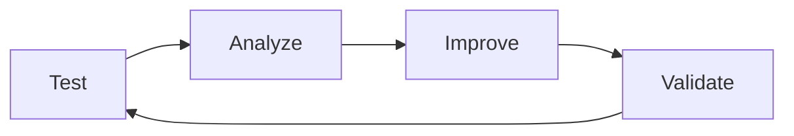

# AI Framework Testing Guide

## 📋 Overview

This guide provides comprehensive instructions for testing AI development frameworks and processes to identify improvement opportunities and validate system performance before implementing enhancements.

## 🎯 Purpose

- **Establish Baselines**: Measure current system performance
- **Identify Pain Points**: Document specific areas needing improvement
- **Validate Improvements**: Confirm enhancements deliver expected benefits
- **Ensure Quality**: Maintain high standards throughout improvement process
- **Guide Decision Making**: Use data-driven insights for prioritization

## 🚀 Quick Start

### For First-Time Testing

1. **Read this guide completely** before starting
2. **Use the test creation script** to generate test tracking file
3. **Execute test cases systematically** in fresh sessions
4. **Document everything** - even small observations matter
5. **Analyze results** before proposing improvements

### For Follow-Up Testing

1. **Review previous test results** to understand baseline
2. **Update existing test tracking file** with new results
3. **Compare performance** against previous benchmarks
4. **Focus on regression testing** for implemented improvements

## 🧪 Test Design Principles

### 1. Comprehensive Coverage

- **Workflow Testing**: Cover complete end-to-end processes
- **Edge Case Testing**: Test error conditions and unusual scenarios
- **Performance Testing**: Measure speed, accuracy, and efficiency
- **User Experience Testing**: Evaluate human-AI collaboration quality
- **Integration Testing**: Test how components work together

### 2. Realistic Scenarios

- **Use actual prompts** that real users would provide
- **Test in production-like conditions** with real project context
- **Include time pressure** and context switching scenarios
- **Test with varying levels of user expertise**
- **Simulate real-world interruptions** and complications

### 3. Measurable Outcomes

- **Define clear success criteria** before testing
- **Use quantitative metrics** where possible
- **Include qualitative assessments** for user experience
- **Track performance trends** over time
- **Document both positive and negative results**

## 📝 Test Case Creation

### Step 1: Define Test Objectives

```markdown
## Test Objectives

1. **Primary Goal**: What is the main thing you want to validate?
2. **Success Criteria**: How will you know if the test passed?
3. **Performance Targets**: What metrics should be achieved?
4. **User Experience Goals**: What should the experience feel like?
```

### Step 2: Design Test Scenarios

```markdown
## Test Scenario Design

- **Context**: What situation is being tested?
- **User Prompt**: Exact words the user would say
- **Expected AI Response**: What should happen?
- **Success Indicators**: How to recognize success
- **Failure Indicators**: What would indicate problems
```

### Step 3: Define Expected Results

```markdown
## Expected Results Checklist

- ✅ **Behavior 1**: Specific expected action
- ✅ **Behavior 2**: Another expected outcome
- ✅ **Performance**: Time/quality expectations
- ✅ **User Experience**: How it should feel
- ✅ **Error Handling**: How problems are managed
```

## 🔬 Test Execution

### Pre-Test Preparation

1. **Fresh Environment**: Start each test in a new AI session
2. **Clean State**: Ensure no previous context affects results
3. **Documentation Ready**: Have tracking file open for notes
4. **Timer Ready**: Track actual time from start to completion
5. **Screen Recording**: Consider recording complex interactions

### During Test Execution

1. **Use Exact Prompts**: Don't paraphrase or modify test prompts
2. **Document Everything**: Record all AI responses and actions
3. **Note Timing**: Track how long each step takes
4. **Capture Errors**: Screenshot or copy any error messages
5. **Record Observations**: Note unexpected behaviors (good or bad)

### Post-Test Documentation

1. **Immediate Notes**: Record impressions while fresh
2. **Detailed Analysis**: Compare actual vs expected results
3. **Performance Metrics**: Calculate and record measurements
4. **Improvement Ideas**: Note specific suggestions
5. **Next Steps**: Identify follow-up actions needed

## 📊 Performance Metrics

### Time-Based Metrics

- **Session Startup Time**: Time from first prompt to productive work
- **Task Completion Time**: Time to complete specific workflows
- **Context Loading Time**: Time to understand project state
- **Response Time**: Time for AI to provide helpful responses

### Quality Metrics

- **Context Accuracy**: Percentage of correct project understanding
- **Process Adherence**: Percentage of workflow steps followed correctly
- **Error Recovery**: Percentage of problems handled gracefully
- **User Satisfaction**: Subjective rating of experience quality

### Efficiency Metrics

- **First-Time Success Rate**: Percentage of tasks completed without iteration
- **Rework Required**: Amount of correction/clarification needed
- **Resource Utilization**: How well available tools/context are used
- **Knowledge Transfer**: How well AI learns from session context

## 🔍 Results Analysis

### Quantitative Analysis

```markdown
## Performance Analysis

- **Baseline vs Actual**: Compare against targets
- **Trend Analysis**: Look for patterns across tests
- **Statistical Significance**: Ensure results are meaningful
- **Outlier Investigation**: Understand unusual results
```

### Qualitative Analysis

```markdown
## Experience Analysis

- **User Journey**: Map the complete experience
- **Pain Points**: Identify frustration or confusion
- **Delight Moments**: Note particularly good experiences
- **Improvement Opportunities**: Specific enhancement ideas
```

### Root Cause Analysis

```markdown
## Issue Investigation

- **Symptom**: What was observed?
- **Immediate Cause**: What directly caused the issue?
- **Root Cause**: What underlying factor enabled the problem?
- **System Impact**: How does this affect other areas?
- **Solution Options**: What could address this issue?
```

## 🎯 Improvement Prioritization

### Impact Assessment

- **High Impact**: Affects core workflows or user satisfaction
- **Medium Impact**: Improves efficiency or reduces friction
- **Low Impact**: Nice-to-have enhancements

### Effort Assessment

- **Low Effort**: Quick fixes or configuration changes
- **Medium Effort**: Requires development but straightforward
- **High Effort**: Complex changes requiring significant work

### Priority Matrix

| Impact     | Low Effort    | Medium Effort   | High Effort |
| ---------- | ------------- | --------------- | ----------- |
| **High**   | 🟢 Do First   | 🟡 Plan Soon    | 🟠 Consider |
| **Medium** | 🟢 Quick Wins | 🟡 Evaluate     | 🔴 Defer    |
| **Low**    | 🟡 If Time    | 🔴 Probably Not | 🔴 Skip     |

## 🔄 Continuous Testing

### Regression Testing

- **After Each Change**: Verify improvements don't break existing functionality
- **Before Major Releases**: Comprehensive testing of all workflows
- **Periodic Health Checks**: Regular testing to catch degradation

### Performance Monitoring

- **Baseline Tracking**: Maintain historical performance data
- **Trend Analysis**: Monitor performance over time
- **Alert Thresholds**: Define when performance requires attention

### User Feedback Integration

- **Feedback Collection**: Gather input from actual users
- **Issue Correlation**: Connect user reports to test results
- **Validation Testing**: Test fixes for reported problems

## 🛠️ Tools and Scripts

### Test Creation Script

```powershell
# Generate new test tracking file
Create-TestTracking.ps1"
```

### Test Execution Helpers

```powershell
# Start test session with timing
Start-TestSession.ps1cess-framewor/improvement/testing/../../../process-framework/improvement/testing/ai-framework-testing-tracking.md"
```

### Results Analysis Tools

```powershell
# Analyze test results and generate summary
Analyze-TestResults.ps1ovement/testing/ai-framework-testing-tracking.md"
```

## 📋 Best Practices

### Do's ✅

- **Test Early and Often**: Don't wait until problems are obvious
- **Document Everything**: Small details can reveal important patterns
- **Use Real Scenarios**: Test with actual use cases, not artificial ones
- **Include Edge Cases**: Test error conditions and unusual situations
- **Measure Consistently**: Use the same metrics across all tests
- **Share Results**: Make findings available to the team

### Don'ts ❌

- **Don't Skip Documentation**: Undocumented tests provide no value
- **Don't Test in Isolation**: Consider how changes affect other areas
- **Don't Ignore Negative Results**: Failures provide valuable learning
- **Don't Rush Analysis**: Take time to understand what results mean
- **Don't Test Without Purpose**: Every test should have clear objectives
- **Don't Forget Follow-Up**: Testing without action is wasteful

## 🚨 Common Pitfalls

### Testing Pitfalls

- **Confirmation Bias**: Looking only for expected results
- **Insufficient Sample Size**: Drawing conclusions from too few tests
- **Environmental Differences**: Testing in unrealistic conditions
- **Observer Effect**: Changing behavior because you're testing

### Analysis Pitfalls

- **Correlation vs Causation**: Assuming relationships that don't exist
- **Cherry Picking**: Focusing only on favorable results
- **Premature Optimization**: Fixing things that aren't really problems
- **Analysis Paralysis**: Over-analyzing instead of taking action

## 📞 Getting Help

### When to Seek Assistance

- **Test Design**: If you're unsure how to test something effectively
- **Results Interpretation**: If findings are unclear or contradictory
- **Tool Issues**: If scripts or tools aren't working properly
- **Process Questions**: If you're unsure about testing procedures

### Resources Available

- **Process Framework Documentation**: Complete testing procedures
- **Templates and Scripts**: Tools to streamline testing
- **Previous Test Results**: Historical data for comparison
- **Team Expertise**: Colleagues who have done similar testing

## 🔄 Continuous Improvement

### Testing Process Evolution

- **Regular Reviews**: Periodically evaluate testing effectiveness
- **Process Updates**: Improve testing procedures based on experience
- **Tool Enhancement**: Develop better tools and automation
- **Knowledge Sharing**: Share lessons learned across projects

### Feedback Loop



---

## 📚 Related Resources

- [AI Framework Test Tracking Template](../../improvement/templates/ai-framework-test-tracking-template.md)
- [Process Improvement Task](../../tasks/support/process-improvement-task.md)
- [AI Framework Testing Tracking](../../improvement/testing/ai-framework-testing-tracking.md)
- [Feedback Process Guide](../../improvement/feedback/README.md)

---

_This guide is a living document that should be updated based on testing experience and lessons learned._
