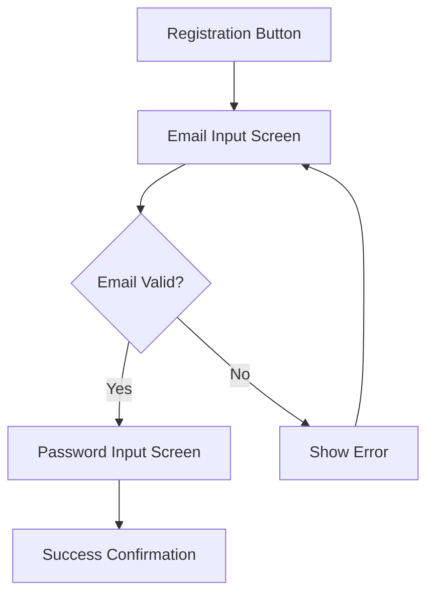

# UI/UX Design Customization Guide

## Overview

This guide provides comprehensive instructions for customizing UI/UX Design Document templates after they are created using the New-UIDesign.ps1 script. UI Design Documents translate functional requirements into concrete visual and interaction designs for Flutter features.

## When to Use

Use this guide when:

- You've created a UI Design document using New-UIDesign.ps1 and need to customize the template content
- You need to define visual design and interaction patterns for a feature
- You're working on features with significant user-facing UI components
- You need to create implementation-ready design specifications for developers

> **🚨 CRITICAL**: UI Design templates created by New-UIDesign.ps1 are structural frameworks only. They MUST be extensively customized with actual design specifications before use. Never use an uncustomized UI Design template.

> **🎨 MANDATORY**: ALWAYS consult the Design Guidelines (PD-UIX-001) before and during UI Design customization to ensure consistency with the design system.

## Table of Contents

1. [Prerequisites](#prerequisites)
2. [Background](#background)
3. [Template Structure Analysis](#template-structure-analysis)
4. [Customization Decision Points](#customization-decision-points)
5. [Step-by-Step Instructions](#step-by-step-instructions)
6. [Quality Assurance](#quality-assurance)
7. [Examples](#examples)
8. [Troubleshooting](#troubleshooting)
9. [Related Resources](#related-resources)

## Prerequisites

Before you begin, ensure you have:

- **UI Design Template Created**: A UI Design template generated using New-UIDesign.ps1
- **Feature Information**: Feature ID, name, and basic description from feature tracking
- **FDD Available**: Functional Design Document (PD-FDD-XXX) defining what the feature does
- **Design Guidelines Reviewed**: Design Guidelines (PD-UIX-001) thoroughly consulted
- **Human Consultation Completed**: Direct consultation with human partner about visual design preferences, brand requirements, and user experience expectations
- **Feature Tier Assessment**: Confirmation that the feature requires UI Design (indicated in feature tracking)
- **Platform Targets**: Knowledge of which platforms (iOS, Android, Web) need design specifications

## Background

UI/UX Design Documents bridge the gap between functional requirements (FDD) and technical implementation (TDD). They focus on **how** users interact with and perceive a feature through visual design, layout, interaction patterns, and accessibility. UI Designs are essential for:

- **Consistent User Experience**: Ensuring features follow established design system patterns
- **Developer Clarity**: Providing implementation-ready specifications for Flutter widgets
- **Accessibility**: Defining inclusive design that works for all users
- **Platform Adaptation**: Specifying iOS, Android, and Web-specific design adaptations
- **Quality Assurance**: Creating visual standards for testing and validation

## Template Structure Analysis

The UI Design template consists of 11 interconnected sections that provide a complete design specification:

### Required Sections

1. **Feature Overview**: Establishes design scope, platforms, and status
2. **Related Documentation**: Links to FDD, Design Guidelines, TDD, and API specs
3. **Design Overview**: Design goals, user context, constraints
4. **Wireframes & User Flows**: Visual journey through the feature
5. **Visual Design Specifications**: Colors, typography, spacing, icons
6. **Component Specifications**: Detailed specs for each UI component
7. **Accessibility Requirements**: WCAG 2.1 compliance and screen reader support
8. **Responsive Design**: Breakpoints and adaptive patterns
9. **Platform-Specific Adaptations**: iOS, Android, and Web-specific designs
10. **Animation & Transitions**: Motion principles and timing specifications
11. **Design System Integration**: Patterns applied and new patterns introduced

### Optional Sections

- **Implementation Notes**: Flutter widget recommendations, state management, assets
- **Design Handoff Checklist**: Quality gates before developer handoff
- **Appendix**: Design decisions log, user research, design resources

### Section Interdependencies

- Feature Overview establishes scope for all design decisions
- Design Guidelines (PD-UIX-001) inform Visual Design Specifications
- FDD drives Wireframes & User Flows
- Wireframes drive Component Specifications
- Component Specifications drive Implementation Notes

## Customization Decision Points

### Critical Customization Choices

1. **Design Depth**: How detailed should the design specifications be?

   - **Simple Features (Tier 1)**: May only need wireframes and basic component specs
   - **Moderate Features (Tier 2)**: Detailed wireframes, visual specs, component specs
   - **Complex Features (Tier 3)**: Complete specifications across all sections
   - **Decision Criteria**: Base on feature complexity, novelty, and risk

2. **Wireframe Fidelity**: ASCII sketches or detailed diagrams?

   - **Low Fidelity (ASCII)**: Quick, early-stage concepts; good for discussion
   - **Medium Fidelity (Mermaid)**: Structured diagrams for flows; good for documentation
   - **High Fidelity (External Tool)**: Pixel-perfect mockups; good for complex UIs
   - **Recommendation**: Start low, increase fidelity as design solidifies

3. **Component Reusability**: Existing vs. custom components?

   - **Prefer Existing**: Use Flutter Material/Cupertino components when possible
   - **Customize Minimally**: Extend existing components before creating new ones
   - **Create New**: Only when existing components don't meet needs
   - **Document New**: Add reusable custom components to design system

4. **Platform Strategy**: Unified vs. platform-specific design?

   - **Unified Design**: Same visual design, adapts to platform conventions (navigation, interactions)
   - **Platform-Specific**: Different visual languages for iOS vs Android
   - **Hybrid**: Core brand elements unified, secondary elements platform-specific
   - **Recommendation**: Unified design with platform-specific adaptations

5. **Animation Complexity**: Minimal, moderate, or rich animations?

   - **Minimal**: Standard transitions (screen changes, button presses)
   - **Moderate**: Feedback animations, loading states, simple micro-interactions
   - **Rich**: Complex multi-step animations, delightful details
   - **Constraint**: Must maintain 60 FPS on mid-range devices

## Step-by-Step Instructions

### Phase 1: Preparation (Consultation & Research)

#### Step 1: Review Prerequisites

**Action**: Verify all prerequisites are met before customization

**Checklist**:

- [ ] UI Design template created via New-UIDesign.ps1
- [ ] FDD reviewed and understood (PD-FDD-XXX)
- [ ] Design Guidelines reviewed (PD-UIX-001)
- [ ] Feature ID and name confirmed from feature tracking
- [ ] Target platforms identified (iOS/Android/Web)

**Human Consultation Required**: Yes

- Discuss visual design preferences and brand requirements
- Clarify user experience expectations
- Identify any design constraints or special considerations

#### Step 2: Consult Design Guidelines (PD-UIX-001)

**Action**: Thoroughly review design system guidelines before design work

**Key Areas to Review**:

- [ ] Design Principles (Section 1)
- [ ] Color Palette (Section 2.1)
- [ ] Typography (Section 2.2)
- [ ] Spacing & Layout (Section 2.3)
- [ ] Component Library (Section 3)
- [ ] Accessibility Standards (Section 4)
- [ ] Platform-Specific Guidelines (Section 5)
- [ ] Design Patterns (Section 8)

**Why This Matters**: Design Guidelines ensure consistency across all features and prevent reinventing solved patterns.

#### Step 3: Analyze Functional Requirements

**Action**: Review FDD to understand functional requirements that impact design

**Key Questions**:

- What are the primary user goals for this feature?
- What data needs to be displayed?
- What user inputs are required?
- What feedback does the user need?
- Are there complex user flows or decision points?

**Output**: List of design-impacting functional requirements

### Phase 2: Core Design (Wireframes & Visual Design)

#### Step 4: Customize Feature Overview (Section 1)

**Action**: Complete the feature overview section with design scope

**Fields to Customize**:

- **Feature ID**: [From feature tracking]
- **Feature Name**: [From feature tracking]
- **Design Scope**: [Brief description - what UI elements are being designed]
- **Target Platforms**: Check applicable platforms: iOS, Android, Web
- **Design Status**: Set to 🎨 Draft initially

**Example**:

```markdown
- **Feature ID**: 1.1.1
- **Feature Name**: User Registration
- **Design Scope**: Registration form UI, email validation feedback, success confirmation
- **Target Platforms**: ☑ iOS • ☑ Android • ☐ Web
- **Design Status**: 🎨 Draft
```

#### Step 5: Link Related Documentation (Section 2)

**Action**: Add cross-references to related documents

**Documents to Link**:

- **FDD**: Link to functional design document (PD-FDD-XXX)
- **Design Guidelines**: Link to PD-UIX-001 (already in template)
- **TDD**: Add link when TDD is created (or mark as "To be created")
- **API**: Add link to API specification if available (PD-API-XXX)

**Customize Content**:

- Under "Key Functional Requirements Impacting Design": List 2-3 specific requirements from FDD that directly influence UI design
- Under "Design System Patterns Applied": List specific patterns from PD-UIX-001 that you'll use (e.g., "Empty state pattern", "Form validation pattern")

#### Step 6: Define Design Goals (Section 3.1)

**Action**: Establish UX objectives and success metrics

**Primary Goals** (3-5 specific goals):

- Example: "Enable users to complete registration in <30 seconds"
- Example: "Provide clear validation feedback for every input field"
- Example: "Achieve 100% keyboard navigation support"

**Success Metrics** (measurable):

- Example: "Task completion rate > 95%"
- Example: "User satisfaction score > 4.5/5"

**Human Consultation Required**: Yes

- Validate design goals align with business objectives
- Confirm success metrics are meaningful and trackable

#### Step 7: Create Wireframes & User Flows (Section 4)

**Action**: Design the user journey and screen layouts

**Step 7a: User Flow Diagram**

- Use Mermaid flowchart to visualize user journey
- Include entry point, primary path, alternative paths, exit points
- Keep flows simple and focused on happy path + 1-2 critical alternatives

**Example Mermaid Diagram**:



**Step 7b: Screen Wireframes**

For each screen in the flow:

- Create ASCII wireframe or describe layout
- List interactive elements with purpose and behavior
- Note layout considerations (spacing, alignment, hierarchy)

**Wireframe Template** (ASCII):

```
┌─────────────────────────────────────┐
│  [Header: "Create Account"]        │
├─────────────────────────────────────┤
│  [Text: "Welcome! Enter your email"]│
│                                     │
│  [Input Field: Email]               │
│  [Helper Text: "We'll send a code"] │
│                                     │
│  [Primary Button: "Continue"]       │
│  [Link: "Already have account?"]    │
│                                     │
└─────────────────────────────────────┘
```

**Decision Point**: Choose wireframe fidelity based on complexity:

- Simple screens: ASCII sketches sufficient
- Complex layouts: Consider Mermaid diagrams or external tools (Figma)

#### Step 8: Visual Design Specifications (Section 5)

**Action**: Define colors, typography, spacing, and icons

**Step 8a: Colors**

- **DO**: Reference colors from Design Guidelines (PD-UIX-001 Section 2.1)
- **DON'T**: Introduce new colors without justification
- List specific colors used in this feature:
  - Primary actions: [Color name] `#XXXXXX`
  - Success states: [Color name] `#XXXXXX`
  - Error states: [Color name] `#XXXXXX`

**Step 8b: Typography**

- **DO**: Use type scale from Design Guidelines (PD-UIX-001 Section 2.2)
- List text styles used:
  - Page title: H1 (32px Bold)
  - Input labels: Caption (12px Regular)
  - Button text: Button (14px Medium)

**Step 8c: Spacing**

- **DO**: Use 8px spacing scale from Design Guidelines (PD-UIX-001 Section 2.3)
- Specify spacing for key components:
  - Form field spacing: 16px (spacing-md)
  - Button padding: 12px vertical, 16px horizontal
  - Screen margins: 16px (mobile), 24px (tablet)

**Step 8d: Icons**

- **DO**: Use Material Icons (rounded) from Design Guidelines (PD-UIX-001 Section 2.4)
- List icons used:
  - Email icon: `email_outlined` (24px)
  - Error icon: `error` (16px, red)
  - Success icon: `check_circle` (24px, green)

#### Step 9: Component Specifications (Section 6)

**Action**: Define each UI component with detailed specifications

**For Each Major Component**:

1. **Component Type**: Button, Input Field, Card, etc.
2. **Variants**: Primary, Secondary, etc.
3. **States**: Default, Hover, Pressed, Focused, Disabled, Loading, Error
4. **Dimensions**: Width, height, padding, margin
5. **Behavior**: User interactions, feedback, transitions
6. **Accessibility**: Labels, roles, focus, contrast

**Example: Primary Button**

```markdown
### 4.1 Component: Primary Button

**Component Type**: ElevatedButton (Flutter Material)

**Variants**:

- Primary: Brand purple background, white text

**States**:

- Default: Purple `#6200EE`, white text, 8px border radius
- Hover: Lighter purple `#7F39FB`
- Pressed: Darker purple `#3700B3`, scale 0.95
- Focused: 2px blue outline
- Disabled: Gray `#BDBDBD`, reduced opacity
- Loading: Circular progress indicator inside button

**Dimensions**:

- Height: 48dp (Android), 44pt (iOS)
- Padding: 16px horizontal, 12px vertical
- Min width: 88px

**Behavior**:

- Tap feedback: Ripple effect (Android), opacity change (iOS)
- Haptic feedback: Light impact on press (iOS)

**Accessibility**:

- Label: Button text is semantic label
- Role: Button
- Contrast: 4.7:1 (meets WCAG AA)
```

**Decision Point**: How many components to specify?

- Specify all major interactive components
- Reuse specifications from Design Guidelines when possible
- Group similar components (e.g., all button variants together)

### Phase 3: Accessibility & Responsive Design

#### Step 10: Accessibility Requirements (Section 7)

**Action**: Define accessibility compliance and screen reader support

**Step 10a: WCAG 2.1 Compliance Checklist**

- Go through the 4-point checklist (Perceivable, Operable, Understandable, Robust)
- Check off applicable requirements for this feature
- Identify any special accessibility considerations

**Key Requirements**:

- [ ] Text contrast ≥ 4.5:1
- [ ] Touch targets ≥ 44x44 points
- [ ] Keyboard accessible
- [ ] Screen reader tested

**Step 10b: Screen Reader Support**

- Define semantic labels for interactive elements
- Specify navigation order (focus order)
- Describe screen reader announcements for state changes

**Example**:

```markdown
**Required Semantic Labels**:

- Email input: "Email address" (label) + "Enter your email" (hint)
- Continue button: "Continue to password"
- Error message: "Error: Invalid email format. Please check and try again."
```

#### Step 11: Responsive Design (Section 8)

**Action**: Define how design adapts across screen sizes

**Step 11a: Breakpoints**

For each breakpoint (Mobile, Tablet, Desktop):

- Describe layout adjustments (single column → multi-column)
- Note component size changes (full-width → fixed-width buttons)
- Identify hidden/shown elements (hamburger menu → top nav)

**Step 11b: Adaptive Patterns**

- Define content priority (what shows on small screens)
- Specify navigation pattern per device size
- Describe form layout changes

**Example**:

```markdown
**Mobile (320px - 599px)**:

- Single column layout
- Full-width input fields
- Stacked buttons (vertical)
- Bottom navigation bar

**Tablet (900px+)**:

- 2-column layout for form
- Side-by-side buttons (horizontal)
- Persistent side navigation
```

#### Step 12: Platform-Specific Adaptations (Section 9)

**Action**: Define iOS, Android, and Web-specific design variations

**For Each Platform**:

- List platform-specific components used (e.g., CupertinoButton for iOS)
- Describe platform-specific behaviors (e.g., swipe gestures on iOS)
- Note compliance with platform guidelines (HIG for iOS, Material for Android)

**Example**:

```markdown
### 7.1 iOS Design

**iOS HIG Compliance**:

- Use bottom sheet modal for registration flow
- Swipe down to dismiss (with confirmation)
- iOS-style text fields with floating labels

**iOS Components Used**:

- CupertinoNavigationBar
- CupertinoTextField
- CupertinoButton

**iOS-Specific Behaviors**:

- Haptic feedback on button press (light impact)
- Pull-to-refresh gesture
```

### Phase 4: Motion & Integration

#### Step 13: Animation & Transitions (Section 10)

**Action**: Specify motion principles and animation details

**Step 13a: Motion Principles**

- Define motion style (Fluid, Snappy, Subtle)
- Explain motion purpose (Feedback, Guidance, Continuity)

**Step 13b: Transition Specifications**

- Screen transitions: Type, duration, easing
- Component animations: Button press, modal appearance, etc.
- Loading animations: Spinner, skeleton, progress bar

**Example Table**:

| Element | Animation Type       | Duration | Easing    | Trigger            |
| ------- | -------------------- | -------- | --------- | ------------------ |
| Button  | Scale (0.95)         | 150ms    | easeOut   | On press           |
| Modal   | Fade + Slide up      | 300ms    | easeInOut | On open            |
| Error   | Shake + Color change | 400ms    | easeOut   | On validation fail |

**Performance Considerations**:

- [ ] Animations use GPU-accelerated properties (transform, opacity)
- [ ] Respect user's `prefers-reduced-motion` preference
- [ ] Target 60 FPS

#### Step 14: Design System Integration (Section 11)

**Action**: Document how this design integrates with the design system

**Step 14a: Reusable Patterns Applied**

- List patterns from Design Guidelines (PD-UIX-001) used in this feature
- Example: "Empty state pattern (Section 8.1)", "Form validation pattern (Section 8.1)"

**Step 14b: New Patterns Introduced**

- Identify any new patterns created for this feature
- Assess reusability (High, Medium, Low)
- Recommend adding to design system if reusable

**Example**:

```markdown
**Candidate Pattern 1**: Email validation with real-time feedback

- **Description**: Shows green checkmark icon as user types valid email
- **Reusability**: High (can be reused for all email inputs)
- **Recommendation**: Add to design system as "Real-time Input Validation" pattern
```

### Phase 5: Implementation & Handoff

#### Step 15: Implementation Notes (Section 12)

**Action**: Provide Flutter-specific implementation guidance

**Step 15a: Widget Recommendations**

- List suggested Flutter widgets for this feature
- Group by purpose: Screen structure, Layout, Inputs, Buttons, Display, Navigation

**Example**:

```markdown
**Suggested Flutter Widgets**:

- **Screen Structure**: Scaffold, AppBar, BottomNavigationBar
- **Layout**: Column, Padding, SizedBox (spacing)
- **Inputs**: TextField with InputDecoration
- **Buttons**: ElevatedButton, TextButton
```

**Step 15b: State Management**

- Identify UI state types (Local, Feature, Global)
- Recommend state management approach (Riverpod/Provider/BLoC)

**Step 15c: Asset Requirements**

- List images, illustrations, icons needed
- Specify formats and resolutions

#### Step 16: Complete Design Handoff Checklist (Section 13)

**Action**: Verify design readiness before developer handoff

**Checklist**:

- [ ] All wireframes completed
- [ ] Visual specifications documented
- [ ] Component specifications defined
- [ ] Accessibility requirements documented
- [ ] Platform adaptations specified
- [ ] Animation specifications detailed
- [ ] Implementation notes provided
- [ ] Human review completed
- [ ] Technical feasibility confirmed

### Phase 6: Quality Assurance

#### Step 17: Human Consultation & Review

**Action**: Review customized UI Design with human partner

**Human Consultation Required**: Yes

**Review Topics**:

- Visual design aligns with brand guidelines
- User flows are intuitive and efficient
- Accessibility requirements are comprehensive
- Platform adaptations are appropriate
- Design is feasible to implement in Flutter
- Design meets business requirements

**Questions to Ask**:

- Does this design align with our brand identity?
- Are there any missing user scenarios or edge cases?
- Are the accessibility requirements sufficient?
- Is there anything that seems technically challenging to implement?

#### Step 18: Verify Design Guidelines Compliance

**Action**: Cross-check design against Design Guidelines (PD-UIX-001)

**Verification Checklist**:

- [ ] Colors match design system palette (Section 2.1)
- [ ] Typography follows type scale (Section 2.2)
- [ ] Spacing uses 8px grid (Section 2.3)
- [ ] Icons from approved library (Section 2.4)
- [ ] Components use Flutter Material/Cupertino (Section 3)
- [ ] Accessibility meets WCAG 2.1 Level AA (Section 4)
- [ ] Platform guidelines followed (Section 5)
- [ ] Design patterns applied correctly (Section 8)

**If Non-Compliant**: Document reason for deviation and get approval

#### Step 19: Technical Feasibility Review

**Action**: Confirm design is implementable in Flutter

**Review Questions**:

- Can all components be built with Flutter Material/Cupertino or simple custom widgets?
- Are animations performant (60 FPS target)?
- Are asset sizes reasonable (images, fonts)?
- Is responsive design achievable with Flutter layout widgets?
- Are platform-specific adaptations feasible?

**Risk Mitigation**: If any aspect seems difficult, consult with developer or create prototype

## Quality Assurance

### Completeness Check

Before considering the UI Design complete, verify:

**Section Completeness**:

- [ ] Feature Overview: All fields filled
- [ ] Related Documentation: All links added
- [ ] Design Overview: Goals, context, constraints defined
- [ ] Wireframes & User Flows: All screens documented
- [ ] Visual Design: Colors, typography, spacing, icons specified
- [ ] Component Specs: All major components detailed
- [ ] Accessibility: WCAG checklist completed, screen reader support defined
- [ ] Responsive Design: Breakpoints and adaptive patterns documented
- [ ] Platform Adaptations: iOS, Android, Web variations specified
- [ ] Animation: Motion principles and transition specs defined
- [ ] Design System Integration: Patterns identified
- [ ] Implementation Notes: Widget recommendations provided
- [ ] Design Handoff Checklist: All items checked

**Content Quality**:

- [ ] All placeholder text replaced with actual content
- [ ] All wireframes are clear and understandable
- [ ] All component specifications are implementation-ready
- [ ] All measurements use proper units (px, dp, pt)
- [ ] All colors specified with hex codes
- [ ] All accessibility requirements are testable

**Consistency**:

- [ ] Design follows Design Guidelines (PD-UIX-001)
- [ ] Terminology consistent with FDD
- [ ] Component naming consistent throughout document
- [ ] Platform-specific designs respect platform conventions

### Human Review

**Required Reviews**:

1. **Design Review**: Visual design, brand alignment, user experience
2. **Accessibility Audit**: WCAG compliance, screen reader support
3. **Technical Review**: Implementation feasibility, Flutter widget choices
4. **Stakeholder Review**: Meets business requirements and expectations

## Examples

### Example 1: Simple Feature (Tier 1) - Empty State Display

**Scope**: Minimal UI design for empty state screen

**Sections to Customize**:

- Feature Overview: Brief description
- Wireframes: Single ASCII sketch
- Visual Design: Reference existing colors/typography
- Component Specs: Icon + Text + Button (brief)
- Accessibility: Basic compliance checklist
- Implementation: Widget list only

**Time Estimate**: 30-45 minutes

### Example 2: Moderate Feature (Tier 2) - User Profile Form

**Scope**: Standard form UI with validation

**Sections to Customize**:

- Feature Overview: Complete
- Wireframes: 2-3 screen wireframes
- Visual Design: Colors, typography, spacing for form elements
- Component Specs: Text fields, buttons, avatar upload (detailed)
- Accessibility: Full WCAG checklist, screen reader labels
- Responsive: Mobile vs desktop layouts
- Platform: iOS vs Android input styles
- Implementation: Widget recommendations + state management notes

**Time Estimate**: 2-3 hours

### Example 3: Complex Feature (Tier 3) - Multi-Step Booking Flow

**Scope**: Complex multi-screen flow with animations

**Sections to Customize**:

- Feature Overview: Complete with all platforms
- Wireframes: 5-7 screens with detailed Mermaid flow diagram
- Visual Design: Full specifications including custom color variations
- Component Specs: All components across all screens (10+ components)
- Accessibility: Comprehensive requirements including testing notes
- Responsive: All breakpoints with adaptive patterns
- Platform: Full iOS, Android, Web adaptations
- Animation: Screen transitions, loading states, micro-interactions
- Design System: New patterns proposed
- Implementation: Detailed widget architecture, state management strategy

**Time Estimate**: 4-6 hours

## Troubleshooting

### Issue: Don't know which design patterns to use

**Solution**:

1. Review Design Guidelines (PD-UIX-001) Section 8: Design Patterns
2. Look at similar features in the app for inspiration
3. Check platform-specific guidelines (iOS HIG, Material Design)
4. Consult human partner for design direction

### Issue: Wireframes are too complex for ASCII

**Solution**:

- Use Mermaid diagrams for structured layouts
- Create external mockups in Figma/Sketch and link them in appendix
- Describe layout in prose if visuals are difficult

### Issue: Not sure about color contrast ratios

**Solution**:

- Use online contrast checker: https://webaim.org/resources/contrastchecker/
- Target 4.5:1 for normal text, 3:1 for large text
- Reference pre-approved colors from Design Guidelines (PD-UIX-001 Section 2.1)

### Issue: Platform-specific designs seem redundant

**Solution**:

- If designs are 90%+ similar across platforms, document once with notes on platform differences
- Only create separate sections if significant design variations exist
- Focus on navigation patterns, native components, and gesture conventions

### Issue: Don't know which Flutter widgets to recommend

**Solution**:

- Start with Material widgets (most common): TextField, ElevatedButton, Card, ListTile
- Use Cupertino widgets for iOS-specific designs
- Reference Flutter widget catalog: https://docs.flutter.dev/ui/widgets
- Consult with developer if unsure

### Issue: Animation specifications are unclear

**Solution**:

- Use the table format from Section 10.2 for structure
- Define: Element, Animation Type (what animates), Duration, Easing, Trigger
- Reference Material Motion guidelines for timing: https://m2.material.io/design/motion/speed.html
- Keep animations simple: most are 100-300ms with easeOut/easeInOut

### Issue: Design violates Design Guidelines

**Solution**:

1. Double-check if violation is necessary (user need, technical constraint, business requirement)
2. Document reason for deviation in "Design Decisions Log" (Appendix A)
3. Consult human partner for approval
4. If pattern is reusable, propose updating Design Guidelines through evolution process (PD-UIX-001 Section 10.2)

## Related Resources

### Core Documents

- **Design Guidelines (PD-UIX-001)**: Foundational design system - MUST consult
- **FDD Template**: Functional requirements that inform UI design
- **TDD Template**: Technical implementation that follows UI design
- **Feature Tracking**: UI Design column for linking completed designs

### Platform Guidelines

- [iOS Human Interface Guidelines](https://developer.apple.com/design/human-interface-guidelines/)
- [Material Design 3](https://m3.material.io/)
- [Flutter Design](https://docs.flutter.dev/ui)

### Accessibility Resources

- [WCAG 2.1 Quick Reference](https://www.w3.org/WAI/WCAG21/quickref/)
- [Flutter Accessibility](https://docs.flutter.dev/ui/accessibility-and-internationalization/accessibility)
- [WebAIM Contrast Checker](https://webaim.org/resources/contrastchecker/)

### Tools

- **Design**: Figma, Sketch (for high-fidelity mockups)
- **Diagrams**: Mermaid, draw.io (for flows and wireframes)
- **Icons**: [Material Symbols](https://fonts.google.com/icons)
- **Color**: [Coolors](https://coolors.co/) (palette generation)

### Scripts & Templates

- **New-UIDesign.ps1**: Script that created this template
- **ui-design-template.md**: The template this guide customizes
- **Add-MarkdownTableColumn.ps1**: Used to add UI Design column to feature tracking

---

**Remember**: UI Design is about translating functional requirements into visual, tangible interfaces that users can understand and interact with. Always prioritize user needs, accessibility, and consistency with the design system.
