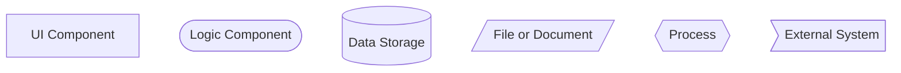
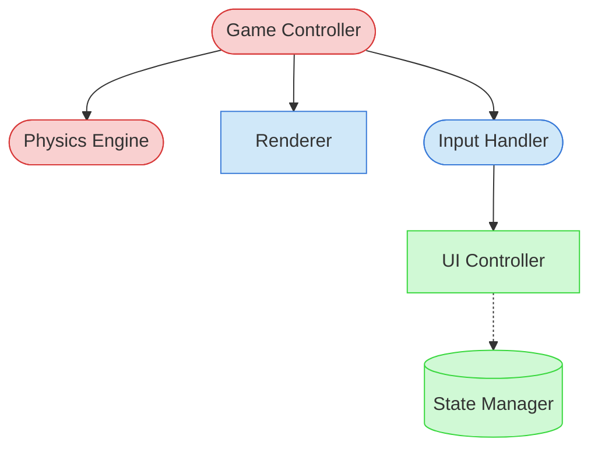

# Visual Notation Guide for AI Interpretation

This guide defines the standard notation used in project diagrams, optimized for AI text-based interpretation. These conventions are designed to be easily understood by AI agents working with text-based representations of diagrams.

## Component Symbols

## Component Types
- **UI Component**: `[Component Name]` - User interface elements, screens, and visual components
- **Logic Component**: `([Component Name])` - Business logic, game mechanics, algorithms
- **Data Storage**: `[(Component Name)]` - Databases, state management, persistent storage
- **File/Document**: `[/Component Name/]` - Documentation, TDDs, source files
- **Process**: `{{Component Name}}` - Workflows, procedures, task sequences
- **External System**: `>Component Name]` - Third-party integrations, external dependencies

## Relationship Types
- **Direct Dependency**: `-->` - Component A requires Component B
- **Bidirectional**: `<-->` - Components interact with each other
- **Indirect/Optional**: `-.->` - Loose coupling or optional dependency
- **Data Flow**: `--o-->` - Data passing between components
- **Inheritance/Extension**: `==>` - Component A extends or inherits from Component B

## Component Priority Classification
- **Critical**: Red fill `classDef critical fill:#f9d0d0,stroke:#d83a3a` - Components that must be understood first
- **Important**: Blue fill `classDef important fill:#d0e8f9,stroke:#3a7bd8` - Components that provide important context
- **Reference**: Green fill `classDef reference fill:#d0f9d5,stroke:#3ad83f` - Components referenced occasionally

## Example Diagram

## Text-based AI Interpretation Guide

1. **Parsing Priority**: AI agents should parse components in priority order (Critical → Important → Reference)
2. **Focus Areas**: Critical components represent the essential elements to load into context window
3. **Relationship Understanding**: Direct dependencies (`-->`) should be prioritized over indirect ones (`-.->`)
4. **Cross-referencing**: Component names in diagrams should match file and component names in code precisely

## Using Visual Notation in Documentation

When referencing components from diagrams in your documentation or discussions:

1. Use the exact component name as shown in the diagram
2. Include the component type for clarity: "the GameController logic component"
3. Reference the relationship type when discussing interactions: "InputHandler directly depends on UIController"
4. Use priority levels to guide attention: "Focus on the critical Physics Engine component first"

This standardized notation ensures consistent visualization across the project and helps AI agents efficiently interpret component relationships without requiring excessive context space.
