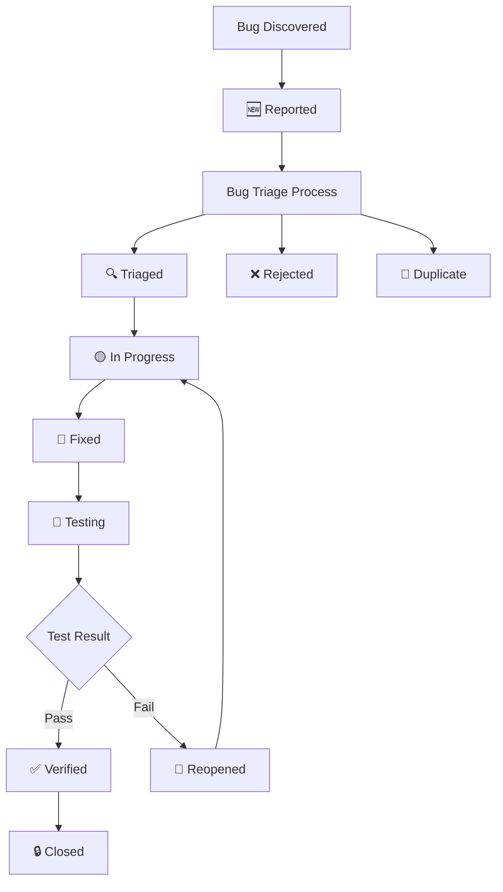

# Bug Tracking

This document tracks the lifecycle of bugs and issues in the LinkWatcher project, providing a systematic approach to bug identification, triage, resolution, and verification.

<strong>📋 Table of Contents</strong>

- [Status Legends](#status-legends)
  - [Bug Status](#bug-status)
  - [Priority Levels](#priority-levels)
  - [Severity Levels](#severity-levels)
  - [Source Types](#source-types)
- [Bug Management Workflow](#bug-management-workflow)
- [Bug Registry](#bug-registry)
  - [Critical Bugs](#critical-bugs)
  - [High Priority Bugs](#high-priority-bugs)
  - [Medium Priority Bugs](#medium-priority-bugs)
  - [Low Priority Bugs](#low-priority-bugs)
- [Closed Bugs](#closed-bugs)
- [Bug Statistics](#bug-statistics)

## Status Legends

### Bug Status

| Symbol | Status      | Description                                           |
| ------ | ----------- | ----------------------------------------------------- |
| 🆕     | Reported    | Bug has been reported but not yet triaged             |
| 🔍     | Triaged     | Bug has been evaluated and prioritized                |
| 🟡     | In Progress | Bug is currently being investigated or fixed          |
| 🧪     | Fixed       | Bug fix has been implemented and is ready for testing |
| ✅     | Verified    | Bug fix has been tested and confirmed working         |
| 🔒     | Closed      | Bug has been resolved and closed                      |
| 🔄     | Reopened    | Previously closed bug has been reopened               |
| ❌     | Rejected    | Bug report was determined to be invalid or not a bug  |
| 🚫     | Duplicate   | Bug is a duplicate of another existing bug            |

### Priority Levels

| Priority | Description                                 | Response Time     |
| -------- | ------------------------------------------- | ----------------- |
| P1       | Critical - System breaking, security issues | Immediate         |
| P2       | High - Major functionality affected         | Within 24 hours   |
| P3       | Medium - Minor functionality affected       | Within 1 week     |
| P4       | Low - Cosmetic or enhancement requests      | When time permits |

### Severity Levels

| Severity | Description                                        |
| -------- | -------------------------------------------------- |
| Critical | System crash, data loss, security vulnerability    |
| High     | Major feature not working, significant user impact |
| Medium   | Minor feature issue, workaround available          |
| Low      | Cosmetic issue, minimal user impact                |

### Source Types

| Source                 | Description                              |
| ---------------------- | ---------------------------------------- |
| Testing                | Discovered during test execution         |
| Test Development       | Found during test implementation         |
| Test Audit             | Discovered during test audit process     |
| User Report            | Reported by end users                    |
| Code Review            | Found during code review process         |
| Feature Development    | Found during feature implementation      |
| Foundation Development | Found during foundational feature work   |
| Code Refactoring       | Discovered during refactoring activities |
| Deployment             | Found during release deployment          |
| Monitoring             | Detected by system monitoring            |
| Development            | Found during general development work    |

## Bug Management Workflow

## Bug Registry

### Critical Bugs

| ID                                    | Title | Status | Priority | Severity | Source | Reported Date | Target Fix Date | Description | Related Feature | Notes |
| ------------------------------------- | ----- | ------ | -------- | -------- | ------ | ------------- | --------------- | ----------- | --------------- | ----- |
| _No critical bugs currently reported_ |

### High Priority Bugs

| ID                                         | Title | Status | Priority | Severity | Source | Reported Date | Target Fix Date | Description | Related Feature | Notes |
| ------------------------------------------ | ----- | ------ | -------- | -------- | ------ | ------------- | --------------- | ----------- | --------------- | ----- |
| _No high priority bugs currently reported_ |

### Medium Priority Bugs

| ID         | Title                                    | Status      | Priority | Severity | Source      | Reported Date | Target Fix Date | Description                                                                                   | Related Feature           | Notes                                                                                                                                         |
| ---------- | ---------------------------------------- | ----------- | -------- | -------- | ----------- | ------------- | --------------- | --------------------------------------------------------------------------------------------- | ------------------------- | --------------------------------------------------------------------------------------------------------------------------------------------- |
| PD-BUG-005 | Stale line numbers cause link updates to fail after file editing | 🆕 Reported | P3 | Medium | Development | 2026-02-19 | — | When a user edits a file and adds/removes lines, LinkWatcher does not rescan (on_modified not overridden). The database retains stale line_number values. When a referenced file is subsequently moved, the updater uses stale line numbers (updater.py:119-122) to locate lines, finds no match, and silently skips the update. | 1.1.2 Event Handler, 2.2.1 Link Updater | Environment: Development; Component: Event Handler / Link Updater; Workaround: restart LinkWatcher or trigger a rescan before moving files after edits |

### Low Priority Bugs

| ID                                         | Title | Status | Priority | Severity | Source | Reported Date | Target Fix Date | Description | Related Feature | Notes |
| ------------------------------------------ | ----- | ------ | -------- | -------- | ------ | ------------- | --------------- | ----------- | --------------- | ----- |
| _No high priority bugs currently reported_ |

## Closed Bugs

<strong>View Closed Bugs History</strong>

| ID         | Title                                            | Status    | Priority | Severity | Source      | Reported Date | Target Fix Date | Description                                                                              | Related Feature    | Notes                                                                                                                                                                                            |
| ---------- | ------------------------------------------------ | --------- | -------- | -------- | ----------- | ------------- | --------------- | ---------------------------------------------------------------------------------------- | ------------------ | ------------------------------------------------------------------------------------------------------------------------------------------------------------------------------------------------ |
| PD-BUG-004 | Compilation Errors in EscapeRoomCachedRepository | 🔒 Closed | P1       | Critical | Development | 2025-09-04    | 2025-01-02      | Multiple compilation errors due to conflicting SearchResults classes and missing imports | Cache System 0.2.1 | Environment: Development; Component: Cache System; Closed: 2025-01-02; Resolution: Analysis confirmed no compilation errors exist - all imports are correct and classes are properly accessible. |

## Bug Statistics

### Current Status Summary

- **Total Active Bugs**: 1
- **Critical (P1)**: 0
- **High (P2)**: 0
- **Medium (P3)**: 1
- **Low (P4)**: 0

### Resolution Metrics

- **Total Bugs Resolved**: 2
- **Average Resolution Time**: 12 minutes
- **Bugs Reopened**: 0
- **Duplicate Rate**: 0%

### Source Analysis

- **Testing**: 1
- **Test Development**: 0
- **Test Audit**: 0
- **User Reports**: 0
- **Code Review**: 0
- **Feature Development**: 0
- **Foundation Development**: 0
- **Code Refactoring**: 0
- **Deployment**: 0
- **Monitoring**: 0
- **Development**: 3

---

## Integration with Feature Tracking

When bugs are related to specific features, they should reference the feature ID from [Feature Tracking](feature-tracking.md). This enables:

1. **Impact Assessment**: Understanding which features are affected by bugs
2. **Priority Alignment**: Aligning bug priority with feature priority
3. **Release Planning**: Ensuring critical bugs are fixed before feature releases
4. **Testing Coordination**: Coordinating bug fixes with feature testing

## Integration with Process Framework

This bug tracking system integrates with the following process framework components:

### Bug Management Tasks

- **[Bug Triage Task](../../tasks/06-maintenance/bug-triage-task.md)**: For bug evaluation and prioritization
- **[Bug Fixing Task](../../tasks/06-maintenance/bug-fixing-task.md)**: For bug resolution workflow

### Development Tasks with Bug Discovery Integration

- **[Data Layer Implementation (PF-TSK-051)](../../tasks/04-implementation/data-layer-implementation.md)**: Bug discovery during data model and repository work
- **[State Management Implementation (PF-TSK-056)](../../tasks/04-implementation/state-management-implementation.md)**: Bug discovery during state layer work
- **[UI Implementation (PF-TSK-052)](../../tasks/04-implementation/ui-implementation.md)**: Bug discovery during UI work
- **[Integration & Testing (PF-TSK-053)](../../tasks/04-implementation/integration-and-testing.md)**: Bug discovery during integration testing
- **[Quality Validation (PF-TSK-054)](../../tasks/04-implementation/quality-validation.md)**: Bug discovery during quality validation
- **[Implementation Finalization (PF-TSK-055)](../../tasks/04-implementation/implementation-finalization.md)**: Bug discovery during finalization
- **[Feature Enhancement (PF-TSK-068)](../../tasks/04-implementation/feature-enhancement.md)**: Bug discovery during enhancement work
- **[Foundation Feature Implementation Task](../../tasks/04-implementation/foundation-feature-implementation-task.md)**: Bug discovery during foundational work
- **[Integration & Testing (PF-TSK-053)](../../tasks/04-implementation/integration-and-testing.md)**: Bug discovery during test development
- **[Test Audit Task](../../tasks/03-testing/test-audit-task.md)**: Bug discovery during test auditing
- **[Code Review Task](../../tasks/06-maintenance/code-review-task.md)**: Bug discovery during code reviews
- **[Code Refactoring Task](../../tasks/06-maintenance/code-refactoring-task.md)**: Bug discovery during refactoring
- **[Release Deployment Task](../../tasks/07-deployment/release-deployment-task.md)**: Bug discovery during deployment

### Automation Integration

All development tasks use the **`New-BugReport.ps1`** script for standardized bug reporting, ensuring consistent bug documentation and automatic integration with this tracking system.

## Usage Guidelines

### Adding New Bugs

#### Automated Method (Recommended)

Use the **`New-BugReport.ps1`** script for standardized bug creation:

- Automatically generates sequential PD-BUG-XXX IDs
- Ensures consistent formatting and required fields
- Integrates with development task workflows
- Creates bug report documents and updates this tracking file

#### Manual Method

1. Use the next sequential bug ID (PD-BUG-001, PD-BUG-002, etc.)
2. Start with status 🆕 Reported
3. Fill in all required fields
4. Place in appropriate priority section
5. Reference related feature ID if applicable

### Updating Bug Status

1. Update the status symbol and any relevant fields
2. Add notes about status changes
3. Move bugs between priority sections if priority changes
4. Update statistics section

### Closing Bugs

1. Change status to 🔒 Closed
2. Move bug entry to Closed Bugs section
3. Update statistics
4. Document resolution approach in notes

### Bug ID Format

- **Format**: PD-BUG-XXX (where XXX is a sequential number)
- **Examples**: PD-BUG-001, PD-BUG-002, PD-BUG-003
- **Scope**: Project-wide unique identifiers following Product Documentation (PD) naming convention
- **Automated Creation**: When using `New-BugReport.ps1`, IDs are automatically generated in the correct format

---

_This document is maintained as part of the Process Framework State Tracking system and should be updated whenever bugs are reported, triaged, fixed, or closed._
