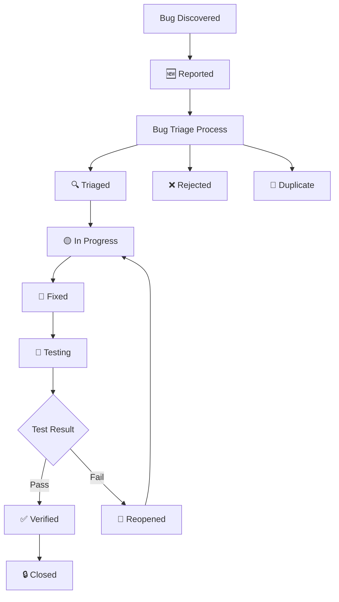

# Bug Tracking

This document tracks the lifecycle of bugs and issues in the LinkWatcher project, providing a systematic approach to bug identification, triage, resolution, and verification.

<strong>📋 Table of Contents</strong>

- [Status Legends](#status-legends)
  - [Bug Status](#bug-status)
  - [Priority Levels](#priority-levels)
  - [Scope Levels](#scope-levels)
  - [Source Types](#source-types)
- [Bug Management Workflow](#bug-management-workflow)
- [Bug Registry](#bug-registry)
  - [Critical Bugs](#critical-bugs)
  - [High Priority Bugs](#high-priority-bugs)
  - [Medium Priority Bugs](#medium-priority-bugs)
  - [Low Priority Bugs](#low-priority-bugs)
- [Closed Bugs](#closed-bugs)
- [Bug Statistics](#bug-statistics)

## Status Legends

### Bug Status

| Symbol | Status      | Description                                           |
| ------ | ----------- | ----------------------------------------------------- |
| 🆕     | Reported    | Bug has been reported but not yet triaged             |
| 🔍     | Triaged     | Bug has been evaluated and prioritized                |
| 🟡     | In Progress | Bug is currently being investigated or fixed          |
| 🧪     | Fixed       | Bug fix has been implemented and is ready for testing |
| ✅     | Verified    | Bug fix has been tested and confirmed working         |
| 🔒     | Closed      | Bug has been resolved and closed                      |
| 🔄     | Reopened    | Previously closed bug has been reopened               |
| ❌     | Rejected    | Bug report was determined to be invalid or not a bug  |
| 🚫     | Duplicate   | Bug is a duplicate of another existing bug            |

### Priority Levels

| Priority | Description                                 | Response Time     |
| -------- | ------------------------------------------- | ----------------- |
| P1       | Critical - System breaking, security issues | Immediate         |
| P2       | High - Major functionality affected         | Within 24 hours   |
| P3       | Medium - Minor functionality affected       | Within 1 week     |
| P4       | Low - Cosmetic or enhancement requests      | When time permits |

### Scope Levels

| Scope | Description                                                      |
| ----- | ---------------------------------------------------------------- |
| S     | Small — single-session fix, no state file needed                 |
| M     | Medium — may span sessions, state file recommended               |
| L     | Large — multi-session, state file required (New-BugFixState.ps1) |

### Source Types

| Source                 | Description                              |
| ---------------------- | ---------------------------------------- |
| Testing                | Discovered during test execution         |
| Test Development       | Found during test implementation         |
| Test Audit             | Discovered during test audit process     |
| User Report            | Reported by end users                    |
| Code Review            | Found during code review process         |
| Feature Development    | Found during feature implementation      |
| Foundation Development | Found during foundational feature work   |
| Code Refactoring       | Discovered during refactoring activities |
| Deployment             | Found during release deployment          |
| Monitoring             | Detected by system monitoring            |
| Development            | Found during general development work    |

## Bug Management Workflow

```mermaid
graph TD
    A[Bug Discovered] --> B[🆕 Reported]
    B --> C[Bug Triage Process]
    C --> D[🔍 Triaged]
    D --> E[🟡 In Progress]
    E --> F[🧪 Fixed]
    F --> G[🧪 Testing]
    G --> H{Test Result}
    H -->|Pass| I[✅ Verified]
    H -->|Fail| J[🔄 Reopened]
    I --> K[🔒 Closed]
    J --> E
    C --> L[❌ Rejected]
    C --> M[🚫 Duplicate]
```

## Bug Registry

### Critical Bugs

| ID | Title | Status | Priority | Scope | Reported | Description | Related Feature | Notes |
| --- | --- | --- | --- | --- | --- | --- | --- | --- |
| _No critical bugs currently reported_ |

### High Priority Bugs

| ID | Title | Status | Priority | Scope | Reported | Description | Related Feature | Notes |
| --- | --- | --- | --- | --- | --- | --- | --- | --- |
| PD-BUG-024 | Incorrect relative path calculation in _collect_path_updates for cross-depth moves | 🆕 Reported | P2 | | 2026-03-02 | When a file is moved across different directory depths (e.g., a/b/c/file.md to x/file.md), _collect_path_updates generates incorrect rel_new because it blindly strips one leading segment from new_path regardless of how many segments were stripped from old_path. This causes mismatched (rel_old, rel_new) pairs, potentially leading to incorrect database cleanup and missed reference updates. | N/A | Source: CodeReview; Environment: Development; Component: File System Monitoring; Evidence: Code analysis during TD010 refactoring: linkwatcher/handler.py:245 |

### Medium Priority Bugs

| ID | Title | Status | Priority | Scope | Reported | Description | Related Feature | Notes |
| --- | --- | --- | --- | --- | --- | --- | --- | --- |
| PD-BUG-008 | Chain reaction moves leave database in inconsistent state | 🔍 Triaged | P3 | | 2026-02-26 | When multiple files are moved in rapid succession, the database state is not properly updated between moves, causing references to intermediate paths | 0.1.2 In-Memory Link Database, 1.1.1 File System Monitoring | Source: Test Audit; Test: test_move_chain_reaction; Component: handler.py, database.py; Updated: 2026-02-26 |
| PD-BUG-009 | Unicode file names cause database lookup failures | 🔍 Triaged | P3 | | 2026-02-26 | Files with Unicode characters in their names fail during database path normalization and lookup, preventing proper reference tracking | 0.1.2 In-Memory Link Database | Source: Test Audit; Test: test_eh_007_unicode_file_names; Component: database.py; Updated: 2026-02-26 |
| PD-BUG-010 | Markdown link title attribute lost during updates | 🔍 Triaged | P3 | | 2026-02-26 | When updating markdown links that include title attributes (e.g., `[text](path "title")`), the updater strips the title portion, causing data loss | 2.2.1 Link Updating | Source: Test Audit; Test: test_lr_001_markdown_standard_links; Component: updater.py; Updated: 2026-02-26 |
| PD-BUG-011 | HTML anchor tags not parsed in markdown | 🔍 Triaged | P3 | | 2026-02-26 | Markdown parser does not recognize HTML anchor tags as valid link references. Note: backtick-delimited references were evaluated and determined to be not-a-bug (code content should not be modified by LinkWatcher). | 2.1.1 Link Parsing System | Source: Test Audit; Test: test_mixed_reference_types; Component: parsers/markdown.py; Updated: 2026-02-26 |
| PD-BUG-012 | Handler path normalization fails for PowerShell script references | 🔍 Triaged | P3 | | 2026-02-26 | When PowerShell scripts referencing markdown files are moved, the handler path normalization does not properly resolve link targets for updating | 1.1.1 File System Monitoring, 2.2.1 Link Updating | Source: Test Audit; Test: test_powershell_script_move_updates_markdown_links; Component: handler.py; Updated: 2026-02-26 |
| PD-BUG-021 | GenericParser regex requires file extension, preventing directory path detection | 🟡 In Progress | P3 | | 2026-02-27 | GenericParser's quoted_pattern and unquoted_pattern regexes both require a file extension (`\.[a-zA-Z0-9]+`) at the end of the match. Directory paths without extensions are never captured, so they are not updated when directories are moved. | 2.1.1 Link Parsing System | Source: Development; Component: parsers/generic.py (lines 22, 25), utils.py; Affects all GenericParser-handled files (.ps1, .sh, .bat, etc.); Fix requires balancing directory path detection vs false positive prevention; Updated: 2026-02-27 |
| PD-BUG-025 | Greedy str.replace for non-markdown link types can corrupt file content | 🆕 Reported | P3 | | 2026-03-02 | In _update_links_within_moved_file, non-markdown link types use content.replace(ref.link_target, new_target) which is an unbounded string replacement. If the link target string appears elsewhere in the file (comments, code, other links), ALL occurrences are replaced, not just the intended reference. Markdown links use a safer regex-based approach. | N/A | Source: CodeReview; Environment: Development; Component: File System Monitoring; Evidence: Code analysis during TD010 refactoring: linkwatcher/handler.py:821-823 |
| PD-BUG-026 | self.stats dict mutated from multiple threads without synchronization | 🆕 Reported | P3 | | 2026-03-02 | The self.stats dictionary in LinkMaintenanceHandler is incremented (+=) from multiple threads: watchdog event thread, timer threads, and background processing threads. Python += on integers is not atomic (read-increment-write). While CPython GIL makes data loss unlikely, stats has no lock protection unlike other shared state (move_detection_lock, dir_move_lock). | N/A | Source: CodeReview; Environment: Development; Component: File System Monitoring; Evidence: Code analysis during TD010 refactoring: linkwatcher/handler.py:115-121 and ~25 mutation sites across methods |

### Low Priority Bugs

| ID | Title | Status | Priority | Scope | Reported | Description | Related Feature | Notes |
| --- | --- | --- | --- | --- | --- | --- | --- | --- |
| PD-BUG-013 | JSON parser fails to resolve duplicate-value line numbers | 🔍 Triaged | P4 | | 2026-02-26 | When multiple JSON values contain the same file path string, the parser line-number resolution assigns incorrect line numbers to some references | 2.1.1 Link Parsing System | Source: Test Audit; Test: test_lr_005_json_file_references; Component: parsers/json_parser.py; Updated: 2026-02-26 |
| PD-BUG-014 | Long path normalization fails in database operations | 🔍 Triaged | P4 | | 2026-02-26 | Windows long paths (>260 characters) are not properly normalized during database add/lookup operations, causing path mismatches | 0.1.2 In-Memory Link Database | Source: Test Audit; Test: test_cp_004_long_path_support; Component: database.py; Updated: 2026-02-26 |
| PD-BUG-015 | structlog cached state bleeds between test instances | 🔍 Triaged | P4 | | 2026-02-26 | Global structlog configuration cache is not properly isolated between test instances, causing setup_logging test to fail when logger state from other tests bleeds through | 3.1.1 Logging System | Source: Test Audit; Test: test_logger_initialization; Component: logging.py; SOURCE_BUG; Updated: 2026-02-26 |

## Closed Bugs

<strong>View Closed Bugs History</strong>

| ID | Title | Status | Priority | Scope | Reported | Description | Related Feature | Notes |
| --- | --- | --- | --- | --- | --- | --- | --- | --- |
| PD-BUG-022 | Get-ProjectRoot finds project-config.json in doc/process-framework/ and returns wrong project root | 🔒 Closed | P2 | | 2026-02-27 | `Get-ProjectRoot` checked for `project-config.json` as a marker. Since it exists in `doc/process-framework/`, it returned wrong root, causing doubled paths. All `New-StandardProjectDocument` scripts failed. | 5.1.1 CI/CD & Development Tooling | Source: Development; Root cause: `project-config.json` used as directory marker but lives inside subdirectory. Fix: read `project.root_directory` field from the config. Verified: New-FeedbackForm.ps1 -WhatIf resolves correct path. Files changed: Core.psm1. Closed: 2026-02-27. |
| PD-BUG-023 | New-BugReport.ps1 fails to add entry to bug-tracking.md | 🔒 Closed | P2 | | 2026-02-27 | Script increments ID counter but does not add entry to bug-tracking table. Root causes: High priority placeholder mismatch, missing fallback for empty tables, SourceMap key mismatch with ValidateSet. | 5.1.1 CI/CD & Development Tooling | Source: Development; Fixed via IMP-055: corrected placeholder text, added header-separator fallback, fixed SourceMap keys. Closed: 2026-02-27. |
| PD-BUG-020 | Single file move triggers full project directory scan via missing trailing slash in _get_files_under_directory | 🔒 Closed | P2 | | 2026-02-27 | When a single file is moved on Windows (delete+create), `on_deleted` calls `_get_files_under_directory()` with the file path. The function builds `dir_prefix` by appending "/" BEFORE `normalize_path()`, but `os.path.normpath()` strips it. The file matches itself via `startswith()`, cascading into treating the project root as dest and walking all 657+ files. | 1.1.1 File System Monitoring | Source: Development; Root cause: `normalize_path(dir_path + "/")` — trailing "/" consumed by `os.path.normpath`. Fix: Changed to `normalize_path(dir_path) + "/"` (slash AFTER normalize). Tests: 3 regression tests, 21/21 pass. Files changed: handler.py. Introduced by: PD-BUG-019 fix. Closed: 2026-02-27. |
| PD-BUG-019 | Directory moves result in partial link updates due to per-file timeout expiration | 🔒 Closed | P2 | | 2026-02-26 | When a directory is moved on Windows, watchdog fires individual delete+create events per file. The per-file 10-second timer expires for most files while earlier matches process synchronously, causing partial link updates. | 1.1.1 File System Monitoring | Source: Development; Fix: 3-phase batch directory move detection. Root cause: `normalize_path()` strips trailing slashes. Tests: 18/18 pass, 1 regression test. Related: PD-BUG-016 (closed). Closed: 2026-02-27. |
| PD-BUG-007 | Special characters in filenames cause path matching failures | 🔒 Closed | P3 | | 2026-02-26 | Files with special characters (parentheses, ampersands, etc.) in their names fail to match during link update operations | 2.1.1 Link Parsing System | Source: Test Audit; Root cause: `quoted_pattern` regex in all 4 parsers used restrictive character class that excluded spaces, ampersands, parentheses. Fix: Changed to permissive `[^\'"]+`. Added URL filtering to `looks_like_file_path()`. Files changed: parsers/markdown.py, generic.py, python.py, dart.py, utils.py, test_complex_scenarios.py. Tests: all parser tests pass (69). Closed: 2026-02-26. |
| PD-BUG-018 | Watchdog observer thread dies silently, no error logging | 🔒 Closed | P2 | | 2026-02-26 | The watchdog Observer thread can crash without any log output. The handler has no on_error method, no top-level try/except on event methods, and the service main loop does not check observer.is_alive(). When the observer dies, the Python process keeps running as a zombie. | 1.1.1 File System Monitoring, 3.1.1 Logging System | Source: Development; Component: handler.py, service.py; Root cause: handler lacked on_error method, event methods had no try/except, service loop didn't check observer.is_alive(). Fix: (1) Added on_error, (2) wrapped events in try/except, (3) added is_alive() check. Tests: 5 regression tests. Closed: 2026-02-26. |
| PD-BUG-017 | LinkWatcher corrupts non-link path strings inside PowerShell scripts | 🔒 Closed | P2 | | 2026-02-26 | LinkWatcher treats path strings inside PowerShell script arguments (e.g. Join-Path -ChildPath) as link references and rewrites them during file move operations. This changed a project-root-relative path to a script-relative path, breaking the New-BugReport.ps1 script. | 2.1.1 Link Parsing System, 2.2.1 Link Updating | Source: Development; Root cause: `_calculate_new_target_relative` assumed all non-absolute paths are source-relative, but GenericParser captures project-root-relative paths from .ps1 files. Fix: direct-match early check. Tests: 5 regression tests. Files changed: updater.py, New-BugReport.ps1. Closed: 2026-02-26. |
| PD-BUG-016 | Directory moves not detected on Windows (watchdog fires delete+create instead of DirMovedEvent) | 🔒 Closed | P2 | | 2026-02-26 | When a directory is moved on Windows, watchdog fires delete+create instead of DirMovedEvent. The handler could not correlate these events. | 1.1.1 File System Monitoring | Source: Development; Fix 2a: `on_deleted` checks `_get_files_under_directory` when `event.is_directory=False`. Fix 2b: relative-to-source link target resolution before prefix matching. Tests: all 17 directory move tests pass. Files changed: handler.py, test_directory_move_detection.py. Closed: 2026-02-26. |
| PD-BUG-006 | Nested directory movement not fully supported | 🔒 Closed | P2 | | 2026-02-26 | When a directory containing files is moved, the handler does not fully update all nested file references in the database, causing stale paths | 1.1.1 File System Monitoring | Source: Test Audit; Root cause: Updater stale-line check compared slash-notation link_target against dot-notation line content, incorrectly flagging Python imports as stale. Fix: Updated stale detection in updater.py. Added stale retry in handler.py. Tests: 4 new regression tests. Files changed: updater.py, handler.py. Closed: 2026-02-26. |
| PD-BUG-005 | Stale line numbers cause link updates to fail after file editing | 🔒 Closed | P3 | | 2026-02-19 | When a user edits a file and adds/removes lines, the database retains stale line_number values. When a referenced file is subsequently moved, the updater uses stale line numbers to locate lines, finds no match, and silently skips the update. | 1.1.1 File System Monitoring, 2.2.1 Link Updating | Source: Development; Root cause: no on_modified handler + line-number-dependent updater. Fix: lazy stale detection in updater.py, rescan+retry in handler.py with exit gate (max 1 retry). Files changed: updater.py, handler.py. Tests: 6 unit + 1 integration. Closed: 2026-02-25. |
| PD-BUG-004 | Compilation Errors in EscapeRoomCachedRepository | 🔒 Closed | P1 | | 2025-09-04 | Multiple compilation errors due to conflicting SearchResults classes and missing imports | Cache System 0.2.1 | Source: Development; Environment: Development; Component: Cache System; Closed: 2025-01-02; Resolution: Analysis confirmed no compilation errors exist - all imports are correct and classes are properly accessible. |

## Bug Statistics

### Current Status Summary

- **Total Active Bugs**: 12
- **Critical (P1)**: 0
- **High (P2)**: 1
- **Medium (P3)**: 8
- **Low (P4)**: 3

---

## Integration with Feature Tracking

When bugs are related to specific features, they should reference the feature ID from [Feature Tracking](feature-tracking.md). This enables:

1. **Impact Assessment**: Understanding which features are affected by bugs
2. **Priority Alignment**: Aligning bug priority with feature priority
3. **Release Planning**: Ensuring critical bugs are fixed before feature releases
4. **Testing Coordination**: Coordinating bug fixes with feature testing

## Integration with Process Framework

This bug tracking system integrates with the following process framework components:

### Bug Management Tasks

- **[Bug Triage Task](../../tasks/06-maintenance/bug-triage-task.md)**: For bug evaluation and prioritization
- **[Bug Fixing Task](../../tasks/06-maintenance/bug-fixing-task.md)**: For bug resolution workflow

### Development Tasks with Bug Discovery Integration

- **[Data Layer Implementation (PF-TSK-051)](../../tasks/04-implementation/data-layer-implementation.md)**: Bug discovery during data model and repository work
- **[Integration & Testing (PF-TSK-053)](../../tasks/04-implementation/integration-and-testing.md)**: Bug discovery during integration testing
- **[Quality Validation (PF-TSK-054)](../../tasks/04-implementation/quality-validation.md)**: Bug discovery during quality validation
- **[Implementation Finalization (PF-TSK-055)](../../tasks/04-implementation/implementation-finalization.md)**: Bug discovery during finalization
- **[Feature Enhancement (PF-TSK-068)](../../tasks/04-implementation/feature-enhancement.md)**: Bug discovery during enhancement work
- **[Foundation Feature Implementation Task](../../tasks/04-implementation/foundation-feature-implementation-task.md)**: Bug discovery during foundational work
- **[Integration & Testing (PF-TSK-053)](../../tasks/04-implementation/integration-and-testing.md)**: Bug discovery during test development
- **[Test Audit Task](../../tasks/03-testing/test-audit-task.md)**: Bug discovery during test auditing
- **[Code Review Task](../../tasks/06-maintenance/code-review-task.md)**: Bug discovery during code reviews
- **[Code Refactoring Task](../../tasks/06-maintenance/code-refactoring-task.md)**: Bug discovery during refactoring
- **[Release Deployment Task](../../tasks/07-deployment/release-deployment-task.md)**: Bug discovery during deployment

### Automation Integration

All development tasks use the **`New-BugReport.ps1`** script for standardized bug reporting, ensuring consistent bug documentation and automatic integration with this tracking system.

## Usage Guidelines

### Adding New Bugs

#### Automated Method (Recommended)

Use the **`New-BugReport.ps1`** script for standardized bug creation:

- Automatically generates sequential PD-BUG-XXX IDs
- Ensures consistent formatting and required fields
- Integrates with development task workflows
- Creates bug report documents and updates this tracking file

#### Manual Method

1. Use the next sequential bug ID (PD-BUG-001, PD-BUG-002, etc.)
2. Start with status 🆕 Reported
3. Fill in all required fields
4. Place in appropriate priority section
5. Reference related feature ID if applicable

### Updating Bug Status

1. Update the status symbol and any relevant fields
2. Add notes about status changes
3. Move bugs between priority sections if priority changes
4. Update statistics section

### Closing Bugs

Use `Update-BugStatus.ps1 -NewStatus "Closed"` which automatically:
1. Changes status to 🔒 Closed
2. Moves the bug entry from its active priority table to the Closed Bugs section
3. Recalculates Bug Statistics (active counts, resolved count)
4. Appends verification notes and timestamp

### Reopening Bugs

Use `Update-BugStatus.ps1 -NewStatus "Reopened" -ReopenReason "reason"` which automatically:
1. Changes status to 🔄 Reopened
2. Moves the bug entry from the Closed Bugs section back to the correct active priority table
3. Recalculates Bug Statistics (active counts, resolved count)
4. Appends reopen reason and timestamp

After reopening, re-evaluate priority and scope through [Bug Triage](../../tasks/06-maintenance/bug-triage-task.md#reopen-workflow).

### Bug ID Format

- **Format**: PD-BUG-XXX (where XXX is a sequential number)
- **Examples**: PD-BUG-001, PD-BUG-002, PD-BUG-003
- **Scope**: Project-wide unique identifiers following Product Documentation (PD) naming convention
- **Automated Creation**: When using `New-BugReport.ps1`, IDs are automatically generated in the correct format

---

_This document is maintained as part of the Process Framework State Tracking system and should be updated whenever bugs are reported, triaged, fixed, or closed._
