# Bug Tracking

This document tracks the lifecycle of bugs and issues in the LinkWatcher project, providing a systematic approach to bug identification, triage, resolution, and verification.

<strong>📋 Table of Contents</strong>

- [Status Legends](#status-legends)
  - [Bug Status](#bug-status)
  - [Priority Levels](#priority-levels)
  - [Severity Levels](#severity-levels)
  - [Source Types](#source-types)
- [Bug Management Workflow](#bug-management-workflow)
- [Bug Registry](#bug-registry)
  - [Critical Bugs](#critical-bugs)
  - [High Priority Bugs](#high-priority-bugs)
  - [Medium Priority Bugs](#medium-priority-bugs)
  - [Low Priority Bugs](#low-priority-bugs)
- [Closed Bugs](#closed-bugs)
- [Bug Statistics](#bug-statistics)

## Status Legends

### Bug Status

| Symbol | Status      | Description                                           |
| ------ | ----------- | ----------------------------------------------------- |
| 🆕     | Reported    | Bug has been reported but not yet triaged             |
| 🔍     | Triaged     | Bug has been evaluated and prioritized                |
| 🟡     | In Progress | Bug is currently being investigated or fixed          |
| 🧪     | Fixed       | Bug fix has been implemented and is ready for testing |
| ✅     | Verified    | Bug fix has been tested and confirmed working         |
| 🔒     | Closed      | Bug has been resolved and closed                      |
| 🔄     | Reopened    | Previously closed bug has been reopened               |
| ❌     | Rejected    | Bug report was determined to be invalid or not a bug  |
| 🚫     | Duplicate   | Bug is a duplicate of another existing bug            |

### Priority Levels

| Priority | Description                                 | Response Time     |
| -------- | ------------------------------------------- | ----------------- |
| P1       | Critical - System breaking, security issues | Immediate         |
| P2       | High - Major functionality affected         | Within 24 hours   |
| P3       | Medium - Minor functionality affected       | Within 1 week     |
| P4       | Low - Cosmetic or enhancement requests      | When time permits |

### Severity Levels

| Severity | Description                                        |
| -------- | -------------------------------------------------- |
| Critical | System crash, data loss, security vulnerability    |
| High     | Major feature not working, significant user impact |
| Medium   | Minor feature issue, workaround available          |
| Low      | Cosmetic issue, minimal user impact                |

### Source Types

| Source                 | Description                              |
| ---------------------- | ---------------------------------------- |
| Testing                | Discovered during test execution         |
| Test Development       | Found during test implementation         |
| Test Audit             | Discovered during test audit process     |
| User Report            | Reported by end users                    |
| Code Review            | Found during code review process         |
| Feature Development    | Found during feature implementation      |
| Foundation Development | Found during foundational feature work   |
| Code Refactoring       | Discovered during refactoring activities |
| Deployment             | Found during release deployment          |
| Monitoring             | Detected by system monitoring            |
| Development            | Found during general development work    |

## Bug Management Workflow

```mermaid
graph TD
    A[Bug Discovered] --> B[🆕 Reported]
    B --> C[Bug Triage Process]
    C --> D[🔍 Triaged]
    D --> E[🟡 In Progress]
    E --> F[🧪 Fixed]
    F --> G[🧪 Testing]
    G --> H{Test Result}
    H -->|Pass| I[✅ Verified]
    H -->|Fail| J[🔄 Reopened]
    I --> K[🔒 Closed]
    J --> E
    C --> L[❌ Rejected]
    C --> M[🚫 Duplicate]
```

## Bug Registry

### Critical Bugs

| ID                                    | Title | Status | Priority | Severity | Source | Reported Date | Target Fix Date | Description | Related Feature | Notes |
| ------------------------------------- | ----- | ------ | -------- | -------- | ------ | ------------- | --------------- | ----------- | --------------- | ----- |
| _No critical bugs currently reported_ |

### High Priority Bugs

| ID | Title | Status | Priority | Severity | Source | Reported Date | Target Fix Date | Description | Related Feature | Notes |
| --- | --- | --- | --- | --- | --- | --- | --- | --- | --- | --- |

### Medium Priority Bugs

| ID | Title | Status | Priority | Severity | Source | Reported Date | Target Fix Date | Description | Related Feature | Notes |
| --- | --- | --- | --- | --- | --- | --- | --- | --- | --- | --- |
| PD-BUG-007 | Special characters in filenames cause path matching failures | 🔍 Triaged | P3 | Medium | Test Audit | 2026-02-26 | *TBD* | Files with special characters (parentheses, ampersands, etc.) in their names fail to match during link update operations | 1.1.1 File System Monitoring | Test: test_cs_005_special_characters_filenames; Component: handler.py, updater.py; Updated: 2026-02-26 |  |
| PD-BUG-008 | Chain reaction moves leave database in inconsistent state | 🔍 Triaged | P3 | Medium | Test Audit | 2026-02-26 | *TBD* | When multiple files are moved in rapid succession, the database state is not properly updated between moves, causing references to intermediate paths | 0.1.2 In-Memory Link Database, 1.1.1 File System Monitoring | Test: test_move_chain_reaction; Component: handler.py, database.py; Updated: 2026-02-26 |  |
| PD-BUG-009 | Unicode file names cause database lookup failures | 🔍 Triaged | P3 | Medium | Test Audit | 2026-02-26 | *TBD* | Files with Unicode characters in their names fail during database path normalization and lookup, preventing proper reference tracking | 0.1.2 In-Memory Link Database | Test: test_eh_007_unicode_file_names; Component: database.py; Updated: 2026-02-26 |  |
| PD-BUG-010 | Markdown link title attribute lost during updates | 🔍 Triaged | P3 | Medium | Test Audit | 2026-02-26 | *TBD* | When updating markdown links that include title attributes (e.g., `[text](path "title")`), the updater strips the title portion, causing data loss | 2.2.1 Link Updating | Test: test_lr_001_markdown_standard_links; Component: updater.py; Updated: 2026-02-26 |  |
| PD-BUG-011 | HTML anchor tags not parsed in markdown | 🔍 Triaged | P3 | Medium | Test Audit | 2026-02-26 | *TBD* | Markdown parser does not recognize HTML anchor tags as valid link references. Note: backtick-delimited references were evaluated and determined to be not-a-bug (code content should not be modified by LinkWatcher). | 2.1.1 Link Parsing System | Test: test_mixed_reference_types; Component: parsers/markdown.py; Updated: 2026-02-26 |  |
| PD-BUG-012 | Handler path normalization fails for PowerShell script references | 🔍 Triaged | P3 | Medium | Test Audit | 2026-02-26 | *TBD* | When PowerShell scripts referencing markdown files are moved, the handler path normalization does not properly resolve link targets for updating | 1.1.1 File System Monitoring, 2.2.1 Link Updating | Test: test_powershell_script_move_updates_markdown_links; Component: handler.py; Updated: 2026-02-26 |  |

### Low Priority Bugs

| ID | Title | Status | Priority | Severity | Source | Reported Date | Target Fix Date | Description | Related Feature | Notes |
| --- | --- | --- | --- | --- | --- | --- | --- | --- | --- | --- |
| PD-BUG-013 | JSON parser fails to resolve duplicate-value line numbers | 🔍 Triaged | P4 | Low | Test Audit | 2026-02-26 | *TBD* | When multiple JSON values contain the same file path string, the parser line-number resolution assigns incorrect line numbers to some references | 2.1.1 Link Parsing System | Test: test_lr_005_json_file_references; Component: parsers/json_parser.py; Updated: 2026-02-26 |  |
| PD-BUG-014 | Long path normalization fails in database operations | 🔍 Triaged | P4 | Low | Test Audit | 2026-02-26 | *TBD* | Windows long paths (>260 characters) are not properly normalized during database add/lookup operations, causing path mismatches | 0.1.2 In-Memory Link Database | Test: test_cp_004_long_path_support; Component: database.py; Updated: 2026-02-26 |  |
| PD-BUG-015 | structlog cached state bleeds between test instances | 🔍 Triaged | P4 | Low | Test Audit | 2026-02-26 | *TBD* | Global structlog configuration cache is not properly isolated between test instances, causing setup_logging test to fail when logger state from other tests bleeds through | 3.1.1 Logging System | Test: test_logger_initialization; Component: logging.py; SOURCE_BUG; Updated: 2026-02-26 |  |

## Closed Bugs

<strong>View Closed Bugs History</strong>

| ID         | Title                                            | Status    | Priority | Severity | Source      | Reported Date | Target Fix Date | Description                                                                              | Related Feature    | Notes                                                                                                                                                                                            |
| ---------- | ------------------------------------------------ | --------- | -------- | -------- | ----------- | ------------- | --------------- | ---------------------------------------------------------------------------------------- | ------------------ | ------------------------------------------------------------------------------------------------------------------------------------------------------------------------------------------------ |
| PD-BUG-018 | Watchdog observer thread dies silently, no error logging | 🔒 Closed | P2 | High | Development | 2026-02-26 | 2026-02-26 | The watchdog Observer thread can crash without any log output. The handler has no on_error method, no top-level try/except on event methods (on_moved, on_deleted, on_created), and the service main loop does not check observer.is_alive(). When the observer dies, the Python process keeps running as a zombie with no monitoring capability. | 1.1.1 File System Monitoring, 3.1.1 Logging System | Environment: Development; Component: handler.py, service.py; Triage: Renamed from PD-BUG-016 (ID collision with closed bug). Silent failure is worst UX — recommended fix order: #1. Root cause: handler lacked on_error method, event methods (on_moved, on_deleted, on_created) had no top-level try/except, service main loop did not check observer.is_alive(). Fix: (1) Added on_error to handler, (2) wrapped all three event methods in try/except with error logging, (3) added observer.is_alive() check in service main loop that triggers shutdown. Tests: 5 regression tests in test_service.py (TestObserverResilience). Files changed: handler.py, service.py. Verified: 2026-02-26. Closed: 2026-02-26. |  |
| PD-BUG-017 | LinkWatcher corrupts non-link path strings inside PowerShell scripts | 🔒 Closed | P2 | High | Development | 2026-02-26 | 2026-02-26 | LinkWatcher treats path strings inside PowerShell script arguments (e.g. Join-Path -ChildPath) as link references and rewrites them during file move operations. This changed a project-root-relative path to a script-relative path, breaking the New-BugReport.ps1 script. | 2.1.1 Link Parsing System, 2.2.1 Link Updating | Root cause: `_calculate_new_target_relative` assumed all non-absolute paths are source-relative, but GenericParser captures project-root-relative paths from .ps1 files. Fix: direct-match early check in `_calculate_new_target_relative`. Tests: 5 regression tests, all pass. Files changed: updater.py, New-BugReport.ps1. Verified: 2026-02-26. Closed: 2026-02-26. |
| PD-BUG-016 | Directory moves not detected on Windows (watchdog fires delete+create instead of DirMovedEvent) | 🔒 Closed | P2 | High | Development | 2026-02-26 | 2026-02-26 | When a directory is moved on Windows, watchdog fires delete+create instead of DirMovedEvent. The handler could not correlate these events. | 1.1.1 File System Monitoring | Fix 2a: `on_deleted` checks `_get_files_under_directory` when `event.is_directory=False`. Fix 2b: relative-to-source link target resolution before prefix matching. Tests: all 17 directory move tests pass. Files changed: handler.py, test_directory_move_detection.py. Verified: 2026-02-26. Closed: 2026-02-26. |
| PD-BUG-006 | Nested directory movement not fully supported | 🔒 Closed | P2 | High | Test Audit | 2026-02-26 | 2026-02-26 | When a directory containing files is moved, the handler does not fully update all nested file references in the database, causing stale paths | 1.1.1 File System Monitoring | Root cause: Updater stale-line check compared slash-notation link_target against dot-notation line content, incorrectly flagging Python imports as stale. Fix: Updated stale detection in updater.py to check ref.link_text (dot-notation) for python-import types. Added stale retry in handler.py _handle_directory_moved. Tests: 4 new regression tests in test_directory_move_detection.py. Files changed: updater.py, handler.py. Closed: 2026-02-26. |
| PD-BUG-005 | Stale line numbers cause link updates to fail after file editing | 🔒 Closed | P3 | Medium | Development | 2026-02-19 | 2026-02-25 | When a user edits a file and adds/removes lines, the database retains stale line_number values. When a referenced file is subsequently moved, the updater uses stale line numbers to locate lines, finds no match, and silently skips the update. | 1.1.1 File System Monitoring, 2.2.1 Link Updating | Root cause: no on_modified handler + line-number-dependent updater. Fix: lazy stale detection in updater.py (returns "stale" on out-of-bounds or content mismatch), rescan+retry in handler.py with exit gate (max 1 retry). Files changed: updater.py, handler.py. Tests: 6 unit + 1 integration. Closed: 2026-02-25. |
| PD-BUG-004 | Compilation Errors in EscapeRoomCachedRepository | 🔒 Closed | P1       | Critical | Development | 2025-09-04    | 2025-01-02      | Multiple compilation errors due to conflicting SearchResults classes and missing imports | Cache System 0.2.1 | Environment: Development; Component: Cache System; Closed: 2025-01-02; Resolution: Analysis confirmed no compilation errors exist - all imports are correct and classes are properly accessible. |

## Bug Statistics

### Current Status Summary

- **Total Active Bugs**: 9
- **Critical (P1)**: 0
- **High (P2)**: 0
- **Medium (P3)**: 6
- **Low (P4)**: 3

### Resolution Metrics

- **Total Bugs Resolved**: 7
- **Average Resolution Time**: N/A
- **Bugs Reopened & Fixed**: 1 (PD-BUG-016)
- **Duplicate Rate**: 0%

### Source Analysis

- **Testing**: 0
- **Test Development**: 0
- **Test Audit**: 10
- **User Reports**: 0
- **Code Review**: 0
- **Feature Development**: 0
- **Foundation Development**: 0
- **Code Refactoring**: 0
- **Deployment**: 0
- **Monitoring**: 0
- **Development**: 5 (1 reopened)

---

## Integration with Feature Tracking

When bugs are related to specific features, they should reference the feature ID from [Feature Tracking](feature-tracking.md). This enables:

1. **Impact Assessment**: Understanding which features are affected by bugs
2. **Priority Alignment**: Aligning bug priority with feature priority
3. **Release Planning**: Ensuring critical bugs are fixed before feature releases
4. **Testing Coordination**: Coordinating bug fixes with feature testing

## Integration with Process Framework

This bug tracking system integrates with the following process framework components:

### Bug Management Tasks

- **[Bug Triage Task](../../tasks/06-maintenance/bug-triage-task.md)**: For bug evaluation and prioritization
- **[Bug Fixing Task](../../tasks/06-maintenance/bug-fixing-task.md)**: For bug resolution workflow

### Development Tasks with Bug Discovery Integration

- **[Data Layer Implementation (PF-TSK-051)](../../tasks/04-implementation/data-layer-implementation.md)**: Bug discovery during data model and repository work
- **[State Management Implementation (PF-TSK-056)](../../tasks/04-implementation/state-management-implementation.md)**: Bug discovery during state layer work
- **[UI Implementation (PF-TSK-052)](../../tasks/04-implementation/ui-implementation.md)**: Bug discovery during UI work
- **[Integration & Testing (PF-TSK-053)](../../tasks/04-implementation/integration-and-testing.md)**: Bug discovery during integration testing
- **[Quality Validation (PF-TSK-054)](../../tasks/04-implementation/quality-validation.md)**: Bug discovery during quality validation
- **[Implementation Finalization (PF-TSK-055)](../../tasks/04-implementation/implementation-finalization.md)**: Bug discovery during finalization
- **[Feature Enhancement (PF-TSK-068)](../../tasks/04-implementation/feature-enhancement.md)**: Bug discovery during enhancement work
- **[Foundation Feature Implementation Task](../../tasks/04-implementation/foundation-feature-implementation-task.md)**: Bug discovery during foundational work
- **[Integration & Testing (PF-TSK-053)](../../tasks/04-implementation/integration-and-testing.md)**: Bug discovery during test development
- **[Test Audit Task](../../tasks/03-testing/test-audit-task.md)**: Bug discovery during test auditing
- **[Code Review Task](../../tasks/06-maintenance/code-review-task.md)**: Bug discovery during code reviews
- **[Code Refactoring Task](../../tasks/06-maintenance/code-refactoring-task.md)**: Bug discovery during refactoring
- **[Release Deployment Task](../../tasks/07-deployment/release-deployment-task.md)**: Bug discovery during deployment

### Automation Integration

All development tasks use the **`New-BugReport.ps1`** script for standardized bug reporting, ensuring consistent bug documentation and automatic integration with this tracking system.

## Usage Guidelines

### Adding New Bugs

#### Automated Method (Recommended)

Use the **`New-BugReport.ps1`** script for standardized bug creation:

- Automatically generates sequential PD-BUG-XXX IDs
- Ensures consistent formatting and required fields
- Integrates with development task workflows
- Creates bug report documents and updates this tracking file

#### Manual Method

1. Use the next sequential bug ID (PD-BUG-001, PD-BUG-002, etc.)
2. Start with status 🆕 Reported
3. Fill in all required fields
4. Place in appropriate priority section
5. Reference related feature ID if applicable

### Updating Bug Status

1. Update the status symbol and any relevant fields
2. Add notes about status changes
3. Move bugs between priority sections if priority changes
4. Update statistics section

### Closing Bugs

1. Change status to 🔒 Closed
2. Move bug entry to Closed Bugs section
3. Update statistics
4. Document resolution approach in notes

### Bug ID Format

- **Format**: PD-BUG-XXX (where XXX is a sequential number)
- **Examples**: PD-BUG-001, PD-BUG-002, PD-BUG-003
- **Scope**: Project-wide unique identifiers following Product Documentation (PD) naming convention
- **Automated Creation**: When using `New-BugReport.ps1`, IDs are automatically generated in the correct format

---

_This document is maintained as part of the Process Framework State Tracking system and should be updated whenever bugs are reported, triaged, fixed, or closed._
