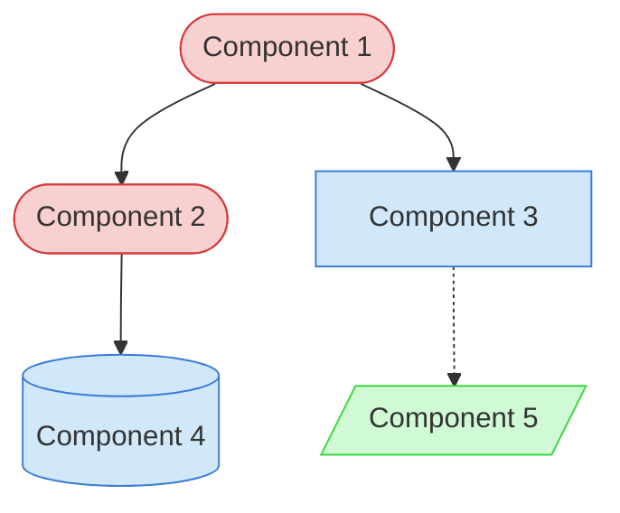

# [Task Name] Context Map

This context map provides a visual guide to the components and relationships relevant to the [Task Name] task. Use this map to identify which components require attention and how they interact.

## Visual Component Diagram

## Essential Components

### Critical Components (Must Understand)
- **Component 1**: [Brief description of purpose and responsibility]
- **Component 2**: [Brief description of purpose and responsibility]

### Important Components (Should Understand)
- **Component 3**: [Brief description of purpose and responsibility]
- **Component 4**: [Brief description of purpose and responsibility]

### Reference Components (Access When Needed)
- **Component 5**: [Brief description of purpose and responsibility]

## Key Relationships

1. **Component 1 → Component 2**: [Description of how they interact]
2. **Component 2 → Component 4**: [Description of how they interact]
3. **Component 3 -.-> Component 5**: [Description of this optional/indirect relationship]

## Implementation in AI Sessions

1. Begin by examining [Component 1] and [Component 2] files
2. Understand how [Component 3] interfaces with [Component 1]
3. When implementing changes to [Component 2], ensure [Component 4] data integrity
4. Only reference [Component 5] when updating documentation

## Related Documentation

- <!-- [Link to Documentation 1](/path/to/documentation1.md) - Template/example link commented out --> - Detailed information about Component 1
- <!-- [Link to Documentation 2](/path/to/documentation2.md) - Template/example link commented out --> - Detailed information about Component 2
- [Component Relationship Index](/doc/product-docs/technical/architecture/component-relationship-index.md) - Complete reference of all component relationships

---

*Note: This context map highlights only the components relevant to this specific task. For a comprehensive view of all components, refer to the [Component Relationship Index](/doc/product-docs/technical/architecture/component-relationship-index.md).*
