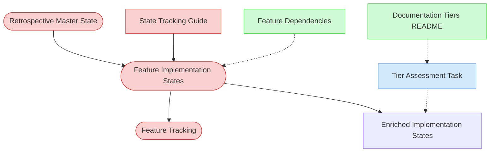

# Codebase Feature Analysis Context Map

This context map provides a visual guide to the components and relationships relevant to the Codebase Feature Analysis task. Use this map to identify which components require attention and how they interact.

## Visual Component Diagram

## Essential Components

### Critical Components (Must Understand)
- **[Retrospective Master State File](../../state-tracking/temporary/retrospective-master-state.md)**: Tracks overall progress across all onboarding phases; read to verify Phase 1 complete, update after each session with analysis progress
- **[Feature Implementation State Files](../../state-tracking/features)**: Per-feature files created in PF-TSK-064 containing code inventories; these are enriched during analysis with Design Decisions, Dependencies, and Implementation Patterns
- **[Feature Tracking](../../state-tracking/permanent/feature-tracking.md)**: Permanent registry of all features; used to identify which features need analysis
- **[Feature Implementation State Tracking Guide](../../guides/guides/feature-implementation-state-tracking-guide.md)**: Guide for populating Design Decisions, Dependencies, and Implementation Patterns sections

### Important Components (Should Understand)
- **[Feature Tier Assessment Task](../01-planning/feature-tier-assessment-task.md)**: Understanding what complexity factors and analysis details feed into tier assessment in the next task

### Reference Components (Access When Needed)
- **[Documentation Tiers README](../../methodologies/documentation-tiers/README.md)**: Understanding tier documentation requirements (useful context for analysis depth)
- **[Feature Dependencies](../../../product-docs/technical/design/feature-dependencies.md)**: Existing dependency documentation (reference when documenting cross-feature dependencies)

## Key Relationships

1. **Retrospective Master State → Feature Implementation States**: Master state tracks which features have been analyzed and which are pending
2. **Feature Implementation States → Enriched Implementation States**: Code inventories from PF-TSK-064 are enriched with Design Decisions, Dependencies, and Implementation Patterns
3. **State Tracking Guide → Feature Implementation States**: Guide provides instructions for populating analysis sections (Design Decisions, Dependencies, etc.)
4. **Enriched Implementation States → Feature Tracking**: Analysis findings are tracked in master state and feature tracking
5. **Tier Assessment Task -.-> Enriched Implementation States**: Analysis content (complexity factors, patterns) feeds into tier assessment in PF-TSK-066

## Implementation in AI Sessions

1. **Every Session Start**: Read [Retrospective Master State](../../state-tracking/temporary/retrospective-master-state.md) to verify Phase 1 complete and identify features needing analysis
2. **Per-Feature Analysis Loop**:
   - Read [Feature Implementation State file](../../state-tracking/features) with code inventory
   - Analyze component architecture, data flow, error handling → Document in Design Decisions section
   - Identify feature dependencies, system dependencies, code dependencies → Document in Dependencies section
   - Map test coverage, test types, test gaps → Document in Test Files section
   - Note complexity factors (file count, integration complexity, state management) → Document for tier assessment
3. **Every Session End**: Update [Retrospective Master State](../../state-tracking/temporary/retrospective-master-state.md) with analyzed features marked "Analyzed ✅", log session notes
4. **Task Complete When**: All features have enriched implementation state files with Design Decisions, Dependencies, and Implementation Patterns documented

## Related Documentation

- [Codebase Feature Analysis Task (PF-TSK-065)](../../tasks/00-onboarding/codebase-feature-analysis.md) - Full task definition with detailed process steps
- [Codebase Feature Discovery Task (PF-TSK-064)](../../tasks/00-onboarding/codebase-feature-discovery.md) - Prerequisite task that creates the initial feature implementation state files
- [Feature Implementation State Template](../../templates/templates/feature-implementation-state-template.md) - Template structure for enrichment
- [Feature Implementation State Tracking Guide](../../guides/guides/feature-implementation-state-tracking-guide.md) - How to populate analysis sections
- [Visual Notation Guide](../../guides/guides/visual-notation-guide.md) - Understanding diagram symbols and notation

---

*Note: This context map is part of the Codebase Feature Analysis task (PF-TSK-065), the second step in adopting the process framework into an existing project.*
