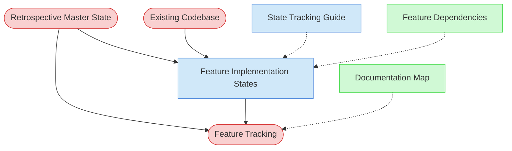

# Codebase Feature Discovery Context Map

This context map provides a visual guide to the components and relationships relevant to the Codebase Feature Discovery task. Use this map to identify which components require attention and how they interact.

## Visual Component Diagram

## Essential Components

### Critical Components (Must Understand)
- **[Retrospective Master State Template](../../templates/templates/retrospective-state-template.md)**: Template for creating the master tracking file that coordinates all onboarding sessions and tracks codebase-wide coverage progress
- **[Existing Codebase](../../..)**: The source code, tests, and configuration files that need to be systematically inventoried and assigned to features
- **[Feature Tracking](../../state-tracking/permanent/feature-tracking.md)**: Permanent registry where all discovered features are added with IDs, descriptions, and status

### Important Components (Should Understand)
- **[Feature Implementation State Template](../../templates/templates/feature-implementation-state-template.md)**: Template for creating per-feature files that contain complete code inventories (files created/modified/used/tested)
- **[Feature Implementation State Tracking Guide](../../guides/guides/feature-implementation-state-tracking-guide.md)**: Comprehensive guide explaining how to populate implementation state files with code inventories

### Reference Components (Access When Needed)
- **[Feature Dependencies](../../../product-docs/technical/design/feature-dependencies.md)**: Documentation of feature relationships and dependencies (useful for understanding feature boundaries)
- **[Documentation Map](../../documentation-map.md)**: Overview of all framework documentation (helpful for orientation)

## Key Relationships

1. **Retrospective Master State → Feature Tracking**: Master state tracks which features have been discovered and added to Feature Tracking
2. **Retrospective Master State → Feature Implementation States**: Master state tracks which features have complete implementation state files
3. **Existing Codebase → Feature Implementation States**: Source code is analyzed and inventoried into feature implementation state files
4. **Feature Implementation States → Feature Tracking**: Each feature state file is linked in the Feature Tracking ID column
5. **State Tracking Guide -.-> Feature Implementation States**: Guide provides instructions for populating the Code Inventory sections

## Implementation in AI Sessions

1. **First Session Only**: Create Retrospective Master State file using `New-RetrospectiveMasterState.ps1`, then survey entire codebase and list all unassigned files
2. **Every Session Start**: Read Retrospective Master State file to understand current progress and phase
3. **Feature Discovery Loop** (per feature):
   - Discover feature from codebase structure, documentation, or git history
   - Add feature to [Feature Tracking](../../state-tracking/permanent/feature-tracking.md)
   - Create Feature Implementation State file using `New-FeatureImplementationState.ps1`
   - Populate Code Inventory section (files created/modified/used, test files)
   - Remove assigned files from master state's "Unassigned Files" list
4. **Every Session End**: Update Retrospective Master State file with progress, mark features as "Impl State ✅", update coverage metrics
5. **Task Complete When**: 100% file coverage achieved (no unassigned files remaining)

## Related Documentation

- [Codebase Feature Discovery Task (PF-TSK-064)](../../tasks/00-onboarding/codebase-feature-discovery.md) - Full task definition with detailed process steps
- [Retrospective Master State Template](../../templates/templates/retrospective-state-template.md) - Template structure and usage
- [Feature Implementation State Template](../../templates/templates/feature-implementation-state-template.md) - Per-feature code inventory template
- [Feature Implementation State Tracking Guide](../../guides/guides/feature-implementation-state-tracking-guide.md) - How to populate state files
- [Visual Notation Guide](../../guides/guides/visual-notation-guide.md) - Understanding diagram symbols and notation

---

*Note: This context map is part of the Codebase Feature Discovery task (PF-TSK-064), the first step in adopting the process framework into an existing project.*
