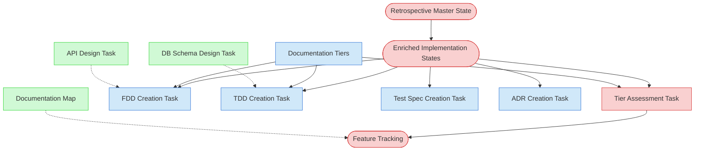

# Retrospective Documentation Creation Context Map

This context map provides a visual guide to the components and relationships relevant to the Retrospective Documentation Creation task. Use this map to identify which components require attention and how they interact.

## Visual Component Diagram

## Essential Components

### Critical Components (Must Understand)
- **[Retrospective Master State File](../../state-tracking/temporary/retrospective-master-state.md)**: Tracks overall progress; read to verify Phase 2 complete, update after each session with assessment and documentation progress
- **[Enriched Feature Implementation State Files](../../state-tracking/features)**: Per-feature files from PF-TSK-065 with Design Decisions, Dependencies, and Implementation Patterns; serve as evidence base for all documentation
- **[Feature Tracking](../../state-tracking/permanent/feature-tracking.md)**: Permanent registry updated with tier assignments and all document links as they are created
- **[Feature Tier Assessment Task](../01-planning/feature-tier-assessment-task.md)**: Task for creating or validating tier assessments based on actual code analysis

### Important Components (Should Understand)
- **[Documentation Tiers README](../../methodologies/documentation-tiers/README.md)**: Defines tier documentation requirements (Tier 2: FDD+TDD, Tier 3: +TestSpec, Foundation: +ADR)
- **[FDD Creation Task](../02-design/fdd-creation-task.md)**: Task for creating Functional Design Documents (Tier 2+) from implemented features
- **[TDD Creation Task](../02-design/tdd-creation-task.md)**: Task for creating Technical Design Documents (Tier 2+) reverse-engineered from code
- **[Test Specification Creation Task](../03-testing/test-specification-creation-task.md)**: Task for creating Test Specifications (Tier 3) documenting existing tests
- **[ADR Creation Task](../02-design/adr-creation-task.md)**: Task for creating Architecture Decision Records (Foundation 0.x.x) documenting architectural patterns

### Reference Components (Access When Needed)
- **[Documentation Map](../../documentation-map.md)**: Registry for all new documents created (update after finalization)
- **[API Design Task](../02-design/api-design-task.md)**: Task for documenting existing API contracts (conditional per tier assessment)
- **[Database Schema Design Task](../02-design/database-schema-design-task.md)**: Task for documenting existing database schema (conditional per tier assessment)

## Key Relationships

1. **Retrospective Master State → Enriched Implementation States**: Master state tracks which features need assessment and which need documentation
2. **Enriched Implementation States → Tier Assessment Task**: Analysis content (complexity factors, patterns) provides evidence for tier assignment
3. **Tier Assessment Task → Feature Tracking**: Tier assignments are recorded in Feature Tracking
4. **Enriched Implementation States → Documentation Tasks**: Design Decisions, Dependencies, and Code Inventory provide content for FDD, TDD, Test Spec, ADR
5. **Documentation Tiers → All Documentation Tasks**: Tier determines which documents are required (Tier 2+: FDD+TDD, Tier 3: +TestSpec, Foundation: +ADR)
6. **Documentation Tasks → Feature Tracking**: All created document links are added to Feature Tracking in appropriate columns

## Implementation in AI Sessions

1. **Every Session Start**: Read [Retrospective Master State](../../state-tracking/temporary/retrospective-master-state.md) to verify Phase 2 complete and identify features needing assessment/documentation
2. **Per-Feature Documentation Loop** (priority: Foundation → Tier 3 → Tier 2):
   - **Assess**: Create/validate tier assessment using [Feature Tier Assessment Task](../01-planning/feature-tier-assessment-task.md) based on analysis from enriched implementation state
   - **Update Tracking**: Add tier to [Feature Tracking](../../state-tracking/permanent/feature-tracking.md), mark "📊 Assessment Created" in master state
   - **Document Tier 2+ Features**:
     - Create FDD using [FDD Creation Task](../02-design/fdd-creation-task.md) (descriptive, mark "Retrospective")
     - Create TDD using [TDD Creation Task](../02-design/tdd-creation-task.md) (reverse-engineered, mark "Retrospective")
     - Add document links to Feature Tracking
   - **Document Tier 3 Features**:
     - Create Test Specification using [Test Specification Creation Task](../03-testing/test-specification-creation-task.md) (document existing tests, mark "Retrospective")
     - Add document link to Feature Tracking
   - **Document Foundation Features**:
     - Create ADRs using [ADR Creation Task](../02-design/adr-creation-task.md) for architectural decisions (mark unknowns clearly, mark "Retrospective")
     - Add document links to Feature Tracking
   - **Conditional Documents**: Create API/DB design docs if tier assessment indicates
3. **Every Session End**: Update [Retrospective Master State](../../state-tracking/temporary/retrospective-master-state.md) with completed assessments and documents, log session notes
4. **Finalization Phase**:
   - Verify all codebase coverage (100%), all features have assessments, all Tier 2+ have FDD+TDD, all Tier 3 have Test Specs, Foundation features have ADRs
   - Update [Documentation Map](../../documentation-map.md) with all new documents
   - Calculate final metrics, archive master state file

## Related Documentation

- [Retrospective Documentation Creation Task (PF-TSK-066)](../../tasks/00-onboarding/retrospective-documentation-creation.md) - Full task definition with detailed process steps
- [Codebase Feature Analysis Task (PF-TSK-065)](../../tasks/00-onboarding/codebase-feature-analysis.md) - Prerequisite task that enriches feature implementation state files
- [Documentation Tiers README](../../methodologies/documentation-tiers/README.md) - Tier definitions and documentation requirements
- [Feature Tier Assessment Task](../01-planning/feature-tier-assessment-task.md) - How to create tier assessments
- [FDD Creation Task](../02-design/fdd-creation-task.md) - How to create Functional Design Documents
- [TDD Creation Task](../02-design/tdd-creation-task.md) - How to create Technical Design Documents
- [Test Specification Creation Task](../03-testing/test-specification-creation-task.md) - How to create Test Specifications
- [ADR Creation Task](../02-design/adr-creation-task.md) - How to create Architecture Decision Records
- [Visual Notation Guide](../../guides/guides/visual-notation-guide.md) - Understanding diagram symbols and notation

---

*Note: This context map is part of the Retrospective Documentation Creation task (PF-TSK-066), the final step in adopting the process framework into an existing project.*
