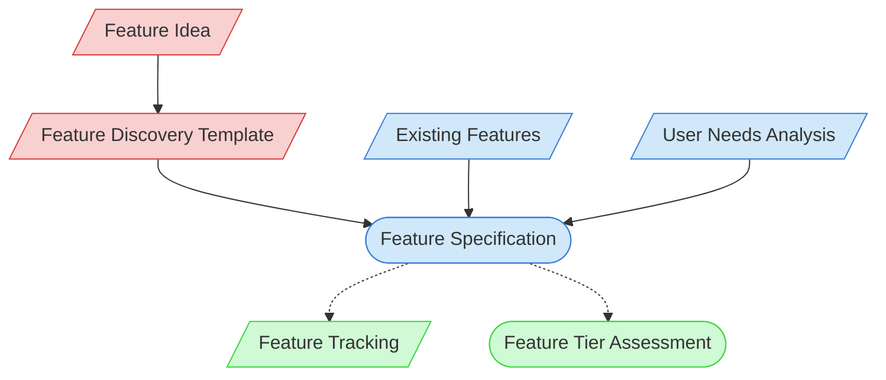

# Feature Discovery Context Map

This context map provides a visual guide to the components and relationships relevant to the Feature Discovery task. Use this map to identify which components require attention and how they interact.

## Visual Component Diagram

## Essential Components

### Critical Components (Must Understand)
- **Feature Idea**: Initial concept or idea for the feature
- **Feature Discovery Template**: Structured template for exploring and defining a feature

### Important Components (Should Understand)
- **User Needs Analysis**: Analysis of user requirements and needs
- **Feature Specification**: Detailed specification of the feature being defined
- **Existing Features**: Documentation of current features to ensure integration and avoid duplication

### Reference Components (Access When Needed)
- **Feature Tracking**: Documentation tracking feature status
- **Feature Tier Assessment**: Assessment of feature complexity for documentation purposes

## Key Relationships

1. **Feature Idea → Discovery Template**: The initial idea is documented using the discovery template
2. **Discovery Template → Feature Specification**: The template guides creation of the feature specification
3. **User Needs Analysis → Feature Specification**: User needs inform the feature requirements
4. **Existing Features → Feature Specification**: Existing functionality informs how the new feature integrates
5. **Feature Specification -.-> Feature Tracking**: The specification enables tracking of the feature
6. **Feature Specification -.-> Tier Assessment**: The specification feeds into complexity assessment

## Implementation in AI Sessions

1. Begin by examining the Feature Idea to understand the core concept
2. Use the Feature Discovery Template to structure the discovery process
3. Analyze User Needs to understand the problem being solved
4. Review Existing Features to ensure integration and avoid duplication
5. Create a detailed Feature Specification based on findings
6. Update Feature Tracking with the new feature information
7. Prepare for Feature Tier Assessment if proceeding to implementation

## Related Documentation

- <!-- [Feature Discovery Template](/doc/process-framework/templates/feature-discovery-template.md) - Template/example link commented out --> - Template for feature exploration
- <!-- [User Needs Analysis Guide](/doc/product-docs/user/needs-analysis/guide.md) - File not found --> - Guide for analyzing user requirements
- <!-- [Feature Specification Template](/doc/process-framework/templates/feature-specification-template.md) - Template/example link commented out --> - Template for feature requirements
- <!-- [Existing Features Catalog](/doc/product-docs/technical/features-catalog.md) - File not found --> - Catalog of existing features
- [Feature Tracking](../../../state-tracking/permanent/feature-tracking.md) - Feature status tracking
- [Component Relationship Index](/doc/product-docs/technical/architecture/component-relationship-index.md) - Complete reference of component relationships

---

*Note: This context map highlights only the components relevant to feature discovery. For a comprehensive view of all components, refer to the [Component Relationship Index](/doc/product-docs/technical/architecture/component-relationship-index.md).*
