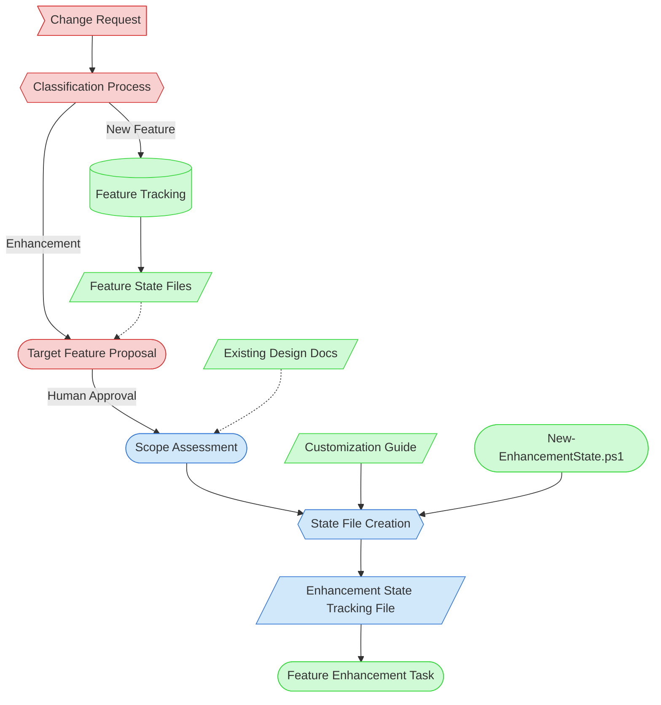

# Feature Request Evaluation Context Map

This context map provides a visual guide to the components and relationships relevant to the Feature Request Evaluation task. Use this map to identify which components require attention and how they interact.

## Visual Component Diagram

## Essential Components

### Critical Components (Must Understand)
- **Change Request**: The human partner's description of what needs to be added or changed — the primary input
- **Classification Process**: Determines whether the request is a new feature or an enhancement to an existing feature
- **Target Feature Proposal**: AI agent proposes which existing feature this enhances, with rationale. Human approval required before proceeding.

### Important Components (Should Understand)
- **Scope Assessment**: Evaluates the enhancement using practical criteria (files affected, sessions needed, docs to update)
- **State File Creation**: Uses New-EnhancementState.ps1 + Customization Guide to create the Enhancement State Tracking File
- **Enhancement State Tracking File**: The primary output — a customized execution plan for the Feature Enhancement task

### Reference Components (Access When Needed)
- **Feature Tracking**: Current feature inventory for identifying existing features
- **Feature State Files**: Implementation state of candidate target features
- **Existing Design Docs**: FDD, TDD, ADR associated with the target feature
- **Customization Guide**: Enhancement State Tracking Customization Guide for state file creation
- **New-EnhancementState.ps1**: Script for generating state file from template
- **Feature Enhancement Task**: The downstream task that consumes the state file

## Key Relationships

1. **Change Request → Classification**: Every change request enters through classification
2. **Classification → New Feature path**: New features are added to feature tracking and route to existing workflow
3. **Classification → Enhancement path**: Enhancements flow through target proposal, scope assessment, and state file creation
4. **Target Proposal → Human Approval**: AI agent must wait for human confirmation before proceeding
5. **Feature State Files -.-> Target Proposal**: Feature state files inform the target feature proposal
6. **Enhancement State File → Feature Enhancement Task**: The state file is the handover artifact to the execution task

## Implementation in AI Sessions

1. Begin by reading the change request and feature tracking to classify the request
2. For enhancements: read candidate feature state files and propose the target feature
3. After human approval: assess scope using practical criteria, referencing existing design docs
4. Use New-EnhancementState.ps1 to create the state file, then customize following the guide
5. Update feature tracking with "🔄 Needs Revision" status and link to state file

## Related Documentation

- [Feature Request Evaluation Task](../../../tasks/01-planning/feature-request-evaluation.md) — Task definition
- [Feature Tracking](../../../state-tracking/permanent/feature-tracking.md) — Current feature inventory
- [Enhancement Workflow Concept (PF-PRO-002)](../../../proposals/proposals/enhancement-workflow-concept.md) — Full design rationale

---

*Note: This context map highlights only the components relevant to the Feature Request Evaluation task. For the downstream execution workflow, see the [Feature Enhancement Context Map](../04-implementation/feature-enhancement-map.md).*
