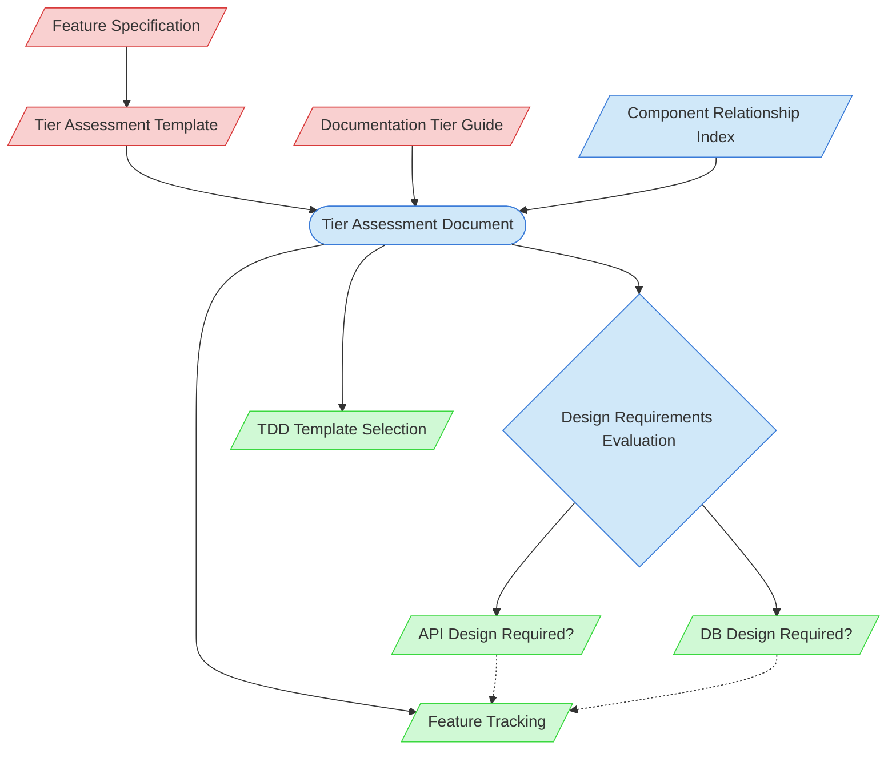

# Feature Tier Assessment Context Map

This context map provides a visual guide to the components and relationships relevant to the Feature Tier Assessment task. Use this map to identify which components require attention and how they interact.

## Visual Component Diagram

## Essential Components

### Critical Components (Must Understand)
- **Feature Specification**: Detailed requirements and expectations for the feature
- **Tier Assessment Template**: Template for conducting the complexity assessment
- **Documentation Tier Guide**: Guidelines for determining documentation complexity tiers

### Important Components (Should Understand)
- **Tier Assessment Document**: The completed assessment determining feature complexity
- **Component Relationship Index**: Documentation of how components interact within the system
- **Design Requirements Evaluation**: Assessment of whether API and/or Database design documentation is needed

### Reference Components (Access When Needed)
- **TDD Template Selection**: Selection of the appropriate TDD template based on tier
- **Feature Tracking**: Documentation tracking feature status and assessment
- **API Design Required**: Evaluation result determining if API design documentation is needed
- **DB Design Required**: Evaluation result determining if database design documentation is needed

## Key Relationships

1. **Feature Specification → Tier Template**: The specification informs which aspects to assess
2. **Tier Template → Tier Assessment**: The template guides the assessment process
3. **Documentation Tier Guide → Tier Assessment**: The guide provides complexity criteria
4. **Component Index → Tier Assessment**: Component relationships inform architectural complexity
5. **Tier Assessment → Design Requirements Evaluation**: Assessment includes evaluation of design needs
6. **Design Requirements Evaluation → API Design Required**: Determines if API design documentation is needed
7. **Design Requirements Evaluation → DB Design Required**: Determines if database design documentation is needed
8. **Tier Assessment → TDD Template Selection**: Assessment results determine documentation requirements
9. **Tier Assessment → Feature Tracking**: Assessment updates feature tracking with tier and design requirements
10. **API Design Required -.-> Feature Tracking**: API design requirement updates feature tracking
11. **DB Design Required -.-> Feature Tracking**: Database design requirement updates feature tracking

## Implementation in AI Sessions

1. Begin by examining the Feature Specification to understand requirements
2. Study the Documentation Tier Guide to understand tier criteria
3. Use the Tier Assessment Template to structure the assessment
4. Consult the Component Relationship Index to assess architectural impact
5. **Evaluate Design Requirements**: Determine if API and/or Database design documentation is needed
6. Complete the Tier Assessment Document with justified tier assignment and design requirements
7. Identify the appropriate TDD Template based on the assessment
8. Update Feature Tracking with assessment results, including API Design and DB Design columns

## Related Documentation

- <!-- [Feature Specification Templates](/doc/process-framework/templates/feature-specification-template.md) - Template/example link commented out --> - Templates for feature requirements
- <!-- [Tier Assessment Template](/doc/process-framework/methodologies/documentation-tiers/tier-assessment-template.md) - Template/example link commented out --> - Template for complexity assessment
- <!-- [Documentation Tier Guide](/doc/process-framework/methodologies/documentation-tiers/documentation-tier-guide.md) - File not found --> - Guidelines for tier determination
- [Component Relationship Index](/doc/product-docs/technical/architecture/component-relationship-index.md) - Reference for component interactions
- <!-- [TDD Templates](/doc/product-docs/technical/architecture/design-docs) - Template/example link commented out --> - Tier-specific TDD templates
- [Feature Tracking](../../../state-tracking/permanent/feature-tracking.md) - Feature status tracking

---

*Note: This context map highlights only the components relevant to feature tier assessment. For a comprehensive view of all components, refer to the [Component Relationship Index](/doc/product-docs/technical/architecture/component-relationship-index.md).*
