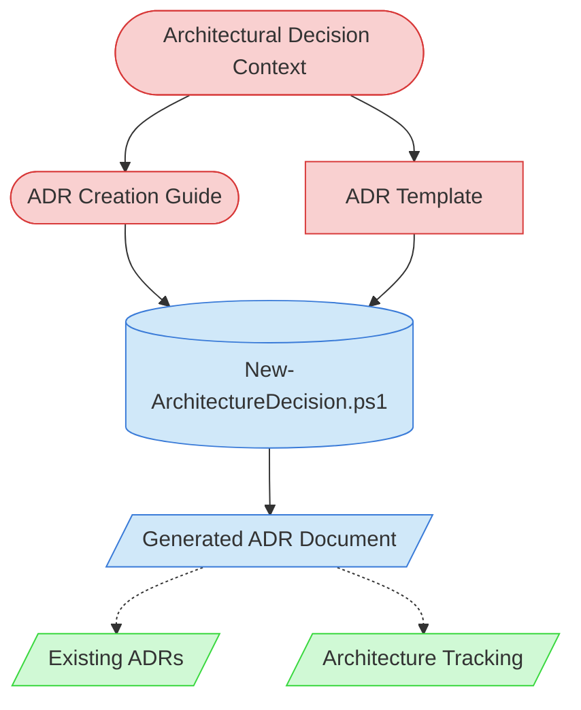

# ADR Creation Context Map

This context map provides a visual guide to the components and relationships relevant to the ADR Creation task. Use this map to identify which components require attention and how they interact.

## Visual Component Diagram

## Essential Components

### Critical Components (Must Understand)
- **Architectural Decision Context**: The specific decision to be documented, including problem statement, constraints, and stakeholder requirements
- **ADR Creation Guide**: Comprehensive guide for customizing ADR templates and following best practices
- **ADR Template**: Structured template providing sections for Context, Decision, Impact Assessment, Alternatives, and Consequences

### Important Components (Should Understand)
- **New-ArchitectureDecision.ps1**: Automation script for creating ADRs with proper ID assignment and metadata
- **Generated ADR Document**: The final ADR document with complete decision documentation

### Reference Components (Access When Needed)
- **Existing ADRs**: Previously created ADRs for consistency and reference patterns
- **Architecture Tracking**: State tracking file for recording architectural decisions and their impact

## Key Relationships

1. **Architectural Decision Context → ADR Creation Guide**: Decision context informs which sections of the guide are most relevant for customization
2. **ADR Creation Guide → New-ArchitectureDecision.ps1**: Guide provides instructions for using the script effectively
3. **ADR Template → New-ArchitectureDecision.ps1**: Script uses template to generate structured ADR documents
4. **Generated ADR Document -.-> Existing ADRs**: New ADRs reference existing ones for consistency and to avoid conflicts
5. **Generated ADR Document -.-> Architecture Tracking**: ADRs are recorded in architecture tracking for project-wide visibility

## Implementation in AI Sessions

1. Begin by analyzing the **Architectural Decision Context** and reviewing the **ADR Creation Guide**
2. Understand the **ADR Template** structure and required sections
3. Use **New-ArchitectureDecision.ps1** script to generate the ADR with proper metadata
4. Complete the **Generated ADR Document** following the guide's customization instructions
5. Reference **Existing ADRs** for consistency and update **Architecture Tracking** for project visibility

## Related Documentation

- [ADR Creation Task Definition](../../../tasks/02-design/adr-creation-task.md) - Complete task workflow and requirements
- [Architecture Decision Creation Guide](../../../guides/guides/architecture-decision-creation-guide.md) - Comprehensive customization guide
- [ADR Template](../../../../product-docs/templates/templates/adr-template.md) - Template structure and sections
- [New-ArchitectureDecision.ps1](../../../scripts/file-creation/New-ArchitectureDecision.ps1) - ADR creation script
- [Component Relationship Index](../../../../product-docs/technical/architecture/component-relationship-index.md) - Complete reference of all component relationships

---

*Note: This context map highlights only the components relevant to this specific task. For a comprehensive view of all components, refer to the [Component Relationship Index](/doc/product-docs/technical/architecture/component-relationship-index.md).*
