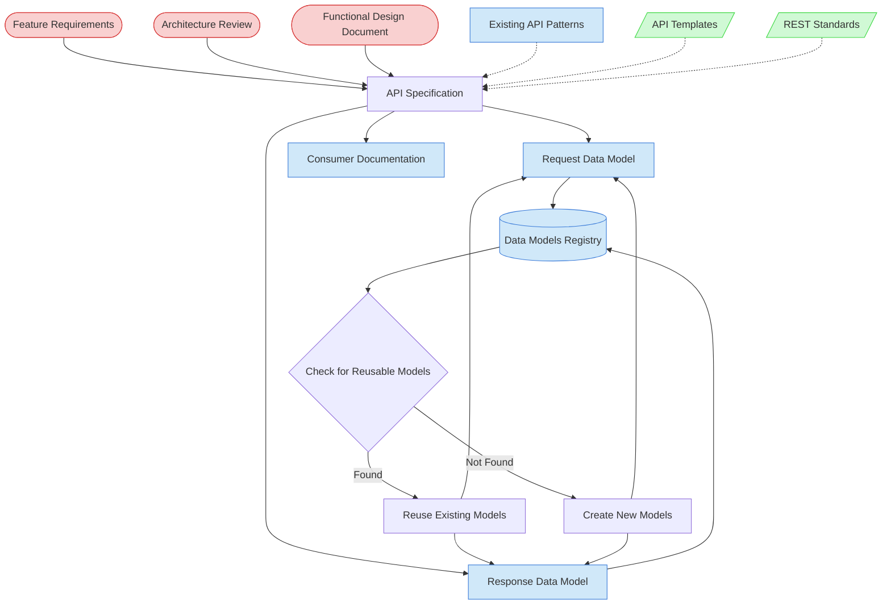

# API Design Task Context Map

This context map provides a visual guide to the components and relationships relevant to the API Design Task task. Use this map to identify which components require attention and how they interact.

## Visual Component Diagram

## Essential Components

### Critical Components (Must Understand)

- **Feature Requirements**: The functional requirements that define what the API must support
- **Architecture Review**: Architectural decisions and constraints that impact API design
- **Functional Design Document (FDD)**: For Tier 2+ features, detailed functional requirements and user flows

### Important Components (Should Understand)

- **Data Models Registry**: Central registry of all existing data models to check for reusability
- **Request Data Model**: Schema definition for API request objects with validation rules
- **Response Data Model**: Schema definition for API response objects with field definitions
- **Consumer Documentation**: Developer-friendly usage guide with integration examples
- **Existing API Patterns**: Current API conventions and patterns in the project

### Reference Components (Access When Needed)

- **API Templates**: Standardized templates for creating API specifications
- **REST Standards**: Industry best practices and standards for RESTful API design

## Key Relationships

1. **Feature Requirements → API Specification**: Requirements define the functional scope and endpoints needed
2. **Architecture Review → API Specification**: Architectural constraints influence API design patterns and structure
3. **FDD → API Specification**: Functional design provides detailed requirements for API endpoints and flows
4. **Data Models Registry → Reuse Check**: Registry is consulted to identify existing models that can be reused
5. **Reuse Check → Existing/New Models**: Decision point determines whether to reuse existing models or create new ones
6. **API Specification → Request/Response Models**: API endpoints require corresponding data model definitions
7. **API Specification → Consumer Documentation**: Specifications are used to generate developer-friendly usage guides
8. **Request/Response Models → Registry**: New models are added to registry, existing models are marked as reused
9. **Existing API Patterns -.-> API Specification**: Current patterns provide guidance for consistency

## Implementation in AI Sessions

1. **Start with Critical Context**: Begin by examining Feature Requirements, Architecture Review results, and FDD (for Tier 2+ features)
2. **Check Registry First**: Always consult the Data Models Registry before creating new data models to identify reusable components
3. **Make Reuse Decisions**: For each data model needed, decide whether to reuse existing models or create new ones based on registry analysis
4. **Follow Modular Approach**: Create separate documents for API specification, request model, response model, and consumer documentation
5. **Maintain Registry**: Update the registry with new models and mark existing models as reused by the current feature
6. **Ensure Consistency**: Validate that all components (specification, models, documentation) work together cohesively
7. **Reference Standards**: Only access templates and standards when clarification is needed for specific design decisions

## Related Documentation

- [Feature Tracking](/doc/process-framework/state-tracking/permanent/feature-tracking.md) - Current feature requirements and status
- [API Data Models Registry](../../../state-tracking/permanent/api-models-registry.md) - Central registry of all API data models
- [System Architecture Review Task](/doc/process-framework/tasks/01-planning/system-architecture-review.md) - Prerequisite architectural analysis
- [API Design Task](/doc/process-framework/tasks/02-design/api-design-task.md) - Complete task definition using this context map
- [API Specification Creation Guide](/doc/process-framework/guides/guides/api-specification-creation-guide.md) - How to use the ../../scripts/file-creation/New-APISpecification.ps1 script
- [API Data Model Creation Guide](/doc/process-framework/guides/guides/api-data-model-creation-guide.md) - How to use the ../../scripts/file-creation/New-APIDataModel.ps1 script

---

_Note: This context map highlights only the components relevant to this specific task. For a comprehensive view of all components, refer to the [Component Relationship Index](/doc/product-docs/technical/architecture/component-relationship-index.md)._
