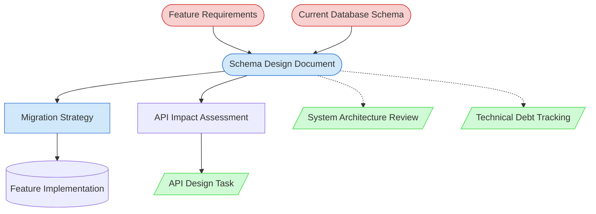

# Database Schema Design Task Context Map

This context map provides a visual guide to the components and relationships relevant to the Database Schema Design Task task. Use this map to identify which components require attention and how they interact.

## Visual Component Diagram

## Essential Components

### Critical Components (Must Understand)
- **Feature Requirements**: Clear understanding of what the feature needs to accomplish and its data requirements
- **Current Database Schema**: Complete knowledge of existing database structure, relationships, and constraints

### Important Components (Should Understand)
- **Schema Design Document**: The main deliverable containing entity definitions, relationships, and migration plans
- **Migration Strategy**: Step-by-step plan for safely implementing schema changes with rollback procedures

### Reference Components (Access When Needed)
- **API Design Task**: For coordinating API changes that result from schema modifications
- **System Architecture Review**: For evaluating how schema changes fit into overall system architecture
- **Technical Debt Tracking**: For documenting schema optimization opportunities and constraints

## Key Relationships

1. **Feature Requirements → Schema Design**: Requirements drive the data model design and entity definitions
2. **Current Schema → Schema Design**: Existing schema constraints and relationships must be considered in new design
3. **Schema Design → Migration Strategy**: Schema changes require safe migration plans with rollback procedures
4. **Schema Design → API Impact**: Database changes often require corresponding API modifications
5. **Migration Strategy → Feature Implementation**: Migration must be completed before feature implementation begins
6. **Schema Design -.-> Architecture Review**: Complex schema changes may require architectural evaluation
7. **Schema Design -.-> Technical Debt**: Schema design may identify optimization opportunities for future work

## Implementation in AI Sessions

1. **Load Critical Context**: Begin by examining feature requirements and current database schema documentation
2. **Analyze Current State**: Review existing database structure, relationships, and constraints that will be affected
3. **Design Data Model**: Create comprehensive schema design document with entities, relationships, and validation rules
4. **Plan Migration**: Develop step-by-step migration strategy with rollback procedures and data validation
5. **Assess Integration Impact**: Evaluate how schema changes affect APIs, services, and frontend applications
6. **Document Dependencies**: Reference API Design Task for coordinated changes and Architecture Review for complex modifications

## Related Documentation

- [Database Schema Design Task](/doc/process-framework/tasks/02-design/database-schema-design-task.md) - Complete task definition and process
- [Database Schema Design Task Usage Guide](/doc/process-framework/guides/guides/database-schema-design-task-usage-guide.md) - Comprehensive usage instructions
- [Schema Design Template](/doc/process-framework/templates/templates/schema-design-template.md) - Template for creating schema design documents
- [API Design Task](/doc/process-framework/tasks/02-design/api-design-task.md) - For coordinating API changes
- [System Architecture Review](/doc/process-framework/tasks/01-planning/system-architecture-review.md) - For architectural evaluation
- [Component Relationship Index](/doc/product-docs/technical/architecture/component-relationship-index.md) - Complete reference of all component relationships

---

*Note: This context map highlights only the components relevant to this specific task. For a comprehensive view of all components, refer to the [Component Relationship Index](/doc/product-docs/technical/architecture/component-relationship-index.md).*
