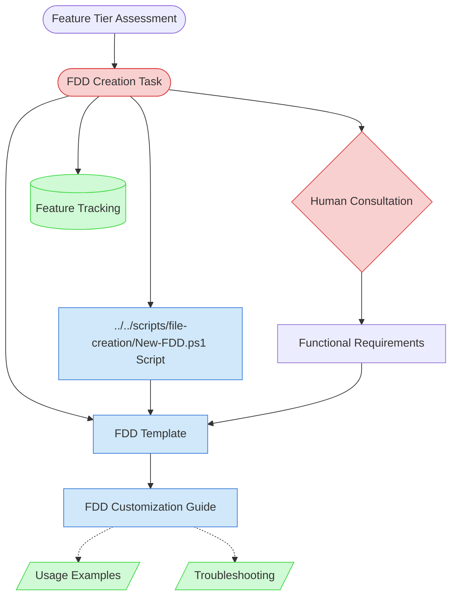

# FDD Creation Context Map

This context map provides a visual guide to the components and relationships relevant to the FDD Creation task. Use this map to identify which components require attention and how they interact.

## Visual Component Diagram

## Essential Components

### Critical Components (Must Understand)

- **FDD Creation Task**: Core task definition that orchestrates the entire functional design process for Tier 2+ features
- **Human Consultation**: Essential step where AI agent consults with human partner about feature behavior and user needs

### Important Components (Should Understand)

- **../../scripts/file-creation/New-FDD.ps1 Script**: Automated script that creates FDD documents with proper metadata and structure
- **FDD Template**: Standardized template structure for capturing functional requirements, user flows, and acceptance criteria
- **FDD Customization Guide**: Comprehensive guide with step-by-step instructions for customizing FDD templates

### Reference Components (Access When Needed)

- **Usage Examples**: Real-world examples of completed FDDs (e.g., User Registration feature)
- **Troubleshooting**: Common issues and solutions for FDD creation and customization
- **Feature Tracking**: Central tracking document where FDD links are maintained

## Key Relationships

1. **Feature Tier Assessment → FDD Creation**: FDD Creation is triggered only for Tier 2 (Moderate) and Tier 3 (Complex) features
2. **FDD Creation → ../../scripts/file-creation/New-FDD.ps1 Script**: Task execution uses the script to create structured FDD documents with proper metadata
3. **../../scripts/file-creation/New-FDD.ps1 Script → FDD Template**: Script populates the template with feature-specific information and creates the document
4. **Human Consultation → Functional Requirements**: Human input is essential for defining what the feature should do from user perspective
5. **FDD Template → FDD Customization Guide**: Template provides structure, guide provides instructions for meaningful customization
6. **FDD Customization Guide -.-> Examples & Troubleshooting**: Guide references examples and troubleshooting for comprehensive support

## Implementation in AI Sessions

1. **Start with Human Consultation**: Always begin by consulting with human partner about feature behavior and user needs
2. **Execute FDD Creation Task**: Use the task definition to understand AI agent role and responsibilities
3. **Run ../../scripts/file-creation/New-FDD.ps1 Script**: Create the FDD document structure with proper Feature ID and metadata
4. **Follow FDD Customization Guide**: Use step-by-step instructions to customize the template with actual functional requirements
5. **Validate Against Examples**: Reference usage examples to ensure FDD quality and completeness
6. **Update Feature Tracking**: Link the completed FDD in the central feature tracking document

## Related Documentation

- [FDD Creation Task](../../tasks/02-design/fdd-creation-task.md) - Complete task definition with AI agent role and execution steps
- [FDD Template](../../templates/templates/fdd-template.md) - Standardized template for creating Functional Design Documents
- [FDD Customization Guide](../../guides/guides/fdd-customization-guide.md) - Step-by-step guide for customizing FDD templates
- [Feature Tier Assessment Task](../../tasks/01-planning/feature-tier-assessment-task.md) - Prerequisite task for determining when FDD is needed
- [Feature Tracking](../../state-tracking/permanent/feature-tracking.md) - Central tracking document for all features
- [../../scripts/file-creation/New-FDD.ps1 Script](../../../product-docs/functional-design/../../scripts/file-creation/New-FDD.ps1) - Script for creating FDD documents

---

_This context map provides a complete view of the FDD Creation task ecosystem. Use it to understand component relationships and ensure proper task execution. The visual diagram shows the workflow from feature assessment through FDD completion._
