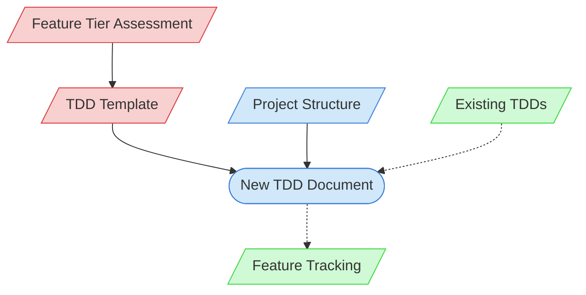

# TDD Creation Context Map

This context map provides a visual guide to the components and relationships relevant to the TDD Creation task. Use this map to identify which components require attention and how they interact.

## Visual Component Diagram

## Essential Components

### Critical Components (Must Understand)
- **Feature Tier Assessment**: Document determining the complexity tier of the feature
- **TDD Template**: Tier-specific template for creating the technical design document

### Important Components (Should Understand)
- **Project Structure**: Information about the project architecture and organization
- **New TDD Document**: The technical design document being created

### Reference Components (Access When Needed)
- **Existing TDDs**: Previously created TDDs that can serve as references
- **Feature Tracking**: Documentation tracking feature status and TDD creation

## Key Relationships

1. **Tier Assessment → TDD Template**: The feature's assessed tier determines which template to use
2. **TDD Template → New TDD**: The template provides the structure for the new document
3. **Project Structure → New TDD**: Project architecture informs design decisions in the TDD
4. **Existing TDDs -.-> New TDD**: Previous TDDs may inform the approach for the new one
5. **New TDD -.-> Feature Tracking**: Feature tracking is updated after TDD creation

## Implementation in AI Sessions

1. Begin by examining the Feature Tier Assessment to determine complexity tier
2. Select the appropriate TDD Template based on the complexity tier
3. Review the Project Structure to understand architectural context
4. Reference Existing TDDs only as needed for design patterns or approaches
5. Create the New TDD Document following the template
6. Only reference Feature Tracking when updating TDD status

## Related Documentation

- <!-- [TDD Templates](/doc/product-docs/technical/architecture/design-docs) - Template/example link commented out --> - Tier-specific templates
- [Feature Assessment](../../../methodologies/documentation-tiers/assessments) - Complexity tier assessments
- [Project Structure](/doc/product-docs/technical/architecture/project-structure.md) - Project architecture information
- [Existing TDDs](/doc/product-docs/technical/design) - Previously created design documents
- [Feature Tracking](../../../state-tracking/permanent/feature-tracking.md) - Feature status tracking
- [Component Relationship Index](/doc/product-docs/technical/architecture/component-relationship-index.md) - Complete reference of component relationships

---

*Note: This context map highlights only the components relevant to TDD creation. For a comprehensive view of all components, refer to the [Component Relationship Index](/doc/product-docs/technical/architecture/component-relationship-index.md).*
