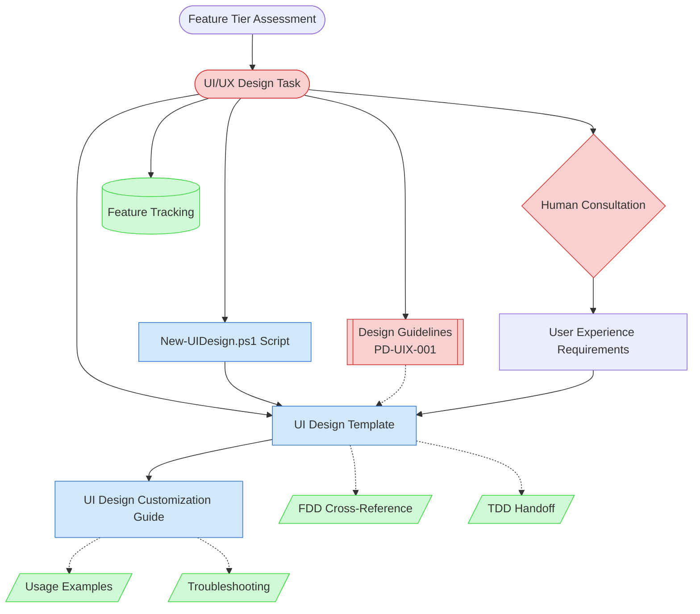

# UI/UX Design Task Context Map

This context map provides a visual guide to the components and relationships relevant to the UI/UX Design Task. Use this map to identify which components require attention and how they interact.

## Visual Component Diagram

## Essential Components

### Critical Components (Must Understand)

- **UI/UX Design Task**: Core task definition that orchestrates the visual and interaction design process for features
- **Design Guidelines (PD-UIX-001)**: Living reference document containing design principles, visual foundation, component library, accessibility standards, and platform-specific guidelines - MUST be consulted for every UI Design
- **Human Consultation**: Essential step where AI agent consults with human partner about user experience requirements, design preferences, and platform-specific needs

### Important Components (Should Understand)

- **New-UIDesign.ps1 Script**: Automated script that creates UI Design documents with proper metadata, structure, and links to Design Guidelines
- **UI Design Template**: Comprehensive template structure for capturing visual specifications, wireframes, component details, accessibility requirements, and implementation notes
- **UI Design Customization Guide**: Step-by-step guide with 19-step process across 6 phases for customizing UI Design templates

### Reference Components (Access When Needed)

- **Usage Examples**: Tiered examples (Simple, Moderate, Complex) showing how to customize UI Designs for different feature complexities
- **Troubleshooting**: Common issues and solutions for UI Design creation, customization, and platform adaptation
- **Feature Tracking**: Central tracking document where UI Design links are maintained in the "UI Design" column
- **FDD Cross-Reference**: Functional Design Document that provides functional requirements context for UI designs
- **TDD Handoff**: Technical Design Document where implementation-ready specifications from UI Design are referenced

## Key Relationships

1. **Feature Tier Assessment → UI/UX Design Task**: UI Design is typically created for Tier 2+ features or when visual complexity requires upfront design
2. **UI/UX Design Task → Design Guidelines**: Task MUST consult Design Guidelines (PD-UIX-001) to ensure consistency with established patterns, colors, typography, spacing, and accessibility standards
3. **UI/UX Design Task → New-UIDesign.ps1 Script**: Task execution uses the script to create structured UI Design documents with proper metadata and Design Guidelines reference
4. **New-UIDesign.ps1 Script → UI Design Template**: Script populates the template with feature-specific information and creates the document
5. **Design Guidelines -.-> UI Design Template**: Guidelines inform all design decisions in the template (colors, typography, components, patterns)
6. **Human Consultation → User Experience Requirements**: Human input is essential for understanding user needs, design preferences, brand direction, and platform priorities
7. **UI Design Template → UI Design Customization Guide**: Template provides structure, guide provides 19-step instructions for meaningful customization
8. **UI Design Template -.-> FDD**: UI Design references FDD for functional requirements and user flows
9. **UI Design Template -.-> TDD**: UI Design specifications are handed off to TDD for technical implementation planning
10. **UI Design Customization Guide -.-> Examples & Troubleshooting**: Guide references tiered examples and troubleshooting for comprehensive support

## Implementation in AI Sessions

1. **Start with Human Consultation**: Always begin by consulting with human partner about user experience requirements, design preferences, visual complexity, and platform priorities
2. **Review Design Guidelines (PD-UIX-001)**: MANDATORY step - understand design principles, visual foundation (colors, typography, spacing), component library, accessibility standards, and platform-specific guidelines
3. **Execute UI/UX Design Task**: Use the task definition to understand AI agent role (Designer/Visual Design Specialist) and responsibilities
4. **Run New-UIDesign.ps1 Script**: Create the UI Design document structure with proper Feature ID, metadata, and Design Guidelines reference
5. **Follow UI Design Customization Guide**: Use 19-step process across 6 phases to customize the template:
   - Phase 1: Preparation (review FDD, consult Design Guidelines, gather references)
   - Phase 2: Core Design (wireframes, user flows, visual specifications)
   - Phase 3: Accessibility & Responsive (WCAG compliance, breakpoints, platform adaptations)
   - Phase 4: Motion & Integration (animations, design system patterns)
   - Phase 5: Implementation & Handoff (Flutter widgets, asset specifications)
   - Phase 6: Quality Assurance (checklist verification, human review)
6. **Validate Against Examples**: Reference tiered usage examples to ensure UI Design quality matches feature complexity
7. **Update Feature Tracking**: Link the completed UI Design in the central feature tracking document (auto-updated by script)

## Related Documentation

- [UI/UX Design Task](../../tasks/02-design/ui-ux-design-task.md) - Complete task definition with AI agent role and execution steps
- [Design Guidelines (PD-UIX-001)](../../../../product-docs/technical/design/ui-ux/design-system/design-guidelines.md) - Living reference for design principles, visual foundation, accessibility, and platform guidelines
- [UI Design Template](../../templates/templates/ui-design-template.md) - Comprehensive template for creating UI/UX Design Documents
- [UI Design Customization Guide](../../guides/guides/ui-design-customization-guide.md) - 19-step guide for customizing UI Design templates
- [Feature Tier Assessment Task](../../tasks/01-planning/feature-tier-assessment-task.md) - Prerequisite task for determining when UI Design is needed
- [FDD Creation Task](../../tasks/02-design/fdd-creation-task.md) - Related design task for functional requirements
- [Feature Tracking](../../state-tracking/permanent/feature-tracking.md) - Central tracking document with UI Design column
- [New-UIDesign.ps1 Script](../../scripts/file-creation/New-UIDesign.ps1) - Script for creating UI Design documents

---

_This context map provides a complete view of the UI/UX Design Task ecosystem. Use it to understand component relationships and ensure proper task execution. The visual diagram emphasizes the critical role of Design Guidelines (PD-UIX-001) consultation in maintaining design consistency._
