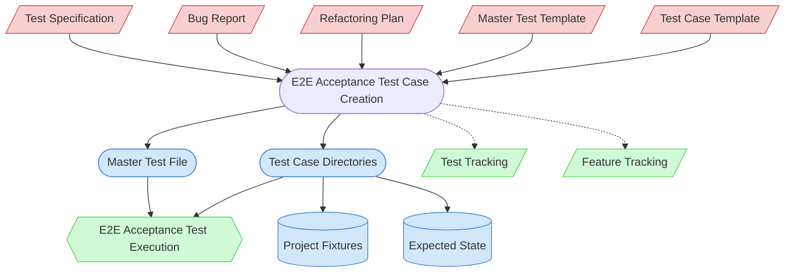

# E2E Acceptance Test Case Creation Context Map

This context map provides a visual guide to the components and relationships relevant to the E2E Acceptance Test Case Creation task. Use this map to identify which components require attention and how they interact.

## Visual Component Diagram

## Essential Components

### Critical Components (Must Understand)
- **Test Specification**: Source of E2E acceptance test scenarios (new feature/enhancement paths) — identifies what needs E2E validation and the requirements for each scenario
- **Bug Report**: Source of reproduction steps (bug fix path) — provides the failing behavior that needs a concrete test case
- **Refactoring Plan**: Source of behavior preservation requirements (tech debt path) — identifies functionality that must continue working correctly
- **Master Test Template**: Template for group-level quick validation files — defines the structure of master tests
- **Test Case Template**: Template for individual test case files — defines the structure of test-case.md files

### Important Components (Should Understand)
- **Master Test File**: Group-level quick validation sequence — created first to define scope, individual test cases support isolation when it fails
- **Test Case Directories**: Individual test case folders containing test-case.md, project fixtures, and expected state
- **Project Fixtures**: Pristine files forming the starting state of a test — copied to workspace before execution
- **Expected State**: Post-test file state for automated comparison — enables verification script to confirm pass/fail

### Reference Components (Access When Needed)
- **Test Tracking**: Records E2E acceptance test creation status (📋 Case Created) and execution results
- **Feature Tracking**: Feature-level test coverage overview — updated when E2E acceptance test coverage changes
- **E2E Acceptance Test Execution**: Downstream task that executes the test cases created here

## Key Relationships

1. **Test Specification → Test Case Creation**: E2E acceptance test scenarios from the spec provide the requirements for what each test case must validate
2. **Bug Report → Test Case Creation**: Reproduction steps are formalized into concrete, repeatable test cases with exact expected outcomes
3. **Refactoring Plan → Test Case Creation**: Affected functionality is captured as baseline test cases before code changes
4. **Templates → Test Case Creation**: Both templates provide structural frameworks that are customized for each specific test case
5. **Test Case Creation → Master Test File**: Master test is created first (top-down), covering key scenarios from all test cases in the group
6. **Test Case Creation → Test Case Directories**: Individual test cases with project fixtures and expected state enable both manual execution and automated verification
7. **Test Case Creation -.-> Test Tracking**: New entries added with status 📋 Case Created
8. **Test Case Creation -.-> Feature Tracking**: Test Status updated if E2E acceptance test coverage changes the overall status
9. **Master Test + Test Cases → E2E Acceptance Test Execution**: Completed test cases are consumed by the execution task

## Implementation in AI Sessions

1. Determine which workflow path triggered this task (new feature, bug fix, tech debt, enhancement)
2. Review the appropriate input document (test specification, bug report, or refactoring plan)
3. Check existing test groups in `test/e2e-acceptance-testing/templates/` for the affected feature
4. Plan test case structure: which group, how many cases, priority classification
5. **🚨 CHECKPOINT**: Present plan to human partner for approval
6. Create master test file first (for new groups) using the master test template
7. Create individual test case directories with test-case.md, project fixtures, and expected state
8. **🚨 CHECKPOINT**: Present completed test cases for human review
9. Update test-tracking.md and feature-tracking.md with new entries

## Related Documentation

- [E2E Acceptance Test Case Creation Task](/doc/process-framework/tasks/03-testing/e2e-acceptance-test-case-creation-task.md) - Full task definition with process steps
- [E2E Acceptance Master Test Template](/doc/process-framework/templates/03-testing/e2e-acceptance-master-test-template.md) - Template for group-level master tests
- [E2E Acceptance Test Case Template](/doc/process-framework/templates/03-testing/e2e-acceptance-test-case-template.md) - Template for individual test cases
- [Test Tracking](/test/state-tracking/permanent/test-tracking.md) - Test creation and execution status
- [Feature Tracking](/doc/product-docs/state-tracking/permanent/feature-tracking.md) - Feature development status with test coverage
- [Test Specification Creation Task](/doc/process-framework/tasks/03-testing/test-specification-creation-task.md) - Upstream task that identifies E2E acceptance test scenarios

---

*Note: This context map highlights only the components relevant to this specific task. For a comprehensive view of all components, refer to the [Component Relationship Index](/doc/product-docs/technical/architecture/component-relationship-index.md).*
