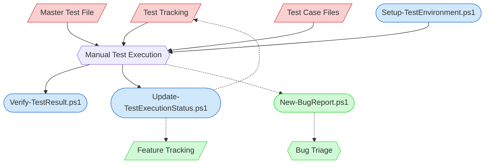

# Manual Test Execution Context Map

This context map provides a visual guide to the components and relationships relevant to the Manual Test Execution task. Use this map to identify which components require attention and how they interact.

## Visual Component Diagram

## Essential Components

### Critical Components (Must Understand)
- **Test Tracking**: Identifies which groups need re-execution (`🔄 Needs Re-execution`) and tracks current status of all manual tests
- **Master Test File**: Group-level quick validation sequence — execute this first for fast feedback
- **Test Case Files**: Individual test cases with exact steps, preconditions, expected results, and verification methods

### Important Components (Should Understand)
- **Setup-TestEnvironment.ps1**: Copies pristine fixtures from templates/ to workspace/ for clean test execution
- **Verify-TestResult.ps1**: Compares workspace state against expected/ state for automated pass/fail determination
- **Update-TestExecutionStatus.ps1**: Updates test-tracking.md and feature-tracking.md with execution results

### Reference Components (Access When Needed)
- **Feature Tracking**: Feature-level test coverage overview — updated by Update-TestExecutionStatus.ps1
- **New-BugReport.ps1**: Creates bug reports for genuine defects discovered during execution
- **Bug Triage**: Downstream task for evaluating and prioritizing discovered bugs

## Key Relationships

1. **Test Tracking → Execution**: Test tracking identifies what needs testing (groups marked `🔄 Needs Re-execution`)
2. **Master Test → Execution**: Quick validation sequence is executed first; if it passes, individual cases are skipped
3. **Test Cases → Execution**: Individual cases are executed only when master test fails, to isolate the issue
4. **Setup Script → Execution**: Environment must be set up before any test execution
5. **Execution → Verify Script**: After execution, results are verified by comparing workspace against expected state
6. **Execution → Update Script**: Results are recorded in tracking files via the update script
7. **Update Script -.-> Tracking Files**: Tracking files are updated with pass/fail status and execution dates
8. **Execution -.-> Bug Report**: Failures indicating genuine defects are reported as bugs

## Implementation in AI Sessions

1. Check test-tracking.md for groups needing re-execution
2. Run Setup-TestEnvironment.ps1 to prepare workspace
3. Guide human partner through master test Quick Validation Sequence
4. If master test fails, guide through individual test cases
5. Run Verify-TestResult.ps1 for automated comparison
6. Run Update-TestExecutionStatus.ps1 to record results
7. Create bug reports for any genuine defects

## Related Documentation

- [Manual Test Execution Task](/doc/process-framework/tasks/03-testing/manual-test-execution-task.md) - Full task definition
- [Manual Test Case Creation Task](/doc/process-framework/tasks/03-testing/manual-test-case-creation-task.md) - Upstream task creating test cases
- [Test Tracking](/doc/process-framework/state-tracking/permanent/test-tracking.md) - Test status tracking
- [Feature Tracking](/doc/process-framework/state-tracking/permanent/feature-tracking.md) - Feature-level status

---

*Note: This context map highlights only the components relevant to this specific task. For a comprehensive view of all components, refer to the [Component Relationship Index](/doc/product-docs/technical/architecture/component-relationship-index.md).*
