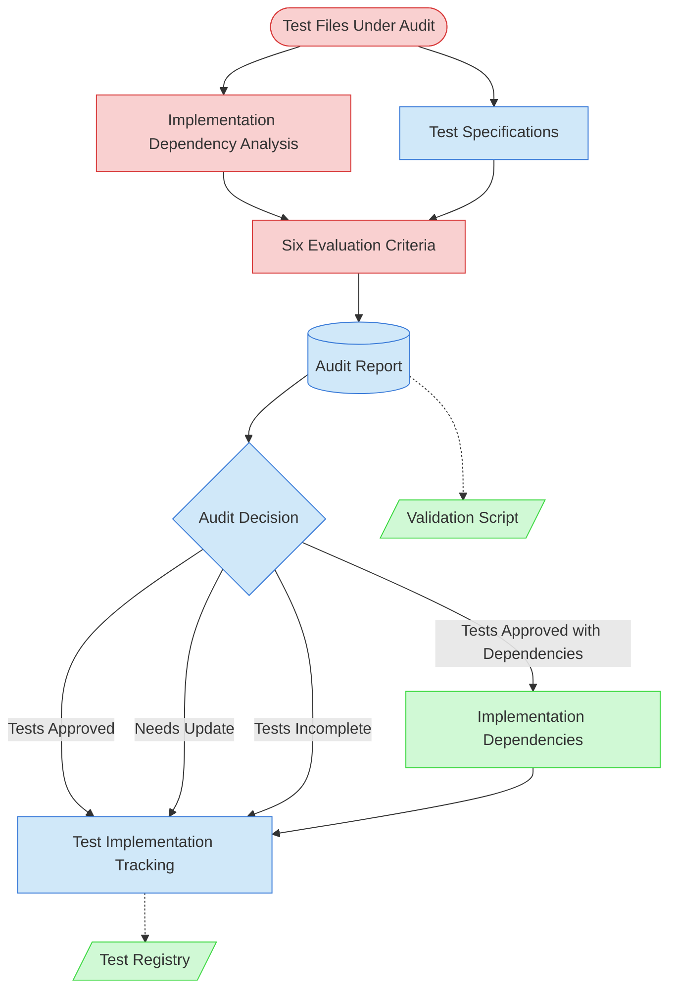

# Test Audit Context Map

This context map provides a visual guide to the components and relationships relevant to the Test Audit task. Use this map to identify which components require attention during systematic test quality assessment and how they interact in the audit workflow.

## Visual Component Diagram

## Essential Components

### Critical Components (Must Understand)

- **Test Files Under Audit**: The actual test implementation files being evaluated for quality
- **Implementation Dependency Analysis**: Pre-audit assessment of what can actually be tested vs missing dependencies
- **Six Evaluation Criteria**: Purpose Fulfillment, Coverage Completeness (implementable scenarios), Test Quality & Structure, Performance & Efficiency, Maintainability, Integration Alignment

### Important Components (Should Understand)

- **Test Specifications**: Original test specifications that define expected test behavior and coverage
- **Audit Report**: Comprehensive documentation of audit findings, assessments, and recommendations with dependency analysis
- **Audit Decision**: Four possible outcomes (Tests Approved, Tests Approved with Dependencies, Needs Update, Tests Incomplete)
- **Test Implementation Tracking**: State tracking file that manages test implementation status and audit results

### Reference Components (Access When Needed)

- **Implementation Dependencies**: Documentation of missing implementations that block tests
- **Test Registry**: Central registry of all test files with metadata and relationships
- **Validation Script**: Automated validation tool for ensuring audit report completeness

## Key Relationships

1. **Test Files → Six Evaluation Criteria**: Test files are systematically evaluated against each of the six quality criteria
2. **Test Files → Test Specifications**: Original specifications provide context and expected behavior for audit assessment
3. **Evaluation Criteria + Test Specifications → Audit Report**: Assessment results and specification context combine to create comprehensive audit documentation
4. **Audit Report → Test Implementation Tracking**: Audit decisions update test status (Tests Approved or Needs Update)
5. **Test Implementation Tracking -.-> Test Registry**: Optional updates to central test registry with audit status information
6. **Audit Report -.-> Validation Script**: Optional validation to ensure audit report completeness before finalization

## Implementation in AI Sessions

1. **Preparation Phase**: Begin by examining test files under audit and their corresponding test specifications
2. **Context Gathering**: Understand how test specifications define expected behavior and coverage requirements
3. **Systematic Evaluation**: Apply each of the six evaluation criteria systematically to the test files
4. **Documentation Phase**: Create comprehensive audit report documenting findings, evidence, and recommendations
5. **Decision Making**: Make binary audit decision (Tests Approved or Needs Update) based on evaluation results
6. **Tracking Updates**: Update test implementation tracking with audit results and status changes
7. **Validation**: Use validation script to ensure audit report completeness before finalization
8. **Registry Updates**: Optionally update test registry with audit status information

## Related Documentation

- [Test Audit Task Definition](../../tasks/03-testing/test-audit-task.md) - Complete task specification and process
- [Test Audit Usage Guide](../../guides/guides/test-audit-usage-guide.md) - Step-by-step instructions for conducting audits
- [Test Implementation Tracking](../../state-tracking/permanent/test-implementation-tracking.md) - Status tracking and workflow integration
- [Test Audit Report Template](../../templates/templates/test-audit-report-template.md) - Standardized audit report structure
- [New-TestAuditReport.ps1](../../test-audits/New-TestAuditReport.ps1) - Audit report creation automation
- [Validate-AuditReport.ps1](../../test-audits/Validate-AuditReport.ps1) - Audit report validation automation

---

_Note: This context map highlights only the components relevant to the Test Audit task. For a comprehensive view of all test-related components and their relationships, refer to the [Test Implementation Tracking](../../state-tracking/permanent/test-implementation-tracking.md) and [Test Registry](../../../../test/test-registry.yaml)._
