# Test Implementation Context Map

This context map provides a visual guide to the components and relationships relevant to the Test Implementation task. Use this map to identify which components require attention and how they interact during test implementation.

## Visual Component Diagram

```mermaid
graph TD
    classDef critical fill:#f9d0d0,stroke:#d83a3a
    classDef important fill:#d0e8f9,stroke:#3a7bd8
    classDef reference fill:#d0f9d5,stroke:#3ad83f

    TestSpec[/Test Specification Document/] --> TestImpl([Test Implementation])
    DevGuide[/Development Guide/] --> TestImpl
    TDD[/Technical Design Document/] --> TestImpl
    TierAssessment[/Feature Tier Assessment/] --> TestImpl

    TestImpl --> UnitTests([Unit Tests])
    TestImpl --> IntegrationTests([Integration Tests])
    TestImpl --> WidgetTests([Widget Tests])
    TestImpl --> E2ETests([End-to-End Tests])

    TestStructure[/Existing Test Structure/] --> TestImpl
    MockServices[/Mock Services/] --> TestImpl
    TestHelpers[/Test Helpers/] --> TestImpl
    SourceCode[/Source Code/] --> TestImpl

    TestImpl --> UpdatedMocks([Updated Mock Services])
    TestImpl --> UpdatedHelpers([Updated Test Helpers])
    TestImpl --> TestReport([Test Implementation Report])

    TestImpl -.-> TestImplTracking[/Test Implementation Tracking/]
    TestImpl -.-> TestRegistry[/Test Registry/]
    TestImpl -.-> FeatureTracking[/Feature Tracking/]

    class TestSpec,DevGuide,TDD,TierAssessment critical
    class TestStructure,MockServices,TestHelpers,SourceCode important
    class TestImplTracking,TestRegistry,FeatureTracking reference
```

## Essential Components

### Critical Components (Must Understand)
- **Test Specification Document**: The detailed test specifications that define what tests to implement and their expected behavior
- **Development Guide**: Testing standards and practices that must be followed during test implementation
- **Technical Design Document**: The TDD for the feature - provides context for understanding what is being tested
- **Feature Tier Assessment**: Complexity assessment that determines the scope of test implementation required

### Important Components (Should Understand)
- **Existing Test Structure**: Current test organization and patterns that new tests should follow
- **Mock Services**: Available mock implementations that can be used or need to be enhanced
- **Test Helpers**: Utility functions for test setup that can be leveraged or extended
- **Source Code**: The actual code being tested - essential for understanding implementation details

### Reference Components (Access When Needed)
- **Test Implementation Tracking**: Documentation tracking test implementation status - updated during and after implementation
- **Test Registry**: Central registry of all test files with IDs, metadata, and relationships - updated with implementation status
- **Feature Tracking**: Documentation tracking feature development status - updated after test implementation completion

## Key Relationships

1. **Test Specification → Test Implementation**: The test specification provides the blueprint for what tests to implement
2. **Development Guide → Test Implementation**: Testing standards guide the implementation approach and code quality
3. **TDD → Test Implementation**: Technical design provides context for understanding the components being tested
4. **Tier Assessment → Test Implementation**: Complexity tier determines the scope of tests to implement
5. **Test Structure → Test Implementation**: Existing patterns guide organization and naming conventions
6. **Mock Services → Test Implementation**: Available mocks are leveraged and enhanced as needed
7. **Source Code → Test Implementation**: Understanding the implementation is crucial for effective testing
8. **Test Implementation → Test Outputs**: Implementation produces various test files and supporting infrastructure

## Implementation Flow

### Phase 1: Preparation and Setup
1. **Verify Test Requirement**: Confirm the feature requires tests - features marked as "🚫 No Test Required" in Feature Tracking should not use this task
2. Review the Test Specification Document to understand what needs to be implemented
3. Examine the Feature Tier Assessment to understand the scope of testing required
4. Study the Development Guide for testing standards and best practices
5. Analyze the Existing Test Structure to understand patterns and organization
6. Review available Mock Services and Test Helpers for reuse opportunities

**Note**: This task should only be used for features that have test specifications. Features marked as "🚫 No Test Required" (assessment/documentation features) do not require test implementation.

### Phase 2: Infrastructure Development
7. Create or update Mock Services as specified in the test specification
8. Create or update Test Helpers for common test setup and utilities
9. Set up test data and fixtures as needed

### Phase 3: Test Implementation
10. Implement Unit Tests for individual components and services
11. Implement Integration Tests for component interactions
12. Implement Widget Tests for UI components (Flutter features)
13. Implement End-to-End Tests for complete user flows (Tier 3 features)

### Phase 4: Validation and Documentation
14. Execute all tests to ensure they pass
15. Validate test coverage meets specification requirements
16. Update Test Implementation Tracking with completion status
17. Update Test Registry with implementation status and test case counts
18. Update Feature Tracking with test implementation status
19. Run validation scripts to ensure tracking consistency

## Test Categories and Outputs

### Unit Tests (`/test/unit/`)
- Test individual components in isolation
- Use mocks for dependencies
- Focus on business logic and edge cases

### Integration Tests (`/test/integration/`)
- Test component interactions
- Validate data flow between services
- Test API integrations and database operations

### Widget Tests (`/test/widget/`)
- Test UI components and user interactions
- Validate widget behavior and state changes
- Test responsive design and accessibility

### End-to-End Tests (`/integration_test/`)
- Test complete user workflows
- Validate entire application behavior
- Test cross-platform functionality

## Related Documentation

- [Test Specification Documents](/test/specifications/feature-specs/) - Repository of test specifications
- [Development Guide](/doc/product-docs/guides/guides/development-guide.md) - Testing standards and practices
- [Technical Design Documents](/doc/product-docs/technical/design) - Repository of TDDs for context
- [Feature Tier Assessment Guide](../../../methodologies/documentation-tiers/README.md) - Understanding complexity tiers
- [Test Structure Documentation](/test/) - Current test organization patterns
- [Test Implementation Tracking](../../../state-tracking/permanent/test-implementation-tracking.md) - Test implementation status tracking
- [Test Registry](/test/test-registry.yaml) - Central registry of test files with IDs and metadata
- [Feature Tracking](../../../state-tracking/permanent/feature-tracking.md) - Feature development status tracking

---

*Note: This context map highlights only the components relevant to this specific task. For a comprehensive view of all components, refer to the [Component Relationship Index](/doc/product-docs/technical/architecture/component-relationship-index.md).*
