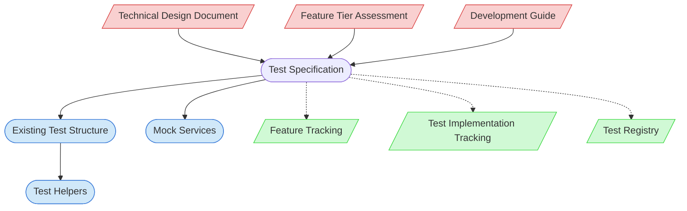

# Test Specification Creation Context Map

This context map provides a visual guide to the components and relationships relevant to the Test Specification Creation task. Use this map to identify which components require attention and how they interact.

## Visual Component Diagram

## Essential Components

### Critical Components (Must Understand)
- **Technical Design Document**: The TDD for the feature being specified - provides architectural context and component definitions
- **Feature Tier Assessment**: Complexity assessment that determines the depth and scope of test specifications required
- **Development Guide**: Testing standards and practices that must be followed during test specification creation

### Important Components (Should Understand)
- **Existing Test Structure**: Current test organization and patterns that new specifications should follow
- **Mock Services**: Available mock implementations that can be leveraged in test specifications
- **Test Helpers**: Utility functions for test setup that should be referenced in specifications

### Reference Components (Access When Needed)
- **Feature Tracking**: Documentation tracking feature development status - updated after specification completion
- **Test Implementation Tracking**: Records test specification creation and implementation status
- **Test Registry**: Central registry of all test files with IDs, metadata, and relationships

## Key Relationships

1. **TDD → Test Specification**: The technical design document provides the architectural foundation for creating comprehensive test specifications
2. **Tier Assessment → Test Specification**: The complexity tier determines the depth of testing (Tier 1: basic, Tier 2: comprehensive, Tier 3: full suite)
3. **Development Guide → Test Specification**: Testing standards guide the format and approach for test specifications
4. **Test Specification → Test Structure**: New specifications must align with existing test organization patterns
5. **Test Specification → Mock Services**: Specifications reference available mocks and define new mock requirements
6. **Test Specification -.-> Feature Tracking**: Status updates after specification completion
7. **Test Specification -.-> Test Implementation Tracking**: Records specification creation status
8. **Test Specification -.-> Test Registry**: Updates test file metadata with specification paths

## Implementation in AI Sessions

1. **Assess Test Requirement**: First determine if the feature requires tests - assessment/documentation features should be marked as "🚫 No Test Required" in Feature Tracking
2. Begin by examining the Technical Design Document to understand feature architecture and components
3. Review the Feature Tier Assessment to determine appropriate test depth and scope
4. Consult the Development Guide for testing standards and specification format requirements
5. Analyze the Existing Test Structure to understand current patterns and organization
6. Review available Mock Services and Test Helpers to leverage existing testing infrastructure
7. Create comprehensive test specifications mapping TDD components to test cases
8. Define mock requirements and test implementation roadmap
9. Update Feature Tracking, Test Implementation Tracking, and Test Registry with completion status
10. Run validation scripts to ensure tracking consistency

**Note**: If a feature is determined to not require tests (pure assessment/documentation features), skip this task and update Feature Tracking Test Summary directly to "🚫 No Test Required".

## Related Documentation

- [Technical Design Documents](/doc/product-docs/technical/design) - Repository of TDDs for features
- [Feature Tier Assessment Guide](../../../methodologies/documentation-tiers/README.md) - Understanding complexity tiers
- [Development Guide](/doc/product-docs/guides/guides/development-guide.md) - Testing standards and practices
- [Test Structure Documentation](/test/) - Current test organization patterns
- [Feature Tracking](../../../state-tracking/permanent/feature-tracking.md) - Feature development status tracking
- [Test Implementation Tracking](../../../state-tracking/permanent/test-implementation-tracking.md) - Test specification and implementation tracking
- [Test Registry](/test/test-registry.yaml) - Central registry of test files with IDs and metadata

---

*Note: This context map highlights only the components relevant to this specific task. For a comprehensive view of all components, refer to the [Component Relationship Index](/doc/product-docs/technical/architecture/component-relationship-index.md).*
