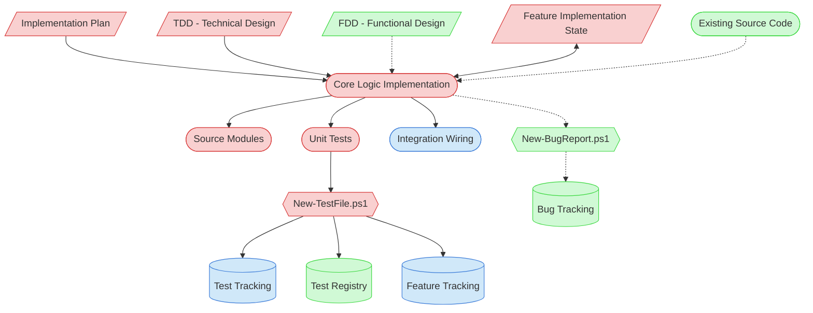

# Core Logic Implementation Context Map

This context map provides a visual guide to the components and relationships relevant to the Core Logic Implementation task (PF-TSK-078). Use this map to identify which components require attention and how they interact.

## Visual Component Diagram



## Essential Components

### Critical Components (Must Understand)
- **Implementation Plan**: The roadmap from Feature Implementation Planning (PF-TSK-044) defining which modules to build and in what order
- **TDD (Technical Design Document)**: Module specifications, interface contracts, and component design guiding the implementation
- **Feature Implementation State**: Tracks implementation progress, code inventory, and task completion across the feature lifecycle
- **Source Modules**: The core business logic code being created or modified
- **Unit Tests**: Test files created via `New-TestFile.ps1` with pytest markers for automated tracking

### Important Components (Should Understand)
- **Integration Wiring**: CLI commands, service registrations, or event hooks connecting new modules to the existing system
- **Feature Tracking**: Central feature status document — updated to 🧪 Testing upon task completion
- **Test Tracking**: Automatically updated by `New-TestFile.ps1` with test file links and status

### Reference Components (Access When Needed)
- **FDD (Functional Design Document)**: Business requirements and acceptance criteria (Tier 2+ features only)
- **Existing Source Code**: Similar modules in the codebase for pattern consistency
- **Test Tracking**: Test implementation status — automatically updated by `New-TestFile.ps1`
- **Bug Tracking / New-BugReport.ps1**: For documenting bugs discovered but not fixed in this session

## Key Relationships

1. **Implementation Plan → Core Logic**: The plan defines what to build; this task executes it
2. **TDD → Core Logic**: Design specifications guide interface contracts and module structure
3. **Core Logic ↔ Feature State**: Bidirectional — reads context, writes progress and code inventory
4. **Unit Tests → New-TestFile.ps1**: All test files created through automation for proper tracking
5. **New-TestFile.ps1 → Tracking Files**: Script auto-updates test-tracking.md and feature-tracking.md
6. **Core Logic -.-> Bug Report**: Optional — only when bugs are discovered that won't be fixed in this session

## Task Position in Implementation Chain

```
Feature Implementation Planning (PF-TSK-044)
  ↓
[Data Layer Implementation (PF-TSK-051)] ← optional, if DB needed
  ↓
★ Core Logic Implementation (PF-TSK-078) ← THIS TASK
  ↓
Integration & Testing (PF-TSK-053)
  ↓
Quality Validation (PF-TSK-054)
  ↓
Implementation Finalization (PF-TSK-055)
```

## Related Documentation

- [Task Definition](/doc/process-framework/tasks/04-implementation/core-logic-implementation.md) - Full process steps and checklist
- [Development Guide](/doc/process-framework/guides/04-implementation/development-guide.md) - Coding best practices
- [Definition of Done](/doc/process-framework/guides/04-implementation/definition-of-done.md) - Completion criteria
- [Bug Reporting Guide](/doc/process-framework/guides/06-maintenance/bug-reporting-guide.md) - Bug documentation standards
<!-- [Component Relationship Index](/doc/product-docs/technical/architecture/component-relationship-index.md) - Removed: file deleted -->

---
