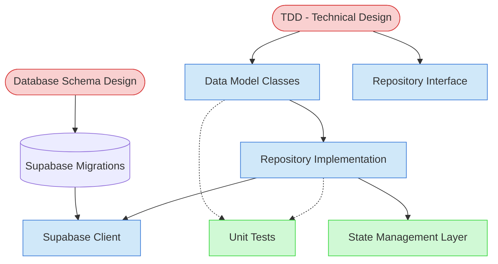

# Data Layer Implementation Context Map

This context map provides a visual guide to the components and relationships relevant to the Data Layer Implementation task. Use this map to identify which components require attention and how they interact.

## Visual Component Diagram

## Essential Components

### Critical Components (Must Understand)
- **TDD (Technical Design Document)**: Defines data model structure, validation rules, and repository requirements for the feature
- **Database Schema Design**: Specifies table schemas, relationships, indexes, RLS policies, and migration scripts

### Important Components (Should Understand)
- **Data Model Classes**: Dart classes representing database entities with fromJson/toJson methods and validation logic (`/lib/data/models/[feature]/`)
- **Repository Interface**: Contract defining data access methods (CRUD operations, queries) (`/lib/data/repositories/[feature]/`)
- **Repository Implementation**: Concrete implementation using Supabase client with error handling and data transformation
- **Supabase Client**: Configured database connection instance (`/lib/core/supabase_client.dart`)

### Reference Components (Access When Needed)
- **Unit Tests**: Test coverage for model serialization and repository operations (`/test/unit/data/[feature]/`)
- **State Management Layer**: Riverpod providers that will consume the repository (next task in sequence)

## Key Relationships

1. **TDD → Data Models**: TDD specifications drive model class structure, field types, and validation requirements
2. **TDD → Repository Interface**: TDD defines required data access methods and query operations
3. **Database Schema → Migrations**: Schema design is implemented through Supabase migration scripts
4. **Data Models → Repository Implementation**: Repository transforms database records into model instances
5. **Repository Implementation → Supabase Client**: Repository uses client for all database operations (queries, mutations)
6. **Migrations → Supabase Client**: Migrations are executed through the Supabase client connection
7. **Repository Implementation -.-> Unit Tests**: Test coverage validates repository behavior with mocked database
8. **Repository Implementation → State Management**: Repositories are consumed by Riverpod providers (next task)

## Implementation in AI Sessions

1. **Start with Design Documents**: Review TDD and Database Schema Design to understand requirements
2. **Execute Migrations First**: Run Supabase migration scripts and verify database schema is created correctly
3. **Implement Data Models**: Create model classes in `/lib/data/models/[feature]/` following TDD specifications
4. **Define Repository Interface**: Create interface in `/lib/data/repositories/[feature]/` based on required operations
5. **Implement Repository**: Build concrete repository with Supabase client integration and error handling
6. **Write Tests**: Create unit tests for models and repositories with appropriate mocking
7. **Prepare for Handoff**: Document completed work in Feature Implementation State file for state management task

## Related Documentation

- [Data Layer Implementation Task](../../../tasks/04-implementation/data-layer-implementation.md) - Complete task definition with process steps
- [Feature Implementation State Template](../../../templates/templates/feature-implementation-state-template.md) - Template for tracking implementation progress
- [TDD Creation Guide](/doc/product-docs/technical/architecture/design-docs/tdd/README.md) - Understanding technical design documents
- [Database Schema Design Guide](/doc/product-docs/technical/database/README.md) - Database design documentation standards
- [Component Relationship Index](/doc/product-docs/technical/architecture/component-relationship-index.md) - Complete reference of all component relationships

---

*Note: This context map highlights only the components relevant to this specific task. For a comprehensive view of all components, refer to the [Component Relationship Index](/doc/product-docs/technical/architecture/component-relationship-index.md).*
