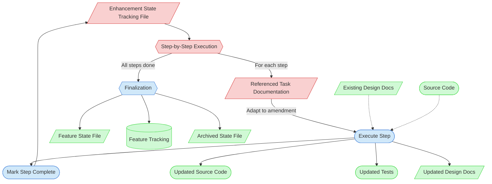

# Feature Enhancement Context Map

This context map provides a visual guide to the components and relationships relevant to the Feature Enhancement task. Use this map to identify which components require attention and how they interact.

## Visual Component Diagram

## Essential Components

### Critical Components (Must Understand)
- **Enhancement State Tracking File**: The primary input — a customized execution plan produced by Feature Request Evaluation, containing sequenced steps with task documentation references
- **Step-by-Step Execution**: The core loop — for each step in the state file, read the referenced task doc, adapt to amendment context, execute, and mark complete
- **Referenced Task Documentation**: Existing task definitions (TDD Creation, FDD Creation, Test Implementation, etc.) that provide quality standards and process guidance for each type of work

### Important Components (Should Understand)
- **Execute Step**: The actual work — amending design docs, extending code, modifying tests, adapted from the referenced task's new-feature guidance
- **Mark Step Complete**: Immediately update the state file after each step completes to maintain accurate progress tracking
- **Finalization**: Update feature state file, restore feature tracking status, archive the Enhancement State Tracking File

### Reference Components (Access When Needed)
- **Updated Source Code / Tests / Design Docs**: The outputs produced by executing steps
- **Feature State File**: Target feature's implementation state — updated on finalization
- **Feature Tracking**: Status restored from "🔄 Needs Revision" to appropriate status on finalization
- **Archived State File**: Completed state file moved to `temporary/old/`
- **Existing Design Docs / Source Code**: The existing artifacts being amended or extended

## Key Relationships

1. **Enhancement State File → Step Execution**: The state file drives all work — each step defines what to do and where to find guidance
2. **Step Execution → Referenced Task Doc → Execute Step**: For each step, read the referenced task doc, then adapt and execute
3. **Execute Step → Mark Complete → State File**: After execution, mark the step done in the state file (circular loop)
4. **Step Execution → Finalization**: When all steps are complete, finalize by updating state files and archiving
5. **Existing Design Docs -.-> Execute Step**: Existing docs are read and amended during execution

## Implementation in AI Sessions

1. Begin by reading the Enhancement State Tracking File to understand full scope
2. For each step: read the referenced task documentation, adapt to amendment context, execute, and immediately mark complete
3. For multi-session enhancements: at session end, ensure the state file reflects accurate progress and next steps
4. On completion: update feature state file, restore feature tracking status, archive the Enhancement State Tracking File

## Related Documentation

- [Feature Enhancement Task](../../../tasks/04-implementation/feature-enhancement.md) — Task definition
- [Feature Request Evaluation Task](../../../tasks/01-planning/feature-request-evaluation.md) — The upstream task that produces the Enhancement State Tracking File
- [Enhancement Workflow Concept (PF-PRO-002)](../../../proposals/proposals/enhancement-workflow-concept.md) — Full design rationale

---

*Note: This context map highlights only the components relevant to the Feature Enhancement task. For the upstream classification workflow, see the [Feature Request Evaluation Context Map](../01-planning/feature-request-evaluation-map.md).*
