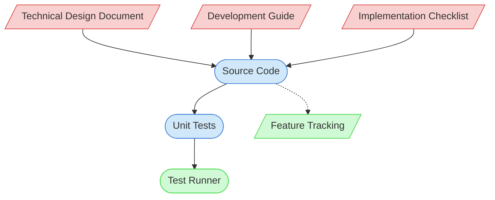

# Feature Implementation Context Map

This context map provides a visual guide to the components and relationships relevant to the Feature Implementation task. Use this map to identify which components require attention and how they interact.

## Visual Component Diagram

## Essential Components

### Critical Components (Must Understand)
- **Technical Design Document**: Blueprint for the feature implementation containing requirements, architecture decisions, and interfaces
- **Development Guide**: Standards and practices to follow during implementation
- **Implementation Checklist**: Required items to complete for feature implementation

### Important Components (Should Understand)
- **Source Code**: Actual code files being created or modified for the feature
- **Unit Tests**: Tests created to verify the feature implementation

### Reference Components (Access When Needed)
- **Test Runner**: System for executing and validating test results
- **Feature Tracking**: Documentation tracking feature implementation status

## Key Relationships

1. **TDD → Source Code**: The technical design document guides the source code implementation
2. **Source Code → Unit Tests**: The implemented code should have corresponding unit tests
3. **Development Guide → Source Code**: Implementation follows the standards in the guide
4. **Implementation Checklist → Source Code**: Checklist items must be addressed in the implementation
5. **Source Code -.-> Feature Tracking**: Status updates in tracking documentation after implementation

## Implementation in AI Sessions

1. Begin by examining the Technical Design Document to understand feature requirements
2. Review the Development Guide for applicable standards and practices
3. Use the Implementation Checklist to guide your implementation work
4. Create or modify source code files according to the TDD
5. Develop unit tests that validate the implementation
6. Only reference Feature Tracking when updating implementation status

## Related Documentation

- [Technical Design Documents](/doc/product-docs/technical/design) - Detailed feature designs
- [Development Guide](/doc/product-docs/guides/guides/development-guide.md) - Development standards and practices
- [Implementation Checklist](/doc/product-docs/checklists/checklists/feature-implementation-checklist.md) - Required items to complete
- [Feature Tracking](../../../state-tracking/permanent/feature-tracking.md) - Feature status tracking
- <!-- [Component Relationship Index](/doc/product-docs/technical/architecture/component-relationship-index.md) - File not found --> - Complete reference of component relationships

---

*Note: This context map highlights only the components relevant to feature implementation. For a comprehensive view of all components, refer to the [Component Relationship Index](/doc/product-docs/technical/architecture/component-relationship-index.md).*
