# Feature Implementation Planning Context Map

This context map provides a visual guide to the inputs, outputs, and supporting components for the Feature Implementation Planning task (PF-TSK-044). The task transforms design documentation into actionable implementation roadmaps.

## Visual Component Diagram

```mermaid
graph TD
    classDef critical fill:#f9d0d0,stroke:#d83a3a
    classDef important fill:#d0e8f9,stroke:#3a7bd8
    classDef reference fill:#d0f9d5,stroke:#3ad83f
    classDef tool fill:#f0e8d0,stroke:#d89a3a

    TASK["Feature Implementation<br/>Planning Task<br/>(PF-TSK-044)"]

    INPUT["📥 Design Inputs"]
    FDD["FDD<br/>(Functional Design)"]
    TDD["TDD<br/>(Technical Design)"]
    API["API Design<br/>(if applicable)"]
    DBSCHEMA["Database Schema<br/>(if applicable)"]
    UIDESIGN["UI/UX Design<br/>(if applicable)"]
    FEATURES["Feature Tracking<br/>(Feature Info)"]

    TOOLS["🛠️ Automation Tools"]
    IMPPLAN["New-ImplementationPlan.ps1<br/>(Creates PD-IMP-XXX docs)"]
    FEATSTATE["New-FeatureImplementationState.ps1<br/>(Creates PF-FEA-XXX docs)"]

    OUTPUTS["📤 Planning Outputs"]
    IMPLPLAN_DOC["Implementation Plan<br/>(PD-IMP-XXX)<br/>in /product-docs/technical/"]
    FEATSTATE_DOC["Feature State Document<br/>(PF-FEA-XXX)<br/>in /process-framework/state-tracking/features/"]

    REFERENCE["📚 Reference Materials"]
    TEMPLATE_IMPL["Implementation Plan Template<br/>(PF-TEM-042)"]
    TEMPLATE_STATE["Feature State Template<br/>(PF-TEM-037)"]
    GUIDE_CUSTOM["Implementation Plan<br/>Customization Guide<br/>(PF-GDE-046)"]
    GUIDE_STATE["Feature State Tracking<br/>Guide"]

    FDD --> TASK
    TDD --> TASK
    API --> TASK
    DBSCHEMA --> TASK
    UIDESIGN --> TASK
    FEATURES --> TASK

    TASK --> IMPPLAN
    TASK --> FEATSTATE

    IMPPLAN --> IMPLPLAN_DOC
    FEATSTATE --> FEATSTATE_DOC

    TEMPLATE_IMPL -.-> IMPPLAN
    TEMPLATE_STATE -.-> FEATSTATE

    GUIDE_CUSTOM -.-> TASK
    GUIDE_STATE -.-> TASK

    class TASK critical
    class IMPPLAN,FEATSTATE tool
    class IMPLPLAN_DOC,FEATSTATE_DOC important
    class TEMPLATE_IMPL,TEMPLATE_STATE,GUIDE_CUSTOM,GUIDE_STATE reference
    class FDD,TDD,API,DBSCHEMA,UIDESIGN,FEATURES important
```

## Essential Components

### Critical Component (Task Center)
- **Feature Implementation Planning Task (PF-TSK-044)**: The task that analyzes design documentation and creates implementation execution strategies. Outputs are two documents: implementation plan and feature state document.

### Important Input Components (Must Read Before Starting)
- **Technical Design Document (TDD)**: Architecture decisions, component design, layer breakdown - forms foundation for implementation sequencing
- **Functional Design Document (FDD)**: For Tier 2+ features, user workflows, acceptance criteria, functional requirements
- **Feature Tracking Entry**: Feature ID, complexity tier, current status, links to design documents
- **API Design Documentation**: If applicable, service contracts and integration endpoints
- **Database Schema Design**: If applicable, table structure, migrations, RLS policies
- **UI/UX Design Documentation**: If applicable, screen layouts, component hierarchy, navigation flow

### Tool Components (Automation Scripts)
- **New-ImplementationPlan.ps1**: Creates implementation plan documents with PD-IMP-XXX IDs
- **New-FeatureImplementationState.ps1**: Creates feature state tracking documents with PF-FEA-XXX IDs

### Important Output Components (Created During Task)
- **Implementation Plan Document (PD-IMP-XXX)**: Strategic execution roadmap with phases, dependencies, risks, testing strategy
- **Feature State Document (PF-FEA-XXX)**: Permanent living document tracking feature context and implementation progress

### Reference Components (Supporting Documentation)
- **Implementation Plan Template (PF-TEM-042)**: Template used by New-ImplementationPlan.ps1
- **Feature State Template (PF-TEM-037)**: Template used by New-FeatureImplementationState.ps1
- **Implementation Plan Customization Guide (PF-GDE-046)**: Step-by-step guidance for customizing implementation plans
- **Feature State Tracking Guide**: Guidance for maintaining feature state documents

## Key Relationships

### Input → Task Relationships
1. **Design Documents → Task**: TDD provides technical foundation; FDD (if applicable) provides requirements context; other design docs provide specific implementation guidance
2. **Feature Tracking → Task**: Provides feature ID, complexity tier, and current status to inform planning scope
3. All design documents must be complete and approved before task begins

### Task → Output Relationships
1. **Task → Implementation Plan**: Task creates executable roadmap with phases, file mappings, dependencies, risks
2. **Task → Feature State**: Task initializes permanent living document that will track implementation progress
3. Both outputs use templates and scripts for consistency and ID assignment

### Output → Next Tasks Relationships
1. **Implementation Plan + State Document → Feature Implementation Task**: Provides roadmap and context for actual implementation work
2. **Feature State Document → Session Continuity**: Enables handover and progress tracking across multiple implementation sessions

## Implementation in AI Sessions

### Session Starting - Information Flow
1. **Load Feature Context**: Read feature-tracking.md to get feature ID, complexity tier, design document links
2. **Read Design Documents**: Review TDD (required), FDD (if applicable), and other design docs for implementation guidance
3. **Understand Templates**: Read feature-implementation-state-template.md to understand permanent state tracking structure
4. **Reference Guide**: Use implementation-plan-customization-guide.md for step-by-step customization instructions

### During Planning
1. **Use Automation Scripts**: Execute New-ImplementationPlan.ps1 and New-FeatureImplementationState.ps1 to create documents with proper IDs
2. **Follow Template Structure**: Customize generated templates following the guide's recommendations
3. **Reference Design Docs**: Link implementation plan sections to specific design document sections
4. **Document File Mappings**: Specify exact file paths in `/lib/` for each implementation phase
5. **Identify Risks**: Document technical, integration, and schedule risks with actionable mitigations

### Outputs Summary
1. **Implementation Plan (PD-IMP-XXX)**: Executable roadmap with phases, dependencies, testing strategy, risk assessment
2. **Feature State Document (PF-FEA-XXX)**: Living document with planning context, file mappings, dependencies for entire implementation lifecycle

## Related Documentation

- [Feature Implementation Planning Task (PF-TSK-044)](../../tasks/04-implementation/feature-implementation-planning-task.md) - Complete task definition with detailed process
- [Implementation Plan Template (PF-TEM-042)](../../templates/templates/implementation-plan-template-template.md) - Template structure for implementation plans
- [Implementation Plan Customization Guide (PF-GDE-046)](../../guides/guides/implementation-plan-customization-guide.md) - Step-by-step customization instructions
- [Feature Implementation State Template (PF-TEM-037)](../../templates/templates/feature-implementation-state-template.md) - Permanent state tracking template
- [Feature Tracking](../../state-tracking/permanent/feature-tracking.md) - Registry of all features and their status
- [New-ImplementationPlan.ps1](../../scripts/file-creation/New-ImplementationPlan.ps1) - Script for creating implementation plans
- [New-FeatureImplementationState.ps1](../../scripts/file-creation/New-FeatureImplementationState.ps1) - Script for creating feature state documents

---

*Note: This context map shows the task's immediate inputs, outputs, and supporting tools. Once implementation begins, refer to the Feature State Document for ongoing context about component files and dependencies.*
