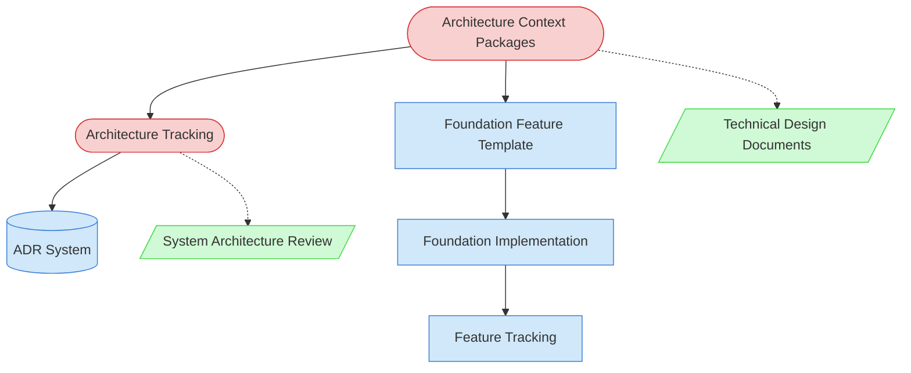

# Foundation Feature Implementation Task Context Map

This context map provides a visual guide to the components and relationships relevant to the Foundation Feature Implementation Task. Use this map to understand the architectural context, dependencies, and documentation flow required for implementing foundation features (0.x.x) that provide structural foundations for regular business features.

## Visual Component Diagram

## Essential Components

### Critical Components (Must Understand)

- **Architecture Context Packages**: Bounded architectural context that provides focused guidance for the specific foundation area being implemented
- **Architecture Tracking**: Current state of architectural decisions and evolution, must be updated throughout implementation

### Important Components (Should Understand)

- **Foundation Feature Template**: Template structure for implementing foundation features with architectural awareness
- **ADR System**: Architecture Decision Records system for documenting significant architectural decisions made during implementation
- **Foundation Implementation**: The actual code and architectural components being implemented
- **Feature Tracking**: System for tracking foundation feature completion and updating dependent features

### Reference Components (Access When Needed)

- **Technical Design Documents**: Detailed specifications that may inform foundation implementation
- **System Architecture Review**: Task that identifies and specifies foundation features

## Key Relationships

1. **Architecture Context Packages → Architecture Tracking**: Context packages inform current architectural state and must be updated in tracking as implementation progresses
2. **Architecture Context Packages → Foundation Feature Template**: Context packages provide the architectural constraints and patterns that guide template usage
3. **Architecture Tracking → ADR System**: Architectural decisions made during implementation must be documented as ADRs and reflected in tracking
4. **Foundation Feature Template → Foundation Implementation**: Template provides the structure and guidance for implementing the actual foundation components
5. **Foundation Implementation → Feature Tracking**: Completed foundation implementation updates feature tracking and unblocks dependent features
6. **Architecture Context Packages -.-> Technical Design Documents**: TDDs may provide additional context when available but are not always required
7. **Architecture Tracking -.-> System Architecture Review**: SAR task identifies foundation features but is not directly accessed during implementation

## Implementation in AI Sessions

1. **Start with Architecture Context Packages**: Load the relevant context package for the foundation area to understand current architectural state and constraints
2. **Review Architecture Tracking**: Understand the current architectural evolution and how this foundation fits into the overall architectural roadmap
3. **Use Foundation Feature Template**: Follow the template structure to ensure architectural awareness throughout implementation
4. **Document Architectural Decisions**: Create ADRs for significant architectural decisions using the existing ADR system (`New-ArchitectureDecision.ps1`)
5. **Update Architecture Tracking**: Continuously update tracking with implementation progress and architectural outcomes
6. **Complete Feature Tracking**: Mark foundation feature as complete and update dependent features to reflect foundation availability
7. **Reference TDDs and SAR**: Access technical design documents and system architecture review results only when additional context is needed

## Related Documentation

- [Foundation Feature Implementation Task](../../tasks/04-implementation/foundation-feature-implementation-task.md) - Complete task definition and process
- [Foundation Feature Template](../../templates/templates/foundation-feature-template.md) - Template for foundation feature structure and architectural documentation
- [Foundation Feature Implementation Usage Guide](../../guides/guides/foundation-feature-implementation-usage-guide.md) - Comprehensive guide for using this task effectively
- [Architecture Context Packages](../../state-tracking/permanent/architecture-context-packages.md) - Current architectural context and component relationships
- [Architecture Tracking](../../state-tracking/permanent/architecture-tracking.md) - Ongoing architectural decisions and evolution
- [Feature Tracking](../../state-tracking/permanent/feature-tracking.md) - Foundation feature status and dependencies
- [ADR Template](../../templates/templates/adr-template.md) - For documenting architectural decisions

---

_Note: This context map highlights the architectural components and documentation flow specific to foundation feature implementation. Foundation features differ from regular features due to their cross-cutting architectural impact and need for continuous architectural context awareness throughout implementation._
