# Integration & Testing Context Map

This context map provides a visual guide to the components and relationships relevant to the Integration & Testing task (PF-TSK-053). Use this map to identify which components require attention and how they interact during test implementation and integration verification.

## Visual Component Diagram

```mermaid
graph TD
    classDef critical fill:#f9d0d0,stroke:#d83a3a
    classDef important fill:#d0e8f9,stroke:#3a7bd8
    classDef reference fill:#d0f9d5,stroke:#3ad83f

    TestSpec[/Test Specification Document/] --> IntTest([Integration & Testing])
    TDD[/Technical Design Document/] --> IntTest
    ImplCode[/Completed Implementation Code/] --> IntTest

    IntTest --> UnitTests([Unit Tests])
    IntTest --> ComponentTests([Component Tests])
    IntTest --> IntegrationTests([Integration Tests])
    IntTest --> AdditionalTests([Additional Test Types])

    TestStructure[/Existing Test Structure/] --> IntTest
    MockServices[/Mock Services/] --> IntTest
    TestHelpers[/Test Helpers/] --> IntTest

    IntTest --> CoverageReport([Coverage Report])
    IntTest --> BugReports([Bug Reports])
    IntTest --> UpdatedMocks([Updated Mock Services])

    IntTest -.-> TestImplTracking[/Test Implementation Tracking/]
    IntTest -.-> TestRegistry[/Test Registry/]
    IntTest -.-> FeatureTracking[/Feature Tracking/]
    IntTest -.-> BugTracking[/Bug Tracking/]
    IntTest -.-> FeatureState[/Feature Implementation State File/]

    class TestSpec,TDD,ImplCode critical
    class TestStructure,MockServices,TestHelpers important
    class TestImplTracking,TestRegistry,FeatureTracking,BugTracking,FeatureState reference
```

## Essential Components

### Critical Components (Must Understand)
- **Test Specification Document** (if exists): The detailed test specifications that define what tests to implement and their expected behavior
- **Technical Design Document**: The TDD for the feature — provides testing requirements, acceptance criteria, and coverage thresholds
- **Completed Implementation Code**: All implemented feature code to be tested — essential for understanding integration points

### Important Components (Should Understand)
- **Existing Test Structure**: Current test organization and patterns that new tests should follow
- **Mock Services**: Available mock implementations that can be used or need to be enhanced
- **Test Helpers**: Utility functions for test setup that can be leveraged or extended

### Reference Components (Access When Needed)
- **Test Implementation Tracking**: Documentation tracking test implementation status — updated during and after implementation
- **Test Registry**: Central registry of all test files with IDs, metadata, and relationships — updated with implementation status
- **Feature Tracking**: Documentation tracking feature development status — updated after test implementation completion
- **Bug Tracking**: Registry for bugs discovered during testing — updated via `New-BugReport.ps1`
- **Feature Implementation State File**: Per-feature implementation tracking (if applicable) — updated with test metrics

## Key Relationships

1. **Test Specification → Integration & Testing**: The test specification provides the blueprint for what tests to implement
2. **TDD → Integration & Testing**: Technical design provides test requirements, acceptance criteria, and coverage expectations
3. **Implementation Code → Integration & Testing**: Understanding the implementation is crucial for effective testing and integration verification
4. **Test Structure → Integration & Testing**: Existing patterns guide organization and naming conventions
5. **Mock Services → Integration & Testing**: Available mocks are leveraged and enhanced as needed
6. **Integration & Testing → Test Outputs**: Implementation produces test files, coverage reports, and bug reports
7. **Integration & Testing → State Files**: Automation scripts update tracking files; manual completion status updates required

## Implementation Flow

### Phase 1: Preparation
1. Review Test Specification (if exists) for required test scenarios
2. Review TDD testing section for acceptance criteria and coverage thresholds
3. Analyze implementation code for integration points and failure scenarios
4. Plan test strategy: determine test types needed (from `project-config.json`)

### Phase 2: Test File Creation and Implementation
5. Create test files using `New-TestFile.ps1` (auto-assigns PD-TST IDs, updates tracking)
6. Implement unit tests for individual components
7. Implement component tests for component-level interactions
8. Implement integration tests for end-to-end workflows
9. Implement additional test types as required by specification
10. Create test mocks and stubs for external dependencies
11. Verify test coverage using project coverage tool

### Phase 3: Finalization
12. Run complete test suite and validate all tests pass
13. Systematic bug discovery and reporting via `New-BugReport.ps1`
14. Update test status and validate tracking consistency via `Validate-TestTracking.ps1`
15. Update Feature Implementation State File (if applicable) with test metrics

## Test Categories and Outputs

Test categories are defined by the project language in `project-config.json`:

- **Python**: Unit, Integration, Parser, Performance
- **Dart**: Unit, Integration, Widget, E2E

### Unit Tests (`/test/unit/`)
- Test individual components in isolation
- Use mocks for dependencies
- Focus on business logic and edge cases

### Integration Tests (`/test/integration/`)
- Test component interactions
- Validate data flow between services
- Test API integrations and database operations

### Additional Types
- Project-specific test types as configured (e.g., Parser tests, Performance tests, Widget tests, E2E tests)

## Related Documentation

- [Integration & Testing Task Definition](/doc/process-framework/tasks/04-implementation/integration-and-testing.md) - Complete task definition (PF-TSK-053)
- [Integration & Testing Usage Guide](/doc/process-framework/guides/guides/test-implementation-usage-guide.md) - Step-by-step implementation guidance
- [Test Specification Documents](/test/specifications/feature-specs/) - Repository of test specifications
- [Test Implementation Tracking](/doc/process-framework/state-tracking/permanent/test-implementation-tracking.md) - Test implementation status tracking
- [Test Registry](/test/test-registry.yaml) - Central registry of test files with IDs and metadata
- [Feature Tracking](/doc/process-framework/state-tracking/permanent/feature-tracking.md) - Feature development status tracking
- [Bug Reporting Guide](/doc/process-framework/guides/guides/bug-reporting-guide.md) - Standardized bug reporting procedures
- [Development Guide](/doc/product-docs/guides/guides/development-guide.md) - Testing standards and practices

---

*Note: This context map highlights only the components relevant to this specific task. For a comprehensive view of all components, refer to the [Component Relationship Index](/doc/product-docs/technical/architecture/component-relationship-index.md).*
