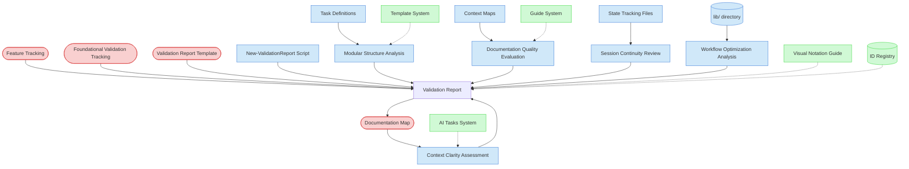

# AI Agent Continuity Validation Context Map

This context map provides a visual guide to the components and relationships relevant to the AI Agent Continuity Validation task. Use this map to identify which components require attention and how they interact.

## Visual Component Diagram

## Essential Components

### Critical Components (Must Understand)

- **Feature Tracking (FT)**: Current status of foundational features to be validated - provides scope and context
- **Foundational Validation Tracking (FVT)**: Master validation matrix and progress tracking - central coordination point
- **Validation Report Template (VRT)**: Standardized template for creating validation reports with consistent structure
- **Documentation Map (DM)**: Process framework structure and organization - key for context clarity assessment

### Important Components (Should Understand)

- **Task Definitions (TASKS)**: Task structure and workflow patterns for AI agent execution analysis
- **Context Maps (CMAPS)**: Visual guidance for AI agent task execution and documentation quality evaluation
- **State Tracking Files (STATE)**: Session continuity and progress tracking patterns for multi-session workflow assessment
- **lib/ directory (LIB)**: Code organization and modular structure for workflow optimization analysis
- **New-ValidationReport Script (NVRS)**: Automation script for generating standardized validation reports
- **Context Clarity Assessment (CCA)**: Process of evaluating how well the codebase provides clear context for AI agents
- **Modular Structure Analysis (MSA)**: Process of assessing code organization and component separation
- **Documentation Quality Evaluation (DQE)**: Process of reviewing documentation completeness and clarity
- **Session Continuity Review (SCR)**: Process of evaluating state tracking and multi-session workflow support
- **Workflow Optimization Analysis (WOA)**: Process of assessing task structure and process guidance effectiveness

### Reference Components (Access When Needed)

- **AI Tasks System (AITASKS)**: Task discovery and selection patterns for AI agent workflow analysis
- **Template System (TEMPLATES)**: Standardized document creation patterns for modular structure assessment
- **Guide System (GUIDES)**: Process guidance and best practices for documentation quality evaluation
- **Visual Notation Guide (VNG)**: For interpreting context map diagrams and visual elements
- **ID Registry (IDR)**: For understanding validation report ID assignments and tracking

## Key Relationships

1. **Feature Tracking → Validation Report**: Provides the scope of foundational features to be validated for AI agent continuity
2. **Documentation Map → Context Clarity Assessment**: Primary source for evaluating process framework organization and clarity
3. **Task Definitions → Modular Structure Analysis**: Source for analyzing task structure and workflow patterns
4. **Context Maps → Documentation Quality Evaluation**: Visual guidance components for assessing documentation effectiveness
5. **State Tracking Files → Session Continuity Review**: Source for evaluating multi-session workflow support
6. **lib/ directory → Workflow Optimization Analysis**: Codebase structure for assessing AI agent navigation and understanding
7. **All Analysis Processes → Validation Report**: Feed their findings into the comprehensive validation report
8. **Validation Report → Documentation Map**: Updates documentation tracking with new validation reports

## Implementation in AI Sessions

1. **Start with Critical Context**: Load Feature Tracking, Foundational Validation Tracking, and Documentation Map to understand scope and framework structure
2. **Assess Context Clarity**: Evaluate how well the process framework provides clear context for AI agent understanding
3. **Analyze Modular Structure**: Review task definitions and code organization for AI agent navigation effectiveness
4. **Evaluate Documentation Quality**: Assess context maps, guides, and documentation for AI agent workflow support
5. **Review Session Continuity**: Examine state tracking patterns for multi-session workflow effectiveness
6. **Optimize Workflow Patterns**: Analyze overall task structure and process guidance for AI agent efficiency
7. **Generate Validation Report**: Use ../../scripts/file-creation/New-ValidationReport.ps1 script with AIAgentContinuity validation type
8. **Update Tracking**: Update Foundational Validation Tracking matrix and Documentation Map with new report
9. **Reference Support Systems**: Access AI Tasks, Templates, and Guides only when specific workflow analysis is needed

## Related Documentation

- [AI Agent Continuity Validation Task](../../../tasks/05-validation/ai-agent-continuity-validation.md) - Complete task definition and process
- [Feature Tracking](../../../state-tracking/permanent/feature-tracking.md) - Current status of foundational features
- [Foundational Validation Tracking](../../../state-tracking/temporary/foundational-validation-tracking.md) - Master validation matrix
- [Documentation Map](../../../documentation-map.md) - Process framework structure and organization
- [AI Tasks System](../../../ai-tasks.md) - Task discovery and selection patterns
- [../../scripts/file-creation/New-ValidationReport.ps1](../../../scripts/file-creation/New-ValidationReport.ps1) - Automation script for report generation

---

_Note: This context map highlights only the components relevant to this specific task. For a comprehensive view of all components, refer to the [Component Relationship Index](/doc/product-docs/technical/architecture/component-relationship-index.md)._
