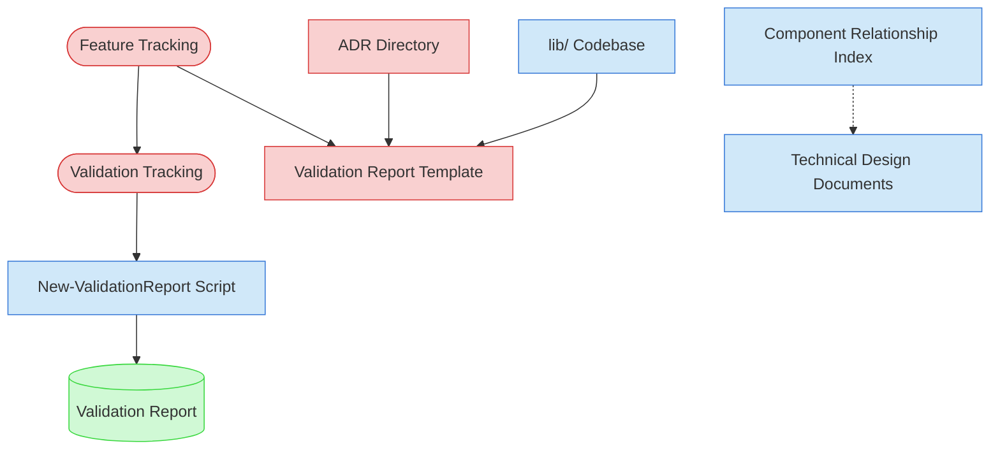

# Architectural Consistency Validation Context Map

This context map provides a visual guide to the components and relationships relevant to the Architectural Consistency Validation task. Use this map to identify which components require attention and how they interact.

## Visual Component Diagram

## Essential Components

### Critical Components (Must Understand)

- **Feature Tracking**: Current status and details of foundational features to be validated
- **Validation Tracking**: Master validation matrix tracking progress across all validation types
- **Validation Report Template**: Standardized template for creating architectural consistency reports
- **ADR Directory**: Architecture Decision Records that define the architectural standards to validate against

### Important Components (Should Understand)

- **Component Relationship Index**: Understanding of how components interact architecturally
- **Technical Design Documents**: Detailed specifications for foundational features
- **lib/ Codebase**: Source code implementations to analyze for architectural patterns
- **New-ValidationReport Script**: Automation tool for generating validation reports

### Reference Components (Access When Needed)

- **Validation Report**: Final output document with scoring and architectural findings

## Key Relationships

1. **Feature Tracking → Validation Tracking**: Feature status determines which features are ready for validation
2. **Feature Tracking → Validation Report Template**: Feature details populate the validation report structure
3. **ADR Directory → Validation Report Template**: Architectural decisions provide validation criteria and standards
4. **Validation Tracking → New-ValidationReport Script**: Matrix tracking guides report generation parameters
5. **lib/ Codebase → Validation Report Template**: Source code analysis provides validation findings
6. **Component Relationship Index -.-> Technical Design Documents**: Optional reference for understanding architectural context

## Implementation in AI Sessions

1. Begin by examining **Feature Tracking** and **Validation Tracking** to identify validation scope
2. Load **ADR Directory** to understand architectural standards and decision criteria
3. Review **Validation Report Template** to understand expected output structure
4. Analyze **lib/ Codebase** implementations against architectural patterns and ADR compliance
5. Use **New-ValidationReport Script** to generate standardized validation reports
6. Update **Validation Tracking** matrix with completed validation results

## Related Documentation

- [Architectural Consistency Validation Task](../../tasks/05-validation/architectural-consistency-validation-task.md) - Complete task definition and process
- [Feature Tracking](../../state-tracking/permanent/feature-tracking.md) - Current status of foundational features
- [Foundational Validation Tracking](../../../state-tracking/temporary/foundational-validation-tracking.md) - Master validation matrix
- [Architecture Decision Records](../../../product-docs/technical/architecture/decisions) - Architectural standards and decisions
- [Component Relationship Index](../../../product-docs/technical/architecture/component-relationship-index.md) - Complete reference of all component relationships

---

_Note: This context map highlights only the components relevant to this specific task. For a comprehensive view of all components, refer to the [Component Relationship Index](/doc/product-docs/technical/architecture/component-relationship-index.md)._
