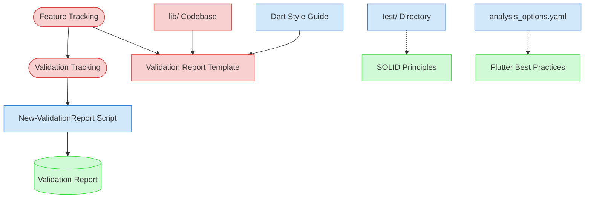

# Code Quality Standards Validation Context Map

This context map provides a visual guide to the components and relationships relevant to the Code Quality Standards Validation task. Use this map to identify which components require attention and how they interact.

## Visual Component Diagram

## Essential Components

### Critical Components (Must Understand)

- **Feature Tracking**: Current status and details of foundational features to be validated
- **Validation Tracking**: Master validation matrix tracking progress across all validation types
- **Validation Report Template**: Standardized template for creating code quality validation reports
- **lib/ Codebase**: Source code implementations to analyze for quality standards

### Important Components (Should Understand)

- **Dart Style Guide**: Official coding standards and formatting guidelines
- **test/ Directory**: Existing test suites for coverage and quality analysis
- **New-ValidationReport Script**: Automation tool for generating validation reports
- **analysis_options.yaml**: Project-specific linting and analysis configuration

### Reference Components (Access When Needed)

- **SOLID Principles**: Object-oriented design principles for evaluation
- **Flutter Best Practices**: Platform-specific development patterns and optimizations
- **Validation Report**: Final output document with scoring and quality findings

## Key Relationships

1. **Feature Tracking → Validation Tracking**: Feature status determines which features are ready for quality validation
2. **Feature Tracking → Validation Report Template**: Feature details populate the validation report structure
3. **lib/ Codebase → Validation Report Template**: Source code analysis provides quality findings and metrics
4. **Dart Style Guide → Validation Report Template**: Official standards provide validation criteria for code style
5. **Validation Tracking → New-ValidationReport Script**: Matrix tracking guides report generation parameters
6. **test/ Directory -.-> SOLID Principles**: Test coverage analysis supports SOLID principles evaluation
7. **analysis_options.yaml -.-> Flutter Best Practices**: Project configuration informs best practices assessment

## Implementation in AI Sessions

1. Begin by examining **Feature Tracking** and **Validation Tracking** to identify validation scope
2. Load **Dart Style Guide** and **SOLID Principles** to understand quality standards
3. Review **Validation Report Template** to understand expected output structure
4. Analyze **lib/ Codebase** implementations against style guides and best practices
5. Check **test/ Directory** for coverage and quality indicators
6. Reference **analysis_options.yaml** for project-specific quality configurations
7. Use **New-ValidationReport Script** to generate standardized validation reports
8. Update **Validation Tracking** matrix with completed validation results

## Related Documentation

- [Code Quality Standards Validation Task](../../tasks/05-validation/code-quality-standards-validation-task.md) - Complete task definition and process
- [Code Quality Standards Validation Concept](../../proposals/code-quality-standards-validation-concept.md) - Detailed concept document
- [Feature Tracking](../../state-tracking/permanent/feature-tracking.md) - Current status of foundational features
- [Foundational Validation Tracking](../../../state-tracking/temporary/foundational-validation-tracking.md) - Master validation matrix
- [Dart Style Guide](https://dart.dev/guides/language/effective-dart/style) - Official Dart/Flutter coding standards
- [Component Relationship Index](../../../product-docs/technical/architecture/component-relationship-index.md) - Complete reference of all component relationships

---

_Note: This context map highlights only the components relevant to this specific task. For a comprehensive view of all components, refer to the [Component Relationship Index](/doc/product-docs/technical/architecture/component-relationship-index.md)._
