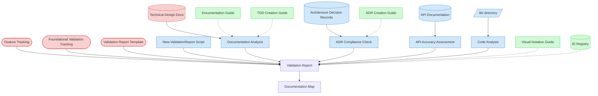

# Documentation Alignment Validation Context Map

This context map provides a visual guide to the components and relationships relevant to the Documentation Alignment Validation task. Use this map to identify which components require attention and how they interact.

## Visual Component Diagram

## Essential Components

### Critical Components (Must Understand)

- **Feature Tracking (FT)**: Current status of foundational features to be validated - provides scope and context
- **Foundational Validation Tracking (FVT)**: Master validation matrix and progress tracking - central coordination point
- **Validation Report Template (VRT)**: Standardized template for creating validation reports with consistent structure
- **Technical Design Documents (TDD)**: Technical specifications that must align with actual implementation - primary validation target

### Important Components (Should Understand)

- **Architecture Decision Records (ADR)**: Architectural decisions that must be properly implemented and followed
- **API Documentation (API)**: API specifications that must accurately reflect actual API implementations
- **lib/ directory (LIB)**: Source code for foundational features - implementation to validate against documentation
- **New-ValidationReport Script (NVRS)**: Automation script for generating standardized validation reports
- **Documentation Analysis (DA)**: Process of comparing TDDs with actual implementation
- **ADR Compliance Check (AC)**: Process of verifying architectural decision implementation
- **API Accuracy Assessment (AA)**: Process of cross-referencing API docs with actual interfaces
- **Code Analysis (CA)**: Process of examining implementation for documentation completeness

### Reference Components (Access When Needed)

- **Documentation Guide (DG)**: Standards for documentation quality and consistency - reference for validation criteria
- **TDD Creation Guide (TDDG)**: Understanding TDD structure and requirements for validation assessment
- **ADR Creation Guide (ADRG)**: Understanding ADR format and content for compliance validation
- **Visual Notation Guide (VNG)**: For interpreting context map diagrams and visual elements
- **ID Registry (IDR)**: For understanding validation report ID assignments and tracking

## Key Relationships

1. **Feature Tracking → Validation Report**: Provides the scope of foundational features to be validated in each session
2. **Foundational Validation Tracking → Validation Report**: Tracks validation progress and links to completed reports
3. **Validation Report Template → Validation Report**: Provides standardized structure and scoring framework
4. **Technical Design Documents → Documentation Analysis**: Primary source for TDD-implementation alignment validation
5. **Architecture Decision Records → ADR Compliance Check**: Source for architectural decision compliance validation
6. **API Documentation → API Accuracy Assessment**: Source for API documentation accuracy validation
7. **lib/ directory → Code Analysis**: Contains implementation code for documentation completeness analysis
8. **New-ValidationReport Script → Validation Report**: Automation tool for generating standardized validation reports
9. **Documentation Analysis → Validation Report**: Feeds TDD alignment findings into the validation report
10. **ADR Compliance Check → Validation Report**: Contributes architectural compliance analysis to the validation report
11. **API Accuracy Assessment → Validation Report**: Contributes API documentation accuracy findings to the validation report
12. **Code Analysis → Validation Report**: Contributes implementation completeness analysis to the validation report
13. **Validation Report → Documentation Map**: Updates documentation tracking with new validation reports

## Implementation in AI Sessions

1. **Start with Critical Context**: Load Feature Tracking, Foundational Validation Tracking, and Validation Report Template to understand scope and structure
2. **Identify Documentation Sources**: Review Technical Design Documents as primary validation targets for alignment assessment
3. **Perform TDD Alignment Analysis**: Compare TDDs with actual implementation in lib/ directory to identify discrepancies
4. **Conduct ADR Compliance Check**: Verify that Architecture Decision Records are properly implemented in the codebase
5. **Execute API Accuracy Assessment**: Cross-reference API Documentation with actual API implementations and interfaces
6. **Analyze Documentation Completeness**: Examine code for missing or outdated documentation requirements
7. **Generate Validation Report**: Use ../../scripts/file-creation/New-ValidationReport.ps1 script with DocumentationAlignment validation type
8. **Update Tracking**: Update Foundational Validation Tracking matrix and Documentation Map with new report
9. **Reference Standards**: Access Documentation Guide and creation guides only when specific guidance is needed for validation criteria

## Related Documentation

- [Documentation Alignment Validation Task](../../../tasks/05-validation/documentation-alignment-validation.md) - Complete task definition and process
- [Feature Tracking](../../../state-tracking/permanent/feature-tracking.md) - Current status of foundational features
- [Foundational Validation Tracking](../../../state-tracking/temporary/foundational-validation-tracking.md) - Master validation matrix
- [Validation Report Template](../../../templates/templates/validation-report-template.md) - Standardized report structure
- [Technical Design Documents](../../../../product-docs/technical/design) - TDD directory for alignment validation
- [Architecture Decision Records](../../../../product-docs/technical/architecture/decisions) - ADR directory for compliance validation
- [../../scripts/file-creation/New-ValidationReport.ps1](../../../scripts/file-creation/New-ValidationReport.ps1) - Automation script for report generation
- [Documentation Guide](../../../guides/guides/documentation-guide.md) - Documentation standards and quality criteria

---

_Note: This context map highlights only the components relevant to this specific task. For a comprehensive view of all components, refer to the [Component Relationship Index](/doc/product-docs/technical/architecture/component-relationship-index.md)._
