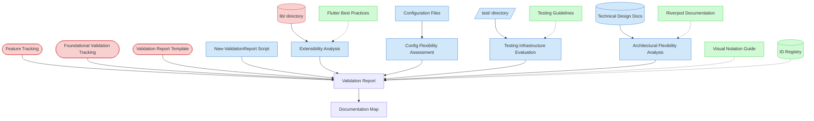

# Extensibility Maintainability Validation Context Map

This context map provides a visual guide to the components and relationships relevant to the Extensibility Maintainability Validation task. Use this map to identify which components require attention and how they interact.

## Visual Component Diagram

## Essential Components

### Critical Components (Must Understand)

- **Feature Tracking (FT)**: Current status of foundational features to be validated - provides scope and context
- **Foundational Validation Tracking (FVT)**: Master validation matrix and progress tracking - central coordination point
- **Validation Report Template (VRT)**: Standardized template for creating validation reports with consistent structure
- **lib/ directory (LIB)**: Source code structure for extensibility analysis - primary codebase to evaluate

### Important Components (Should Understand)

- **Configuration Files (CONFIG)**: pubspec.yaml and environment configs for configuration flexibility assessment
- **test/ directory (TEST)**: Testing infrastructure for coverage and maintainability evaluation
- **Technical Design Documents (TDD)**: Architectural patterns and extension points documentation
- **New-ValidationReport Script (NVRS)**: Automation script for generating standardized validation reports
- **Extensibility Analysis (EA)**: Process of evaluating extension points and architectural flexibility
- **Config Flexibility Assessment (CFA)**: Process of analyzing configuration patterns and adaptability
- **Testing Infrastructure Evaluation (TIE)**: Process of assessing test coverage and testing support
- **Architectural Flexibility Analysis (AFA)**: Process of evaluating architectural scalability and evolution support

### Reference Components (Access When Needed)

- **Flutter Best Practices (FLUTTER)**: Framework-specific extensibility patterns and architectural guidance
- **Testing Guidelines (TESTING)**: Testing infrastructure best practices and coverage standards
- **Riverpod Documentation (RIVERPOD)**: State management extensibility patterns and configuration options
- **Visual Notation Guide (VNG)**: For interpreting context map diagrams and visual elements
- **ID Registry (IDR)**: For understanding validation report ID assignments and tracking

## Key Relationships

1. **Feature Tracking → Validation Report**: Provides the scope of foundational features to be validated for extensibility and maintainability
2. **Foundational Validation Tracking → Validation Report**: Tracks validation progress and links to completed reports
3. **Validation Report Template → Validation Report**: Provides standardized structure and scoring framework
4. **lib/ directory → Extensibility Analysis**: Contains source code for evaluating extension points and architectural flexibility
5. **Configuration Files → Config Flexibility Assessment**: Source for analyzing configuration patterns and environment adaptability
6. **test/ directory → Testing Infrastructure Evaluation**: Contains test infrastructure for coverage and maintainability assessment
7. **Technical Design Documents → Architectural Flexibility Analysis**: Documentation of architectural patterns and extension points
8. **New-ValidationReport Script → Validation Report**: Automation tool for generating standardized validation reports
9. **Extensibility Analysis → Validation Report**: Feeds extension point evaluation findings into the validation report
10. **Config Flexibility Assessment → Validation Report**: Contributes configuration flexibility analysis to the validation report
11. **Testing Infrastructure Evaluation → Validation Report**: Contributes testing support assessment to the validation report
12. **Architectural Flexibility Analysis → Validation Report**: Contributes architectural scalability findings to the validation report
13. **Validation Report → Documentation Map**: Updates documentation tracking with new validation reports

## Implementation in AI Sessions

1. **Start with Critical Context**: Load Feature Tracking, Foundational Validation Tracking, and Validation Report Template to understand scope and structure
2. **Analyze Codebase Structure**: Review lib/ directory for extensibility patterns and architectural flexibility
3. **Evaluate Configuration Flexibility**: Examine configuration files for adaptability and environment-specific support
4. **Assess Testing Infrastructure**: Review test/ directory for coverage, maintainability, and extension testing support
5. **Analyze Architectural Flexibility**: Review Technical Design Documents for documented extension points and scalability patterns
6. **Perform Cross-Cutting Analysis**: Unlike feature-specific validation, this focuses on system-wide extensibility and maintainability concerns
7. **Generate Validation Report**: Use ../../scripts/file-creation/New-ValidationReport.ps1 script with ExtensibilityMaintainability validation type
8. **Update Tracking**: Update Foundational Validation Tracking matrix and Documentation Map with new report
9. **Reference Best Practices**: Access Flutter, testing, and Riverpod documentation only when specific guidance is needed

## Related Documentation

- [Extensibility Maintainability Validation Task](../../../tasks/05-validation/extensibility-maintainability-validation.md) - Complete task definition and process
- [Feature Tracking](../../../state-tracking/permanent/feature-tracking.md) - Current status of foundational features
- [Foundational Validation Tracking](../../../state-tracking/temporary/foundational-validation-tracking.md) - Master validation matrix
- [Validation Report Template](../../../templates/templates/validation-report-template.md) - Standardized report structure
- [../../scripts/file-creation/New-ValidationReport.ps1](../../../scripts/file-creation/New-ValidationReport.ps1) - Automation script for report generation
- [Flutter Architecture Guide](https://docs.flutter.dev/development/data-and-backend/state-mgmt/options) - Framework-specific extensibility patterns
- [Flutter Testing Guide](https://docs.flutter.dev/testing) - Testing infrastructure best practices
- [Riverpod Guide](https://riverpod.dev/) - State management extensibility patterns

---

_Note: This context map highlights only the components relevant to this specific task. For a comprehensive view of all components, refer to the [Component Relationship Index](/doc/product-docs/technical/architecture/component-relationship-index.md)._
