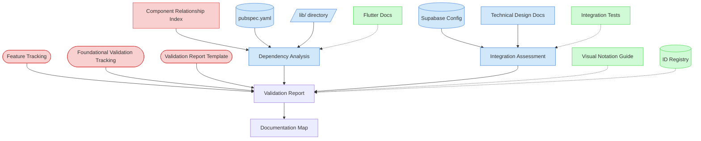

# Integration Dependencies Validation Context Map

This context map provides a visual guide to the components and relationships relevant to the Integration Dependencies Validation task. Use this map to identify which components require attention and how they interact.

## Visual Component Diagram

## Essential Components

### Critical Components (Must Understand)

- **Feature Tracking (FT)**: Current status of foundational features to be validated - provides scope and context
- **Foundational Validation Tracking (FVT)**: Master validation matrix and progress tracking - central coordination point
- **Validation Report Template (VRT)**: Standardized template for creating validation reports with consistent structure
- **Component Relationship Index (CRI)**: Understanding component interactions and dependencies - essential for integration analysis

### Important Components (Should Understand)

- **pubspec.yaml (PC)**: Project dependencies and version constraints - core dependency health analysis
- **lib/ directory (LIB)**: Source code for foundational features - implementation analysis target
- **Supabase Configuration (SUP)**: External system integration configurations - integration pattern analysis
- **Technical Design Documents (TDD)**: Technical specifications for integration patterns - design validation reference
- **Dependency Analysis (DA)**: Process of examining dependency health, versions, and compatibility
- **Integration Assessment (IA)**: Process of evaluating integration patterns and data flow integrity

### Reference Components (Access When Needed)

- **Flutter Documentation (FD)**: Official guidance on dependency management best practices
- **Integration Tests (IT)**: End-to-end tests for integration validation - verification reference
- **Visual Notation Guide (VNG)**: For interpreting context map diagrams and visual elements
- **ID Registry (IDR)**: For understanding validation report ID assignments and tracking

## Key Relationships

1. **Feature Tracking → Validation Report**: Provides the scope of foundational features to be validated in each session
2. **Foundational Validation Tracking → Validation Report**: Tracks validation progress and links to completed reports
3. **Validation Report Template → Validation Report**: Provides standardized structure and scoring framework
4. **Component Relationship Index → Dependency Analysis**: Essential reference for understanding component interactions
5. **pubspec.yaml → Dependency Analysis**: Source of dependency versions, constraints, and configuration
6. **lib/ directory → Dependency Analysis**: Contains implementation code for dependency usage analysis
7. **Supabase Configuration → Integration Assessment**: Defines external system integration patterns
8. **Technical Design Documents → Integration Assessment**: Provides design specifications for integration validation
9. **Dependency Analysis → Validation Report**: Feeds dependency health findings into the validation report
10. **Integration Assessment → Validation Report**: Contributes integration pattern analysis to the validation report
11. **Validation Report → Documentation Map**: Updates documentation tracking with new validation reports

## Implementation in AI Sessions

1. **Start with Critical Context**: Load Feature Tracking, Foundational Validation Tracking, and Validation Report Template to understand scope and structure
2. **Establish Component Understanding**: Review Component Relationship Index to map dependencies and integration points
3. **Analyze Dependencies**: Examine pubspec.yaml for version constraints and lib/ directory for implementation patterns
4. **Assess Integration Patterns**: Review Supabase configuration and Technical Design Documents for external system integration
5. **Perform Cross-Feature Analysis**: Unlike other validation tasks, this focuses on integration patterns across multiple features simultaneously
6. **Generate Validation Report**: Use ../../scripts/file-creation/New-ValidationReport.ps1 script with IntegrationDependencies validation type
7. **Update Tracking**: Update Foundational Validation Tracking matrix and Documentation Map with new report
8. **Reference Documentation**: Access Flutter Documentation and Integration Tests only when specific guidance is needed

## Related Documentation

- [Integration Dependencies Validation Task](../../../tasks/05-validation/integration-dependencies-validation.md) - Complete task definition and process
- [Feature Tracking](../../../state-tracking/permanent/feature-tracking.md) - Current status of foundational features
- [Foundational Validation Tracking](../../../state-tracking/temporary/foundational-validation-tracking.md) - Master validation matrix
- [Validation Report Template](../../../templates/templates/validation-report-template.md) - Standardized report structure
- [Component Relationship Index](/doc/product-docs/technical/architecture/component-relationship-index.md) - Complete reference of all component relationships
- [../../scripts/file-creation/New-ValidationReport.ps1](../../../scripts/file-creation/New-ValidationReport.ps1) - Automation script for report generation
- [Flutter Dependency Management](https://docs.flutter.dev/development/packages-and-plugins/using-packages) - Official dependency management guidance

---

_Note: This context map highlights only the components relevant to this specific task. For a comprehensive view of all components, refer to the [Component Relationship Index](/doc/product-docs/technical/architecture/component-relationship-index.md)._
