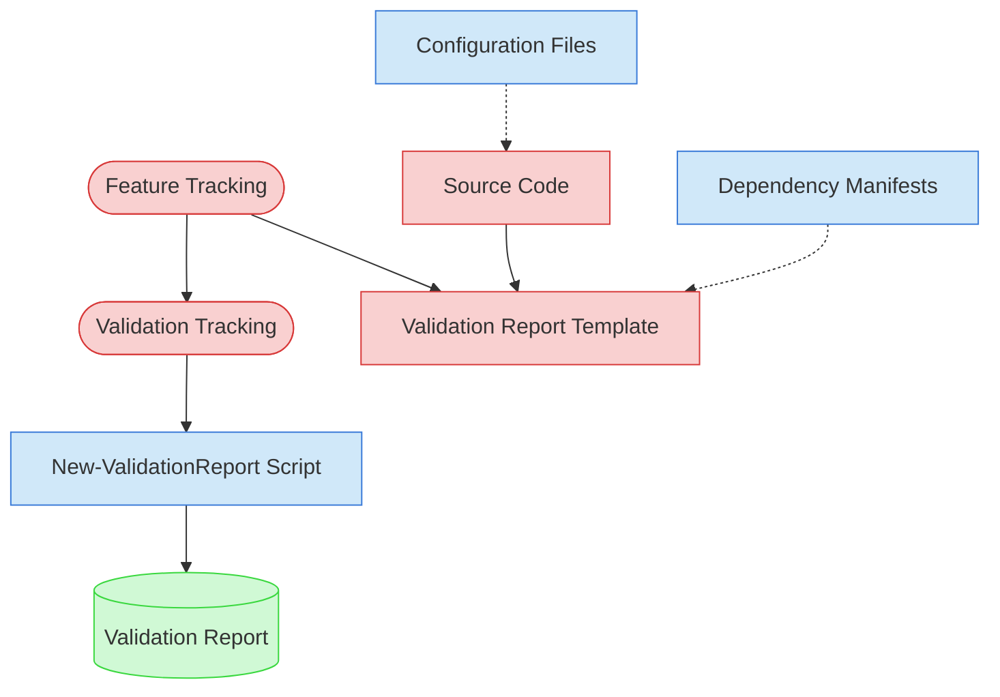

# Security & Data Protection Validation Context Map

This context map provides a visual guide to the components and relationships relevant to the Security & Data Protection Validation task. Use this map to identify which components require attention and how they interact.

## Visual Component Diagram

## Essential Components

### Critical Components (Must Understand)

- **Feature Tracking**: Current status and details of features to be validated
- **Validation Tracking**: Active validation tracking matrix tracking progress across all validation types
- **Validation Report Template**: Standardized template for creating security validation reports
- **Source Code**: Feature implementations to analyze for security patterns, input validation, and data protection

### Important Components (Should Understand)

- **Configuration Files**: Application configuration that may contain secrets, security settings, or sensitive defaults
- **Dependency Manifests**: Package dependency files for vulnerability scanning (requirements.txt, package.json, etc.)
- **New-ValidationReport Script**: Automation tool for generating validation reports

### Reference Components (Access When Needed)

- **Validation Report**: Final output document with security scoring and findings

## Key Relationships

1. **Feature Tracking → Validation Tracking**: Feature status determines which features are ready for validation
2. **Feature Tracking → Validation Report Template**: Feature details populate the validation report structure
3. **Source Code → Validation Report Template**: Security analysis of source code provides validation findings
4. **Configuration Files -.-> Source Code**: Configuration may expose security settings used by source code
5. **Dependency Manifests -.-> Validation Report Template**: Dependency vulnerability scan results feed into report
6. **Validation Tracking → New-ValidationReport Script**: Matrix tracking guides report generation parameters

## Implementation in AI Sessions

1. Begin by examining **Feature Tracking** and **Validation Tracking** to identify validation scope
2. Load **Source Code** for selected features to analyze security patterns
3. Review **Configuration Files** for hardcoded secrets and insecure defaults
4. Check **Dependency Manifests** for known vulnerabilities
5. Use **New-ValidationReport Script** to generate standardized validation reports
6. Update **Validation Tracking** matrix with completed validation results

## Related Documentation

- [Security & Data Protection Validation Task](../../../tasks/05-validation/security-data-protection-validation.md) - Complete task definition and process
- [Feature Tracking](../../../../product-docs/state-tracking/permanent/feature-tracking.md) - Current status of features
- Validation Tracking State File - Active validation tracking matrix (file location depends on validation round)

---
