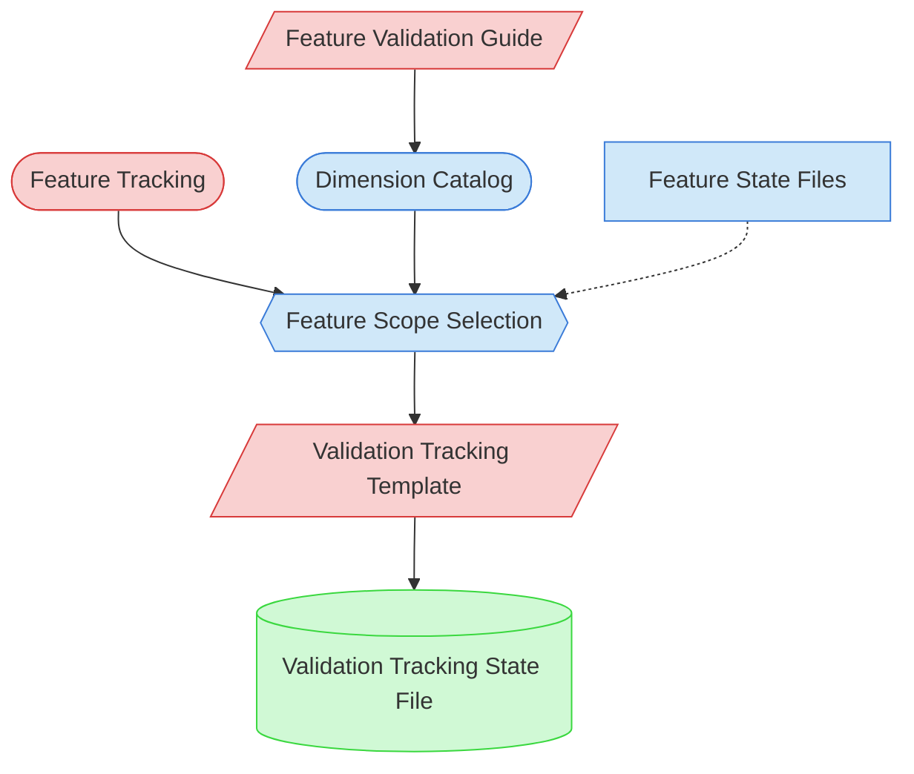

# Validation Preparation Context Map

This context map provides a visual guide to the components and relationships relevant to the Validation Preparation task. Use this map to identify which components require attention and how they interact.

## Visual Component Diagram

## Essential Components

### Critical Components (Must Understand)

- **Feature Validation Guide**: Comprehensive guide containing the Dimension Catalog with applicability criteria for all validation dimensions
- **Feature Tracking**: Current implementation status of all features — determines which features are eligible for validation
- **Validation Tracking Template**: Template for creating the feature×dimension tracking matrix that guides the validation round

### Important Components (Should Understand)

- **Dimension Catalog**: Section within the Feature Validation Guide listing all available validation dimensions with descriptions and applicability criteria
- **Feature Scope Selection**: The decision process that evaluates which features to include based on maturity, priority, and risk
- **Feature State Files**: Per-feature implementation state files providing detailed status beyond the tracking summary

### Reference Components (Access When Needed)

- **Validation Tracking State File**: The output — a customized tracking matrix with selected features and applicable dimensions

## Key Relationships

1. **Feature Validation Guide → Dimension Catalog**: The guide contains the master list of dimensions with applicability criteria
2. **Feature Tracking → Feature Scope Selection**: Feature status data drives scope selection decisions
3. **Dimension Catalog → Feature Scope Selection**: Applicability criteria inform which dimensions to apply per feature
4. **Feature Scope Selection → Validation Tracking Template**: Selected features and dimensions populate the template
5. **Validation Tracking Template → Validation Tracking State File**: Template is copied and customized into the active tracking file
6. **Feature State Files -.-> Feature Scope Selection**: Detailed feature state provides additional context for scope decisions

## Implementation in AI Sessions

1. Begin by examining **Feature Tracking** to identify features eligible for validation
2. Review the **Dimension Catalog** in the **Feature Validation Guide** to understand available dimensions
3. Apply **Feature Scope Selection** criteria to choose features and evaluate dimension applicability
4. Copy **Validation Tracking Template** and customize with selected features and dimensions
5. Plan session sequence for executing dimension tasks

## Related Documentation

- [Validation Preparation Task](../../../tasks/05-validation/validation-preparation.md) - Complete task definition and process
- [Feature Validation Guide](../../../guides/05-validation/feature-validation-guide.md) - Guide with Dimension Catalog
- [Feature Tracking](../../../../product-docs/state-tracking/permanent/feature-tracking.md) - Current status of features
- [Validation Tracking Template](../../../templates/05-validation/validation-tracking-template.md) - Template for tracking matrices

---
