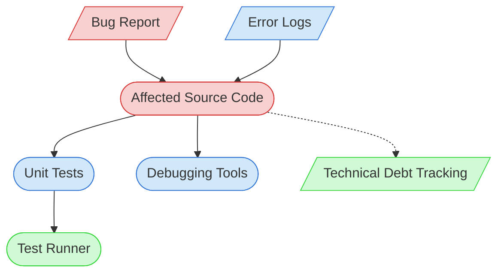

# Bug Fixing Context Map

This context map provides a visual guide to the components and relationships relevant to the Bug Fixing task. Use this map to identify which components require attention and how they interact.

## Visual Component Diagram

## Essential Components

### Critical Components (Must Understand)
- **Bug Report**: Detailed description of the bug, including steps to reproduce, expected behavior, and actual behavior
- **Affected Source Code**: The code files where the bug is located and needs to be fixed

### Important Components (Should Understand)
- **Unit Tests**: Tests that validate the fixed code works correctly
- **Error Logs**: System logs containing error information related to the bug
- **Debugging Tools**: Tools used to identify and analyze the bug

### Reference Components (Access When Needed)
- **Test Runner**: System for executing and validating test results
- **Technical Debt Tracking**: Documentation tracking bugs and technical debt items

## Key Relationships

1. **Bug Report → Source Code**: The bug report guides which source code files need investigation
2. **Source Code → Unit Tests**: The fixed code should pass all related unit tests
3. **Error Logs → Source Code**: Error logs help identify problematic code areas
4. **Source Code → Debugging Tools**: Debugging tools are used to analyze the source code
5. **Source Code -.-> Technical Debt Tracking**: Bug fixes may require updates to technical debt documentation

## Implementation in AI Sessions

1. Begin by examining the Bug Report to understand the issue
2. Review Error Logs for additional context about the failure
3. Identify and analyze the Affected Source Code
4. Use Debugging Tools to diagnose the root cause
5. Implement and test the fix
6. Ensure all Unit Tests pass with the fix
7. Update Technical Debt Tracking if the fix reveals additional issues

## Related Documentation

- <!-- [Bug Report Templates](/doc/process-framework/templates/bug-report-template.md) - Template/example link commented out --> - Standard format for bug reports
- <!-- [Error Log Analysis Guide](/doc/product-docs/development/guides/error-log-analysis.md) - File not found --> - How to interpret error logs
- <!-- [Debugging Guide](/doc/product-docs/development/guides/debugging-guide.md) - File not found --> - Techniques for debugging code
- <!-- [Unit Testing Guide](/doc/product-docs/development/guides/unit-testing-guide.md) - File not found --> - Standards for unit tests
- [Technical Debt Tracking](../../../state-tracking/permanent/technical-debt-tracking.md) - Technical debt status
- [Component Relationship Index](/doc/product-docs/technical/architecture/component-relationship-index.md) - Complete reference of component relationships

---

*Note: This context map highlights only the components relevant to bug fixing. For a comprehensive view of all components, refer to the [Component Relationship Index](/doc/product-docs/technical/architecture/component-relationship-index.md).*
