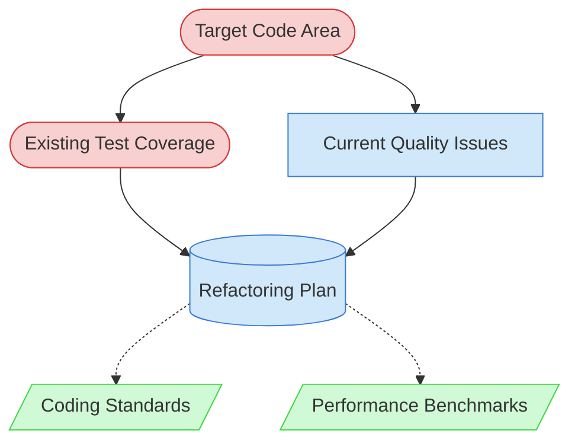

# Code Refactoring Task Context Map

This context map provides a visual guide to the components and relationships relevant to the Code Refactoring Task task. Use this map to identify which components require attention and how they interact.

## Visual Component Diagram

## Essential Components

### Critical Components (Must Understand)

- **Target Code Area**: Specific files, modules, or components to be refactored - the primary focus of improvement efforts
- **Existing Test Coverage**: Current test suite for the code area to ensure behavior preservation during refactoring

### Important Components (Should Understand)

- **Current Quality Issues**: Identified problems, code smells, or technical debt items that drive the refactoring effort
- **Refactoring Plan**: Comprehensive plan documenting scope, approach, and results - the central coordination document

### Reference Components (Access When Needed)

- **Coding Standards**: Project-specific coding conventions and style guides for ensuring consistent improvements
- **Performance Benchmarks**: Current performance metrics to ensure refactoring doesn't degrade performance

## Key Relationships

1. **Target Code Area → Existing Test Coverage**: Tests must comprehensively cover the target code to ensure behavior preservation during refactoring
2. **Target Code Area → Current Quality Issues**: Quality issues are identified within the target code area and drive refactoring decisions
3. **Existing Test Coverage → Refactoring Plan**: Test coverage assessment informs the refactoring strategy and risk management approach
4. **Current Quality Issues → Refactoring Plan**: Quality issues define the specific problems to be addressed and success criteria
5. **Refactoring Plan -.-> Coding Standards**: Standards are referenced when implementing improvements to ensure consistency
6. **Refactoring Plan -.-> Performance Benchmarks**: Benchmarks are consulted to ensure refactoring doesn't degrade performance

## Implementation in AI Sessions

1. **Start with Critical Analysis**: Begin by examining the Target Code Area and assessing Existing Test Coverage to understand the refactoring scope and safety net
2. **Identify Quality Issues**: Analyze Current Quality Issues to understand specific problems, code smells, and technical debt items driving the refactoring
3. **Create Comprehensive Plan**: Develop the Refactoring Plan with specific techniques, phases, and success criteria based on the quality issues identified
4. **Implement with Safety**: Execute refactoring incrementally, running tests after each change to ensure behavior preservation
5. **Reference Standards**: Consult Coding Standards and Performance Benchmarks only when needed to guide specific implementation decisions

## Related Documentation

- [Code Refactoring Task Definition](../../tasks/06-maintenance/code-refactoring-task.md) - Complete task definition and process
- [Refactoring Plan Template](../../templates/templates/refactoring-plan-template.md) - Template for creating refactoring plans
- [Technical Debt Tracking](../../state-tracking/permanent/technical-debt-tracking.md) - For identifying refactoring targets
- [Code Quality Standards](../../guides/guides/code-quality-standards.md) - Project coding standards and best practices
- [Testing Guidelines](../../guides/guides/testing-guidelines.md) - Ensuring behavior preservation during refactoring
- [Component Relationship Index](/doc/product-docs/technical/architecture/component-relationship-index.md) - Complete reference of all component relationships

---

_Note: This context map highlights only the components relevant to this specific task. For a comprehensive view of all components, refer to the [Component Relationship Index](/doc/product-docs/technical/architecture/component-relationship-index.md)._
