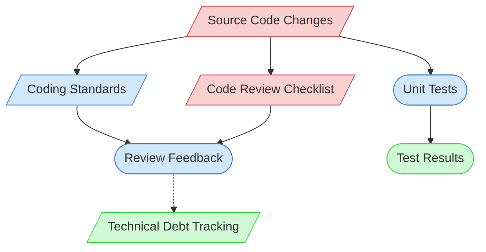

# Code Review Context Map

This context map provides a visual guide to the components and relationships relevant to the Code Review task. Use this map to identify which components require attention and how they interact.

## Visual Component Diagram

## Essential Components

### Critical Components (Must Understand)
- **Source Code Changes**: The code changes being reviewed
- **Code Review Checklist**: Standardized criteria for evaluating code quality

### Important Components (Should Understand)
- **Coding Standards**: Project-specific coding standards and best practices
- **Unit Tests**: Tests that validate the functionality of the code changes
- **Review Feedback**: Structured feedback provided during the review

### Reference Components (Access When Needed)
- **Test Results**: Results from running unit tests on the code changes
- **Technical Debt Tracking**: Documentation tracking potential technical debt items

## Key Relationships

1. **Source Changes → Review Checklist**: Code changes are evaluated against checklist criteria
2. **Source Changes → Coding Standards**: Code changes must comply with established standards
3. **Source Changes → Unit Tests**: Code changes should be covered by appropriate tests
4. **Coding Standards → Review Feedback**: Standards inform the review feedback
5. **Review Checklist → Review Feedback**: Checklist guides structured feedback
6. **Review Feedback -.-> Technical Debt Tracking**: Review may identify technical debt items

## Implementation in AI Sessions

1. Begin by examining the Source Code Changes to understand what has been modified
2. Review the Code Review Checklist to ensure all criteria are addressed
3. Verify the code changes against Coding Standards
4. Check if appropriate Unit Tests exist for the changes
5. Verify the Test Results to ensure all tests pass
6. Provide structured Review Feedback based on the checklist and standards
7. Update Technical Debt Tracking if the review reveals debt items

## Related Documentation

- <!-- [Code Review Checklist](/doc/process-framework/templates/code-review-checklist.md) - Template/example link commented out --> - Standard review criteria
- <!-- [Coding Standards](/doc/product-docs/development/guides/coding-standards.md) - File not found --> - Project-specific coding standards
- <!-- [Unit Testing Standards](/doc/product-docs/development/guides/unit-testing-standards.md) - File not found --> - Standards for unit tests
- [Technical Debt Tracking](../../../state-tracking/permanent/technical-debt-tracking.md) - Technical debt status
- [Component Relationship Index](/doc/product-docs/technical/architecture/component-relationship-index.md) - Complete reference of component relationships

---

*Note: This context map highlights only the components relevant to code review. For a comprehensive view of all components, refer to the [Component Relationship Index](/doc/product-docs/technical/architecture/component-relationship-index.md).*
