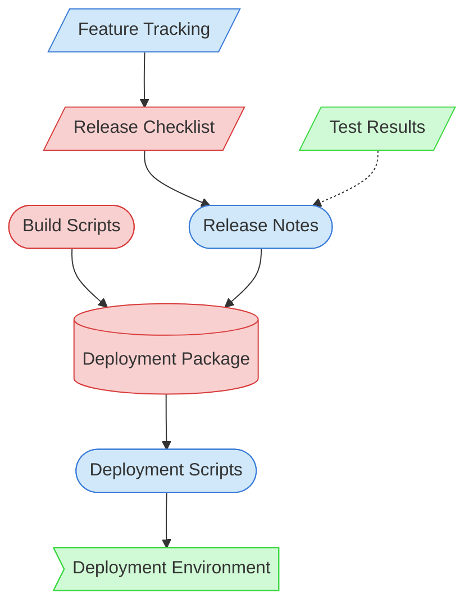

# Release & Deployment Context Map

This context map provides a visual guide to the components and relationships relevant to the Release & Deployment task. Use this map to identify which components require attention and how they interact.

## Visual Component Diagram

## Essential Components

### Critical Components (Must Understand)
- **Release Checklist**: Standardized checklist for release preparation
- **Build Scripts**: Scripts for creating deployment packages
- **Deployment Package**: The compiled package ready for deployment

### Important Components (Should Understand)
- **Feature Tracking**: Documentation of features included in the release
- **Release Notes**: Documentation of changes, fixes, and features in the release
- **Deployment Scripts**: Scripts for deploying the package to environments

### Reference Components (Access When Needed)
- **Deployment Environment**: The target environment for deployment
- **Test Results**: Results from testing the release package

## Key Relationships

1. **Feature Tracking → Release Checklist**: Tracked features inform release preparation
2. **Release Checklist → Release Notes**: Checklist guides release notes creation
3. **Build Scripts → Deployment Package**: Scripts create the deployment package
4. **Release Notes → Deployment Package**: Notes are included in the package
5. **Deployment Package → Deployment Scripts**: Package is deployed using scripts
6. **Deployment Scripts → Deployment Environment**: Scripts deploy to the target environment
7. **Test Results -.-> Release Notes**: Test results may inform release notes

## Implementation in AI Sessions

1. Begin by examining Feature Tracking to understand release content
2. Follow the Release Checklist for systematic release preparation
3. Create Release Notes documenting changes and features
4. Use Build Scripts to create the Deployment Package
5. Verify the Deployment Package with tests if needed
6. Execute Deployment Scripts to deploy to the target environment
7. Update Feature Tracking with release status

## Related Documentation

- [Feature Tracking](../../../state-tracking/permanent/feature-tracking.md) - Feature status tracking
- <!-- [Release Checklist](/doc/process-framework/templates/release-checklist.md) - Template/example link commented out --> - Standardized release preparation steps
- <!-- [Release Notes Template](/doc/process-framework/templates/release-notes-template.md) - Template/example link commented out --> - Template for release notes
- [Build Scripts](/scripts/build_production.sh) - Scripts for building deployment packages
- <!-- [Deployment Scripts](/scripts/deploy.sh) - File not found --> - Scripts for deployment
- <!-- [Deployment Environment Guide](/doc/product-docs/technical/deployment/environment-guide.md) - File not found --> - Guide to deployment environments
- [Component Relationship Index](/doc/product-docs/technical/architecture/component-relationship-index.md) - Complete reference of component relationships

---

*Note: This context map highlights only the components relevant to release and deployment. For a comprehensive view of all components, refer to the [Component Relationship Index](/doc/product-docs/technical/architecture/component-relationship-index.md).*
