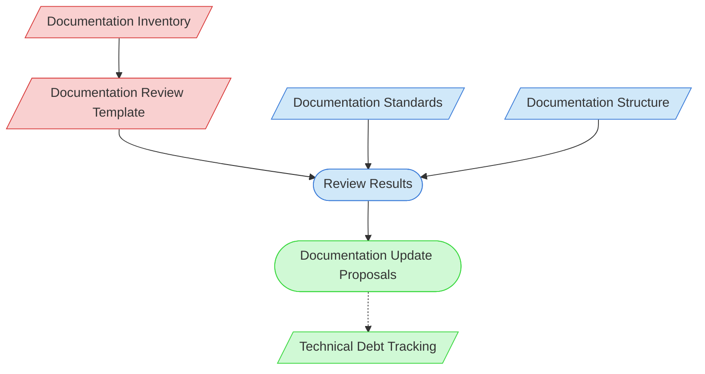

# Documentation Review Context Map

This context map provides a visual guide to the components and relationships relevant to the Documentation Review task. Use this map to identify which components require attention and how they interact.

## Visual Component Diagram

## Essential Components

### Critical Components (Must Understand)
- **Documentation Inventory**: List of documentation to be reviewed
- **Documentation Review Template**: Standardized template for conducting reviews

### Important Components (Should Understand)
- **Documentation Standards**: Standards for quality and completeness
- **Documentation Structure**: Organization and hierarchy of documentation
- **Review Results**: Findings from the documentation review

### Reference Components (Access When Needed)
- **Documentation Update Proposals**: Proposed changes based on review
- **Technical Debt Tracking**: Documentation of technical debt related to documentation

## Key Relationships

1. **Documentation Inventory → Review Template**: Inventory determines what to review
2. **Review Template → Review Results**: Template structures the review findings
3. **Documentation Standards → Review Results**: Standards inform quality assessment
4. **Documentation Structure → Review Results**: Structure informs organization assessment
5. **Review Results → Update Proposals**: Findings drive proposed improvements
6. **Update Proposals -.-> Technical Debt Tracking**: Documentation issues may be tracked as technical debt

## Implementation in AI Sessions

1. Begin by examining the Documentation Inventory to identify review scope
2. Use the Documentation Review Template to structure the review
3. Apply Documentation Standards to assess quality
4. Evaluate Documentation Structure for organization and completeness
5. Document Review Results with specific findings
6. Create Documentation Update Proposals for necessary improvements
7. Update Technical Debt Tracking with documentation-related debt items

## Related Documentation

- [Documentation Inventory](/doc/product-docs/README.md) - Index of project documentation
- <!-- [Documentation Review Template](/doc/process-framework/templates/documentation-review-template.md) - Template/example link commented out --> - Template for reviews
- <!-- [Documentation Standards](/doc/process-framework/guides/documentation-standards.md) - File not found --> - Standards for documentation
- <!-- [Documentation Structure Guide](/doc/product-docs/technical/documentation-structure.md) - File not found --> - Guide to documentation organization
- [Technical Debt Tracking](../../../../process-framework/state-tracking/permanent/technical-debt-tracking.md) - Technical debt status
- [Component Relationship Index](/doc/product-docs/technical/architecture/component-relationship-index.md) - Complete reference of component relationships

---

*Note: This context map highlights only the components relevant to documentation review. For a comprehensive view of all components, refer to the [Component Relationship Index](/doc/product-docs/technical/architecture/component-relationship-index.md).*
