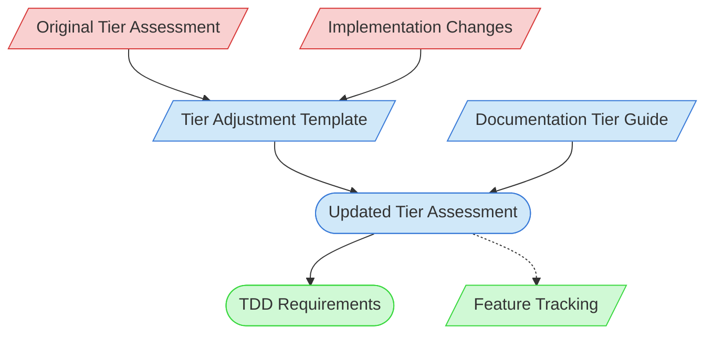

# Documentation Tier Adjustment Context Map

This context map provides a visual guide to the components and relationships relevant to the Documentation Tier Adjustment task. Use this map to identify which components require attention and how they interact.

## Visual Component Diagram

## Essential Components

### Critical Components (Must Understand)
- **Original Tier Assessment**: The initial complexity tier assessment document
- **Implementation Changes**: Changes to implementation that may affect complexity

### Important Components (Should Understand)
- **Tier Adjustment Template**: Template for documenting tier adjustments
- **Documentation Tier Guide**: Guidelines for determining documentation complexity tiers
- **Updated Tier Assessment**: The revised tier assessment document

### Reference Components (Access When Needed)
- **TDD Requirements**: Technical design document requirements based on the new tier
- **Feature Tracking**: Documentation tracking feature status and assessment

## Key Relationships

1. **Original Tier Assessment → Adjustment Template**: Original assessment is the baseline for adjustment
2. **Implementation Changes → Adjustment Template**: Changes drive the need for adjustment
3. **Adjustment Template → Updated Tier Assessment**: Template guides the assessment update
4. **Documentation Tier Guide → Updated Tier Assessment**: Guide informs tier determination
5. **Updated Tier Assessment → TDD Requirements**: New tier determines documentation requirements
6. **Updated Tier Assessment -.-> Feature Tracking**: Updates feature tracking information

## Implementation in AI Sessions

1. Begin by examining the Original Tier Assessment to understand baseline complexity
2. Review Implementation Changes that triggered the adjustment need
3. Use the Tier Adjustment Template to structure the assessment
4. Consult the Documentation Tier Guide to apply tier criteria
5. Create the Updated Tier Assessment with justification for changes
6. Determine new TDD Requirements based on the updated tier
7. Update Feature Tracking with the revised assessment

## Related Documentation

- [Original Tier Assessments](/doc/process-framework/methodologies/documentation-tiers/assessments/) - Repository of initial assessments
- <!-- [Tier Adjustment Template](/doc/process-framework/methodologies/documentation-tiers/tier-adjustment-template.md) - Template/example link commented out --> - Template for adjustment documentation
- <!-- [Documentation Tier Guide](/doc/process-framework/methodologies/documentation-tiers/documentation-tier-guide.md) - File not found --> - Guidelines for tier determination
- <!-- [TDD Templates](/doc/product-docs/technical/architecture/design-docs) - Template/example link commented out --> - Tier-specific TDD templates
- [Feature Tracking](../../../state-tracking/permanent/feature-tracking.md) - Feature status tracking
- [Component Relationship Index](/doc/product-docs/technical/architecture/component-relationship-index.md) - Complete reference of component relationships

---

*Note: This context map highlights only the components relevant to documentation tier adjustment. For a comprehensive view of all components, refer to the [Component Relationship Index](/doc/product-docs/technical/architecture/component-relationship-index.md).*
