# Technical Debt Assessment Task Context Map

This context map provides a visual guide to the components and relationships relevant to the Technical Debt Assessment Task. Use this map to identify which components require attention and how they interact during debt assessment activities.

## Visual Component Diagram

```mermaid
graph TD
    classDef critical fill:#f9d0d0,stroke:#d83a3a
    classDef important fill:#d0e8f9,stroke:#3a7bd8
    classDef reference fill:#d0f9d5,stroke:#3ad83f

    TaskDef([Task Definition<br/>PF-TSK-023]) --> AssessmentScript[Assessment Script<br/>New-TechnicalDebtAssessment.ps1]
    TaskDef --> CriteriaGuide[Assessment Criteria Guide<br/>PF-GDE-022]
    TaskDef --> PriorityGuide[Prioritization Guide<br/>PF-GDE-023]

    AssessmentScript --> AssessmentTemplate[(Assessment Template<br/>PF-TEM-019)]
    AssessmentScript --> DebtItemScript[Debt Item Script<br/>New-DebtItem.ps1]

    DebtItemScript --> DebtItemTemplate[(Debt Item Template<br/>PF-TEM-020)]

    CriteriaGuide -.-> CodeAnalysis[/Code Analysis Tools<br/>flutter analyze, etc./]
    PriorityGuide --> MatrixTemplate[(Priority Matrix Template<br/>PF-TEM-021)]

    AssessmentTemplate --> DebtTracking[/Technical Debt Tracking<br/>PF-STA-001/]
    DebtItemTemplate --> DebtTracking
    MatrixTemplate --> DebtTracking

    class TaskDef critical
    class AssessmentScript,CriteriaGuide,PriorityGuide important
    class CodeAnalysis,DebtTracking reference
```

## Essential Components

### Critical Components (Must Understand)

- **Task Definition (PF-TSK-023)**: Core task specification defining the systematic approach to technical debt assessment with complete process workflow

### Important Components (Should Understand)

- **Assessment Script**: Automated script for creating new technical debt assessment documents
- **Assessment Criteria Guide (PF-GDE-022)**: Detailed criteria for identifying technical debt across 6 categories
- **Prioritization Guide (PF-GDE-023)**: Framework for applying impact/effort matrix to prioritize debt items
- **Debt Item Script**: Automated script for creating individual debt item records

### Reference Components (Access When Needed)

- **Code Analysis Tools**: External tools (flutter analyze, pub outdated, etc.) for automated debt detection
- **Technical Debt Tracking (PF-STA-001)**: Permanent state file for tracking debt items across assessments
- **Templates**: Document templates for assessments, debt items, and prioritization matrices

## Key Relationships

1. **Task Definition → Assessment Criteria Guide**: Task definition references criteria for systematic debt identification
2. **Task Definition → Prioritization Guide**: Task definition references prioritization framework for decision-making
3. **Assessment Script → Templates**: Scripts generate documents using structured templates
4. **All Components → Technical Debt Tracking**: Assessment outputs feed into permanent tracking system

## Implementation in AI Sessions

1. **Start with Task Definition** to understand the overall assessment process and methodology
2. **Review Assessment Criteria Guide** to understand what constitutes technical debt and how to identify it systematically
3. **Use Assessment Script** to create new assessment documents with proper structure and IDs
4. **Apply Prioritization Guide** when evaluating and ranking identified debt items
5. **Reference Code Analysis Tools** for automated detection and validation of debt items
6. **Update Technical Debt Tracking** with assessment results for long-term monitoring

## Context Loading Sequence

When starting a technical debt assessment:

1. **Load Task Context**: Review task definition and current assessment status
2. **Prepare Assessment Environment**: Set up code analysis tools and access to codebase
3. **Create Assessment Document**: Use assessment script to generate structured document
4. **Apply Assessment Criteria**: Use criteria guide to systematically identify debt items
5. **Document Debt Items**: Use debt item script and template for detailed records
6. **Prioritize Items**: Apply prioritization framework to rank debt items
7. **Update Tracking**: Record assessment results in permanent tracking system

## Related Documentation

- [Technical Debt Assessment Task](../../tasks/cyclical/technical-debt-assessment-task.md) - Complete task definition with step-by-step process
- [Assessment Criteria Guide](../../guides/guides/assessment-criteria-guide.md) - Detailed identification criteria
- [Prioritization Guide](../../guides/guides/prioritization-guide.md) - Impact/effort prioritization framework
- [Technical Debt Tracking](../../state-tracking/permanent/technical-debt-tracking.md) - Permanent state tracking

---

_Note: This context map highlights only the components relevant to this specific task. For a comprehensive view of all components, refer to the [Component Relationship Index](/doc/product-docs/technical/architecture/component-relationship-index.md)._
