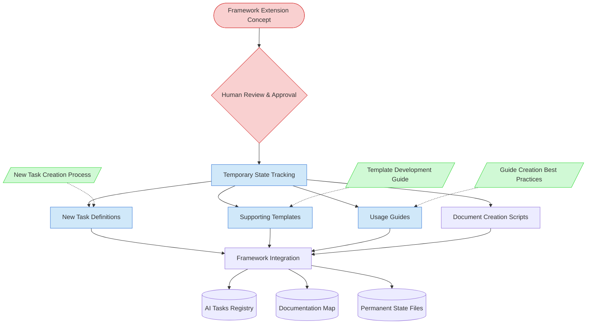

# Framework Extension Task Context Map

This context map provides a visual guide to the components and relationships relevant to the Framework Extension Task. Use this map to understand the multi-session implementation workflow and component dependencies for extending the framework with new capabilities.

## Visual Component Diagram

## Essential Components

### Critical Components (Must Understand)
- **Framework Extension Concept**: Comprehensive proposal document defining extension scope, workflow, and integration strategy
- **Human Review & Approval**: Mandatory human approval checkpoint before implementation begins

### Important Components (Should Understand)
- **Temporary State Tracking**: Multi-session implementation tracker with detailed roadmap and progress tracking
- **New Task Definitions**: Core task definitions with clear input-process-output specifications
- **Supporting Templates**: Templates for extension-specific document types and workflows
- **Usage Guides**: Comprehensive guides for using the new framework extension capabilities

### Reference Components (Access When Needed)
- **New Task Creation Process**: Process for creating individual tasks within the extension
- **Template Development Guide**: Best practices for creating extension-specific templates
- **Guide Creation Best Practices**: Standards for creating comprehensive usage guides

## Key Relationships

1. **Framework Extension Concept → Human Review**: Concept document must be approved before implementation begins
2. **Human Approval → Temporary State Tracking**: Approved concept triggers multi-session implementation planning
3. **Temporary State Tracking → Implementation Components**: State tracking coordinates creation of tasks, templates, guides, and scripts
4. **Implementation Components → Framework Integration**: All components must be integrated into core framework files
5. **Reference Components -.-> Implementation**: Best practices guides inform the creation of extension components

## Implementation in AI Sessions

1. **Session 1**: Create Framework Extension Concept document and obtain human approval
2. **Session 2**: Set up temporary state tracking and create core task definitions
3. **Session 3**: Develop supporting templates and usage guides using two-phase approach
4. **Session 4**: Complete framework integration and update all registry files
5. **Cross-Session**: Maintain temporary state tracking throughout implementation

## Related Documentation

- [Framework Extension Task Definition](../../tasks/support/framework-extension-task.md) - Complete task definition and process
- [Framework Extension Customization Guide](../../guides/guides/framework-extension-customization-guide.md) - Essential guide for customizing Framework Extension Concept documents
- [Framework Extension Concept Template](../../templates/templates/framework-extension-concept-template.md) - Template for concept documents
- [New Task Creation Process](../../tasks/support/new-task-creation-process.md) - Process for creating individual tasks
- [Template Development Guide](../../guides/guides/template-development-guide.md) - Best practices for template creation
- [Guide Creation Best Practices Guide](../../guides/guides/guide-creation-best-practices-guide.md) - Standards for guide creation

---

*Note: This context map highlights the components and workflow specific to the Framework Extension Task. For comprehensive framework documentation, refer to the [Documentation Map](../../documentation-map.md).*
