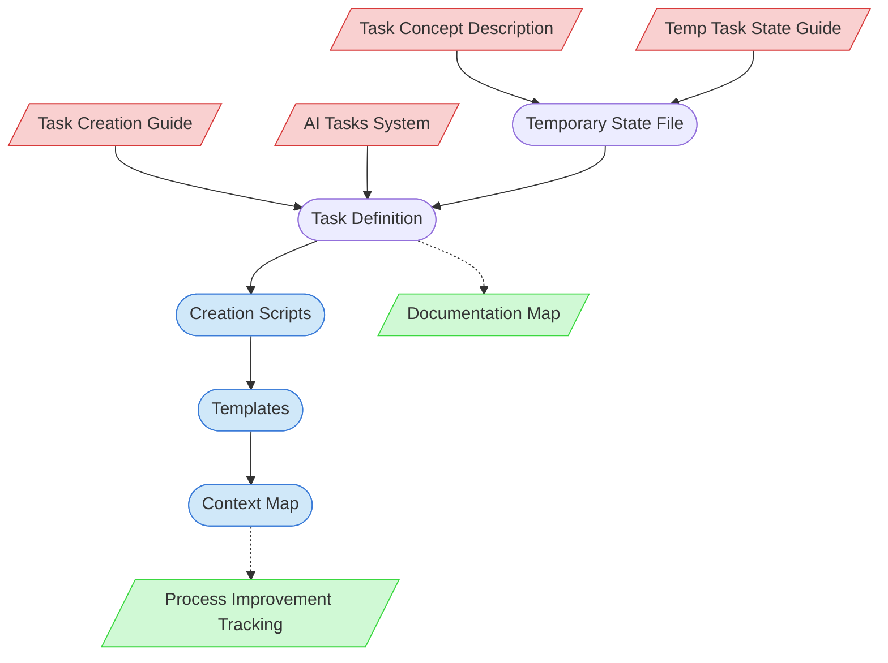

# New Task Creation Process Context Map

This context map provides a visual guide to the components and relationships relevant to the New Task Creation Process task. Use this map to identify which components require attention and how they interact.

## Visual Component Diagram

## Essential Components

### Critical Components (Must Understand)

- **Task Concept Description**: Human-provided description of the new task concept and its purpose - the foundation for all task creation
- **Task Creation Guide**: Understanding task structure requirements and standardized task definition format
- **Temporary Task State Guide**: For creating and managing multi-session state tracking during complex task implementation
- **AI Tasks System**: Main task registry that must be updated with new task entries and categorization

### Important Components (Should Understand)

- **Creation Scripts**: PowerShell scripts for generating task artifacts (New-Task.ps1, New-Template.ps1, New-ContextMap.ps1, etc.)
- **Templates**: Standardized templates for task outputs and documentation artifacts
- **Context Map**: Visual representation of task component relationships and dependencies

### Reference Components (Access When Needed)

- **Documentation Map**: Central registry of all documentation that must be updated with new artifacts
- **Process Improvement Tracking**: Records infrastructure completion and process enhancement activities

## Key Relationships

1. **Task Concept → Temporary State File**: The human-provided concept drives the creation of a structured implementation plan
2. **Task Creation Guide → Task Definition**: Standards and requirements guide the creation of properly formatted task definitions
3. **Temp State Guide → Temporary State File**: Provides the structure for multi-session implementation tracking
4. **AI Tasks System → Task Definition**: Task registry integration ensures proper categorization and discoverability
5. **Temporary State File → Task Definition**: Implementation roadmap guides the actual task creation process
6. **Task Definition → Creation Scripts**: Task requirements determine which automation scripts are needed
7. **Creation Scripts → Templates**: Scripts generate standardized templates for task outputs
8. **Templates → Context Map**: Template creation leads to context map development for task guidance

## Implementation in AI Sessions

1. Begin by gathering the Task Concept Description from human partner with clear requirements
2. Review the Task Creation Guide to understand standardized task structure and requirements
3. Consult the Temporary Task State Guide to set up multi-session implementation tracking
4. Create temporary state file with structured implementation roadmap across multiple sessions
5. Follow the roadmap to create task definition using appropriate Creation Scripts
6. Generate required Templates for task outputs using standardized template creation process
7. Create Context Map to visualize task component relationships and dependencies
8. Update Documentation Map and Process Improvement Tracking with completion status

## Related Documentation

- [Task Creation Guide](../../../../process-framework/guides/guides/task-creation-guide.md) - Understanding task structure requirements
- [Temporary Task State Creation Guide](../../../guides/guides/temp-state-tracking-customization-guide.md) - Multi-session implementation tracking
- [AI Tasks System](../../../../../ai-tasks.md) - Main task registry and categorization
- [New-Task.ps1](../../../scripts/file-creation/New-Task.ps1) - Script for creating task definitions
- [Documentation Map](../../../../process-framework/documentation-map.md) - Central documentation registry
- [Process Improvement Tracking](../../../../process-framework/state-tracking/permanent/process-improvement-tracking.md) - Infrastructure completion tracking

---

_Note: This context map highlights only the components relevant to this specific task. For a comprehensive view of all components, refer to the [Component Relationship Index](/doc/product-docs/technical/architecture/component-relationship-index.md)._
